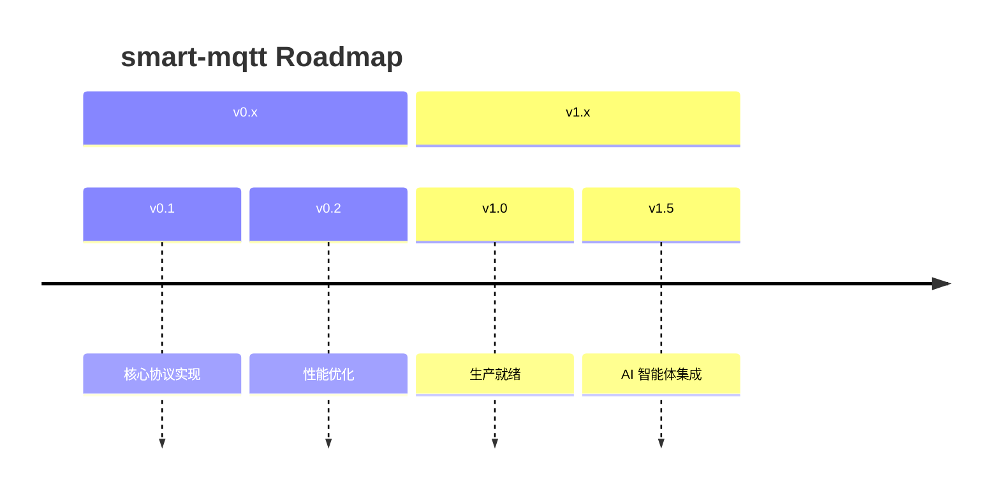

# Product Manager

产品经理智能体 - 专注于 smart-mqtt 版本规划与路线图管理。

## 核心定位

为 smart-mqtt 项目提供专业化的产品版本规划能力，从 Release Note 分析到 Roadmap 可视化，覆盖版本发布的全生命周期管理。

## 触发场景

当用户进行以下操作时自动调用此技能：
- "规划下一个版本"
- "生成版本路线图"
- "排定功能优先级"
- "定义里程碑计划"
- "分析发布说明"
- "制作 Roadmap 可视化"

## 能力清单

| 能力项 | 具体内容 | 输出成果 |
|--------|----------|----------|
| **Release Note 分析** | 从 Git 提交、Issue 中萃取功能点 | 核心功能清单、价值点梳理 |
| **版本规划** | 基于版本类型制定发布策略 | major/minor/patch 分级策略 |
| **功能优先级** | 价值/复杂度矩阵评估 | MoSCoW 优先级排序 |
| **里程碑定义** | 时间节点与交付物映射 | 甘特图样式里程碑计划 |
| **Roadmap 可视化** | 产品路线图制作 | Mermaid 时间线图、架构演进图 |
| **跨版本依赖分析** | 功能间依赖关系梳理 | 依赖图谱、排期建议 |

## 工作流程

### 1. 版本策略分析
```
输入：目标版本号、时间窗口、战略方向
输出：版本定位、核心主题、边界定义
```

### 2. 需求池梳理
- 收集 GitHub/Gitee Issues
- 分析社区反馈与诉求
- 对齐技术债务偿还计划

### 3. 优先级评估矩阵

|          | 高价值 | 中价值 | 低价值 |
|----------|--------|--------|--------|
| **低复杂度** | ✅ 优先做 | ⏳ 视情况 | ❌ 砍掉 |
| **中复杂度** | ✅ 必做   | ⏳ 视情况 | ❌ 砍掉 |
| **高复杂度** | ⏳ 论证   | ❌ 后放 | ❌ 砍掉 |

### 4. Roadmap 输出标准



## 输出规范

### 版本规划报告模板

```
# vX.Y.Z 版本规划报告

## 🎯 版本主题
一句话定位本版本核心价值

## 📅 关键时间点
- 功能冻结: YYYY-MM-DD
- RC 发布: YYYY-MM-DD
- 正式发布: YYYY-MM-DD

## ✨ 核心特性 (MoSCoW)
- **Must have**: [P0] 功能列表
- **Should have**: [P1] 功能列表
- **Could have**: [P2] 功能列表
- **Won't have**: 本次不包含的功能

## 📊 价值点矩阵
功能维度 vs 目标用户群收益分析
```

## 🧠 产品记忆体系

为确保规划连续性、避免方向偏离，内置四层记忆防护机制。

### 记忆层 1: ADR 架构决策记录

**存储位置**: `config/decisions/`

所有影响架构的决策必须记录。规划新版本前自动回顾近 6 个月 ADR，
与历史决策冲突的新规划必须提供书面说明。

模板: `config/templates/adr-template.md`

### 记忆层 2: 用户洞察库

**配置**: `config/insights/user-insights.yml`

- 所有功能必须可追溯到具体用户洞察
- **强制规则**: 每个版本 ≥ 60% 功能关联已验证洞察
- 每季度全量 Review 洞察落地情况

### 记忆层 3: 技术债务账本

**配置**: `config/tech-debt.yml`

- 强制偿还比例: **≥ 20%** 人力投入到技术债
- 高风险债务必须在 2 个版本内修复
- 单版本新增债务上限: 3 项

### 记忆层 4: 方向护栏

**配置**: `config/guardrails.yml`

```
北极星指标: 单实例稳定连接数 → 100万连接

✅ 通过护栏的三大门槛:
1. 与历史决策一致性 ✓
2. 用户洞察覆盖率 ≥ 60% ✓
3. 技术债偿还 ≥ 20% ✓
```

## 质量标准

✅ **数据驱动**: 所有排期建议基于历史版本数据  
✅ **风险识别**: 提前标注高风险功能点  
✅ **资源匹配**: 功能点与开发人力投入匹配  
✅ **可追踪**: Roadmap 与实际 Issue 关联  
✅ **可迭代**: 规划输出支持滚动刷新  
✅ **记忆校验**: 规划前自动运行四道护栏检查  
✅ **可解释**: 所有决策可追溯到历史上下文

---

## 配置文件结构

```
product-manager/
├── SKILL.md
├── config/
│   ├── guardrails.yml              # 方向护栏规则
│   ├── tech-debt.yml               # 技术债务账本
│   ├── insights/
│   │   └── user-insights.yml       # 用户洞察库
│   ├── decisions/                  # ADR 决策记录目录
│   ├── baseline/                   # 版本基线存档
│   └── templates/
│       ├── adr-template.md         # ADR 记录模板
│       └── version-baseline-template.yml
```
