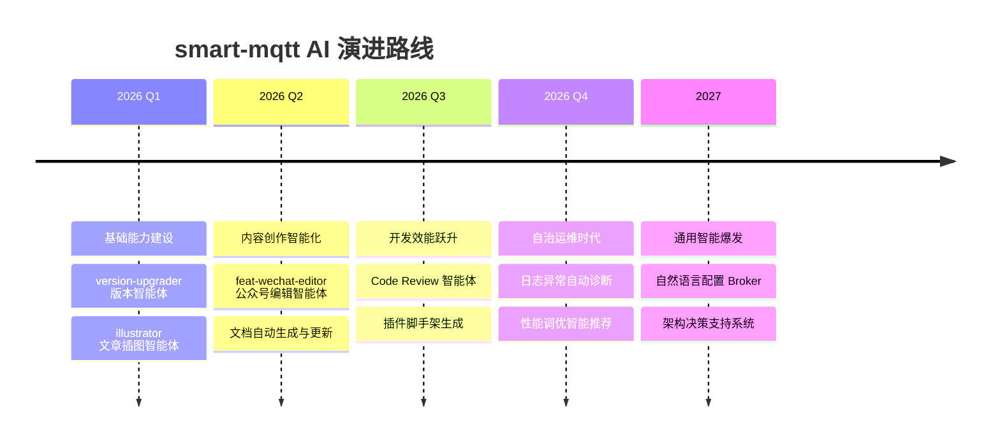

# Agents - smart-mqtt AI 智能体

<p align="center">
  
  
  
</p>

smart-mqtt 是业界首个深度集成 AI 智能体的 MQTT Broker。通过 Feat AI 框架，我们为物联网消息中间件注入了智能协作能力，让开发、运维、文档创作都能获得 AI 的强大助力。

---

## 🤖 智能体体系

smart-mqtt 采用 **分层智能体架构**，构建覆盖完整产品生命周期的 AI 协作网络。

### 核心智能体矩阵

| 分类 | 智能体 | 功能定位 | 技术能力 |
|------|--------|----------|----------|
| **开发工具链** | [版本升级智能体](#版本升级智能体) | 自动化版本发布与同步 | 多文件语义匹配、批量精准替换 |
| | [文章插图智能体](#文章插图智能体) | 技术文档可视化设计 | SVG 生成、品牌规范、响应式布局 |
| | **微信公众号编辑智能体** | 产品发布文案创作 | 排版美学、品牌调性、传播优化 |
| **开发支撑** | **代码审查智能体** | 代码质量与架构评审 | Java 深度分析、性能反模式识别 |
| | **插件生成智能体** | 插件脚手架与模板生成 | SPI 自动发现、配置模板化 |
| **运维支撑** | **故障诊断智能体** | 运行时问题定位与排障 | 日志分析、指标关联、根因推断 |
| | **性能调优智能体** | 集群性能优化建议 | 压测数据分析、参数调优指导 |
| **用户侧** | **文档问答智能体** | 产品文档与使用咨询 | RAG 语义检索、多轮对话 |
| | **配置助手智能体** | 部署配置向导 | 场景化推荐、参数解释 |

---

## 🔧 内置智能体详解

### 版本升级智能体

**Skill ID**: `version-upgrader`

#### 功能描述
自动化执行 smart-mqtt 版本发布流程，确保所有文档和配置文件中的版本号、下载链接保持同步。

#### 能力清单

| 能力项 | 具体内容 | 覆盖文件 |
|--------|----------|----------|
| **版本号同步** | 语义化版本校验与批量更新 | `README.md`, `README_zh.md` |
| **下载链接更新** | Gitee/GitHub 双渠道链接生成 | `DeploymentSection.astro` (中/英) |
| **UI 显示同步** | 首页页脚版本展示、按钮代码 | `index.astro` |
| **一致性校验** | 复制按钮可见内容与 data-code 属性 | 所有 Astro 组件 |

#### 调用触发条件

```
"帮我升级版本到 v1.5.6"
"发布新版本 1.6.0"
"更新 README 中的下载链接"
```

#### 工作流程

1. ✅ 验证版本号格式 `vX.Y.Z`
2. 🔍 扫描所有目标文件的匹配位置
3. ♻️ 执行批量原子替换
4. 🧪 校验所有更新点的一致性

---

### 文章插图智能体

**Skill ID**: `illustrator`

#### 功能描述
为技术文档、产品发布文章、教程内容生成符合品牌规范的专业级插图与可视化图表。

#### 核心能力

| 设计维度 | 能力细节 |
|----------|----------|
| **品牌系统** | 读取 `config/brands/smart-mqtt.yml` 品牌配色与字体规范 |
| **平台适配** | 微信公众号封面、技术文档内联图、社交媒体卡片等多尺寸输出 |
| **可视化类型** | 架构图、对比图、发展历程、思维导图、情绪看板、层次结构图 |
| **安全区域** | 自动避让裁切区，确保关键信息完整展示 |

#### 支持的插图模板

```
art-concept.html        - 概念架构图
art-compare.html        - 特性对比图
art-growth.html         - 发展历程图
art-mindmap.html        - 思维导图
art-layers.html         - 层次结构图
art-mood.html           - 情绪看板
wechat-cover-*.html     - 微信公众号全系列封面
wechat-inline-art.html  - 微信内联插图
```

#### 品牌配置示例

```yaml
brand: smart-mqtt
colors:
  primary: "#2563eb"      - 主色调：科技蓝
  accent: "#f59e0b"       - 强调色：活力橙
  neutral: 灰度阶梯体系
typography:
  font-stack: "-apple-system, 'PingFang SC', sans-serif"
  art-font: "'ZCOOL KuaiLe', display"
```

---

### 微信公众号编辑智能体

**Skill ID**: `feat-wechat-editor`

#### 功能描述
专注于 smart-mqtt 版本发布的公众号文章创作与排版优化专家。

#### 内容创作流程

| 创作阶段 | 工作内容 | 输出标准 |
|----------|----------|----------|
| **亮点提炼** | 从 Release Note 中萃取核心价值 | 3-5 个核心亮点，每个配 emoji 图标 |
| **架构解读** | 技术特性的通俗化转译 | 一图胜千言的架构表达 |
| **情感共鸣** | 开发者视角的故事化叙事 | 避免生硬的功能罗列 |
| **行动号召** | 清晰的试用与反馈引导 | Docker 一键启动命令 |

#### 排版规范

- **封面图**: 900×383px，品牌蓝主色调
- **小标题**: 前后空行、 emoji 前缀、渐变分割线
- **代码块**: 深色主题、行号、复制按钮
- **强调文本**: `<span style="color:#2563eb">` 品牌色高亮

---

## 🏗️ 智能体开发规范

### 目录结构规范

```
.trae/skills/
└── {skill-id}/
    ├── SKILL.md              # 智能体定义与能力说明
    ├── config/
    │   ├── brands/           # 品牌配置集
    │   └── platforms/        # 平台适配集
    └── templates/            # 输出模板库
```

### SKILL.md 元数据规范

```yaml
---
name: "智能体唯一标识"
description: "一句话描述功能与触发场景"
---

# 详细能力说明
## 触发场景
## 输入要求
## 输出规范
## 校验清单
```

### 质量门标准

所有智能体必须通过以下验证：

✅ **幂等性**: 重复执行不产生副作用  
✅ **原子性**: 要么全部成功，要么全部回滚  
✅ **可观测**: 每一步操作都有明确的日志  
✅ **可回滚**: 关键修改前的自动备份  
✅ **用户友好**: 清晰的进度反馈与结果报告

---

## 🚀 AI 驱动的产品演进

smart-mqtt 智能体体系建设路线图



---

## 🧠 设计哲学

### 1. 深度嵌入产品生命周期

智能体不是外挂工具，而是研发流程的一等公民。从版本发布的那一刻起，AI 就深度参与到每一个环节。

### 2. 专精优于通用

每个智能体只专注做好一件事，在垂直场景下做到极致。版本智能体不会去分析代码，插图智能体不会去修改配置。

### 3. 人类为最终决策者

AI 只做 "建议" 和 "辅助"，所有关键决策都有人在环 (Human-in-the-loop)。智能体的产出永远需要人类的最终确认。

### 4. 渐进式增强

从重复劳动中解放开发者，把机械的版本同步、格式调整交给 AI。创造性的架构设计、产品决策，永远属于人类。

---

## 📚 相关资源

- 🔗 [Feat 官方文档](https://smartboot.tech/feat)
- 📖 [smart-mqtt 官方文档](https://smartboot.tech/smart-mqtt/)
- 💬 [反馈与建议](https://gitee.com/smartboot/smart-mqtt/issues)

---

<p align="center">
  <i>让 MQTT Broker 不仅是消息的管道，更是智能协作的节点</i>
</p>
