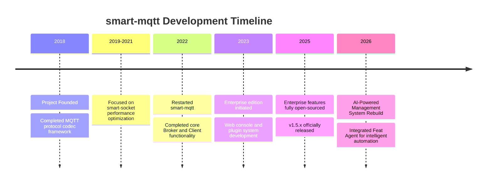

<p align="center">
  <a href="LICENSE"></a>
  <a href="https://github.com/smartboot/smart-mqtt/releases"></a>
  <a href="https://hub.docker.com/r/smartboot/smart-mqtt"></a>
  <a href="https://smartboot.tech/smart-mqtt/"></a>
</p>

<p align="center">
  <b>High-Performance, Plugin-based Enterprise MQTT Broker</b><br>
  Millions of connections, tens of millions of messages per second
</p>

---

## Introduction

smart-mqtt is a high-performance MQTT Broker designed for enterprise IoT scenarios. Developed in Java with underlying communication based on the self-developed asynchronous non-blocking communication framework [smart-socket](https://github.com/smartboot/smart-socket), fully implementing the MQTT v3.1.1 and v5.0 protocol specifications.


### Key Advantages

- **Ultra-High Performance** - Millions of concurrent connections on a single node
- **Plugin Architecture** - Modular design for on-demand feature extension
- **Java Ecosystem** - Zero-barrier integration with existing Java tech stacks
- **Standards Compliant** - Full compliance with MQTT 3.1.1/5.0 protocol standards

> ⚠️ **License Notice**: smart-mqtt is for personal learning use only. **Commercial use is prohibited without authorization**. Please contact us for commercial licensing at [smartboot official website](https://smartboot.tech/).

---

## Quick Start

### Docker Deployment (Recommended)

```bash
docker run --name smart-mqtt \
  -p 1883:1883 \
  -p 18083:18083 \
  -e ENTERPRISE_ENABLE=true \
  -d smartboot/smart-mqtt:latest
```

- `1883` - MQTT service port
- `18083` - Web management console (default credentials: smart-mqtt / smart-mqtt)

### Local Installation

```bash
# Download and extract
curl -LO https://github.com/smartboot/smart-mqtt/releases/download/v1.5.3/smart-mqtt-full-v1.5.3.zip
unzip smart-mqtt-full-v1.5.3.zip && cd smart-mqtt-full-v1.5.3

# Start service
./bin/start.sh
```

---

## Core Features

| Feature | Description |
|---------|-------------|
| Ultra Lightweight | Distribution package size < 800KB, minimal dependencies |
| High Performance | Asynchronous non-blocking I/O, millions of connections per node |
| Zero-Configuration | Out of the box, no complex configuration required |
| Full Protocol Support | MQTT v3.1.1 and v5.0, supporting QoS 0/1/2 |
| Cluster High Availability | Multi-node clustering, load balancing and failover |
| Hot-Pluggable Plugins | Dynamic loading without restarting the service |

---

## Performance Metrics

| Test Scenario | QoS 0 | QoS 1 | QoS 2 |
|---------------|:-----:|:-----:|:-----:|
| Message Subscribe | 10M/sec | 5.4M/sec | 3.2M/sec |
| Message Publish | 970K/sec | 630K/sec | 520K/sec |

**Test Environment**: Intel Xeon E5-2680 v4, 64GB DDR4, CentOS 7.9

---

## Plugin Ecosystem

smart-mqtt adopts a plugin-based architecture. The `enterprise-plugin` provides an enterprise-grade Web management console.

| Plugin | Function | Recommended For |
|--------|----------|-----------------|
| **enterprise-plugin** | Web console, RESTful API, user management | Production environments |
| **cluster-plugin** | Multi-node clustering, load balancing, node discovery | High availability deployments |
| **websocket-plugin** | WebSocket protocol support | Web applications |
| **mqtts-plugin** | SSL/TLS encrypted communication | Security-sensitive scenarios |
| **redis-bridge-plugin** | Message bridging to Redis | Cache integration |
| **simple-auth-plugin** | Username/password authentication, ACL | Basic authentication |

---

## Project History



---

## Documentation

- 📚 [Official Documentation](https://smartboot.tech/smart-mqtt/) - Complete usage documentation and API reference
- 🖥️ [Live Demo](http://115.190.30.166:8083/) - Credentials: smart-mqtt / smart-mqtt
- 🐛 [Issue Tracking](https://github.com/smartboot/smart-mqtt/issues) - GitHub Issues

---

<p align="center">
  License: <b>AGPL-3.0</b> | 
  <a href="https://smartboot.tech/">smartboot Official Website</a> |
  <a href="README_zh.md">🇨🇳 简体中文</a>
</p>
