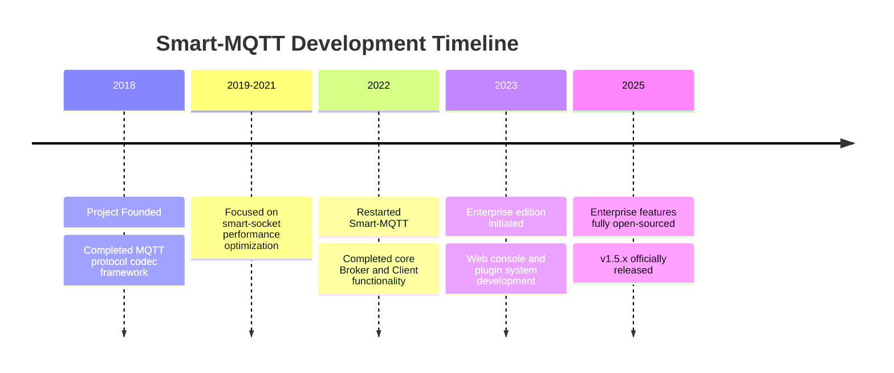

# Smart-MQTT

<p align="center">
  <a href="LICENSE"></a>
  <a href="https://github.com/smartboot/smart-mqtt/releases"></a>
  <a href="https://hub.docker.com/r/smartboot/smart-mqtt"></a>
  <a href="https://smartboot.tech/smart-mqtt/"></a>
</p>

<p align="center">
  <b>High-Performance, Plugin-based Enterprise MQTT Broker</b><br>
  Millions of connections, tens of millions of messages per second
</p>

<p align="center">
  <a href="#introduction">Introduction</a> •
  <a href="#core-features">Core Features</a> •
  <a href="#quick-start">Quick Start</a> •
  <a href="#performance">Performance</a> •
  <a href="#plugin-ecosystem">Plugin Ecosystem</a> •
  <a href="#documentation">Documentation</a>
</p>

---

## Introduction

Smart-MQTT is a high-performance MQTT Broker designed for enterprise IoT scenarios, capable of supporting **tens of thousands to millions of device connections**. As the first IoT infrastructure solution released by the smartboot open-source organization, it is developed in Java with underlying communication based on the self-developed asynchronous non-blocking communication framework [smart-socket](https://github.com/smartboot/smart-socket), fully implementing the MQTT v3.1.1 and v5.0 protocol specifications.


### Why Smart-MQTT?

| Advantage | Business Value |
|:---------:|:---------------|
| 🚀 **Ultra-High Performance** | Millions of concurrent connections on a single node, tens of millions of message throughput. Ordinary servers can support massive devices, with cost advantages becoming more significant at scale |
| 🔧 **Plugin Architecture** | Modular plugin design for on-demand feature extension. Southbound multi-protocol device adaptation, northbound enterprise system integration, avoiding feature bloat |
| ☕ **Java Ecosystem** | Zero-barrier integration with existing Java tech stacks. Teams can get started quickly with mature operation and maintenance toolchains, reducing long-term maintenance costs |
| 🔄 **Standards Compliant** | Full compliance with MQTT 3.1.1/5.0 protocol standards. No vendor lock-in, business autonomy and control, supporting smooth migration |
| 🇨🇳 **Autonomous & Controllable** | Full-stack self-developed core components (from communication framework to application layer). Transparent and secure code, compliant with government and enterprise innovation requirements |

> ⚠️ **Important Notice**: Smart-MQTT code is for personal learning use only. **Commercial use is prohibited without authorization**. Please contact us for commercial licensing. Visit [smartboot official website](https://smartboot.tech/) for details.

---

## Core Features

### 🛠️ Technical Features

- **Ultra Lightweight**: Minimal external dependencies, distribution package size < 800KB
- **High Performance & Low Latency**: Asynchronous non-blocking I/O design and efficient algorithm implementation, fully leveraging hardware performance
- **Zero-Configuration Startup**: Out of the box, start the service quickly without complex configuration
- **Complete Protocol Support**: Full implementation of MQTT v3.1.1 and v5.0 protocols, supporting QoS 0/1/2 message quality levels

### 🚀 Deployment & Operations

- **Multiple Deployment Options**: Support Docker, Kubernetes, local deployment, source code compilation, and more
- **Cluster High Availability**: Support multi-node cluster deployment, implementing load balancing and failover
- **Web Management Console**: Built-in enterprise-grade plugin providing visual monitoring, configuration, and management capabilities
- **Hot-Pluggable Plugins**: Plugins support dynamic loading, starting, and stopping without restarting the service

---

## Quick Start

### 📥 Download & Installation

| Download Channel | Link | Recommended For |
|:-----------------|:-----|:----------------|
| **GitHub Releases** | [Releases](https://github.com/smartboot/smart-mqtt/releases) | International users |
| **Gitee Mirror** | [Releases](https://gitee.com/smartboot/smart-mqtt/releases) | China users |
| **Docker Hub** | [smartboot/smart-mqtt](https://hub.docker.com/r/smartboot/smart-mqtt) | Container deployment |

**Quick Download Command** (Linux/macOS):
```bash
# Download latest version
curl -LO https://github.com/smartboot/smart-mqtt/releases/download/v1.5.3/smart-mqtt-full-v1.5.3.zip
```

### Option 1: Docker Deployment (Recommended)

**Single Node Quick Start**:
```bash
docker run --name smart-mqtt \
  -p 1883:1883 \
  -p 18083:18083 \
  -e ENTERPRISE_ENABLE=true \
  -d smartboot/smart-mqtt:latest
```

**Service Port Reference**:
- `1883`: MQTT service port
- `18083`: Web management console port (default credentials: smart-mqtt / smart-mqtt)

<details>
<summary>📋 Docker Compose Deployment (Multi-node Cluster)</summary>

```yaml
version: '3.8'
networks:
  mqtt-network:
    driver: bridge
services:
  mqtt-broker:
    container_name: smart-mqtt
    hostname: mqtt-broker
    image: smartboot/smart-mqtt:latest
    networks:
      - mqtt-network
    environment:
      ENTERPRISE_ENABLE: "true"
      BROKER_MAXINFLIGHT: "256"
    restart: always
    ports:
      - "18083:18083"
      - "1883:1883"
```

Start command:
```bash
docker-compose up -d
```
</details>

### Option 2: Local Package Installation

```bash
# 1. Extract the package
unzip smart-mqtt-full-v1.5.3.zip
cd smart-mqtt-full-v1.5.3

# 2. Start the service
./bin/start.sh

# 3. Check service status
./bin/status.sh

# 4. Stop the service
./bin/stop.sh
```

---

## Performance

Smart-MQTT demonstrates excellent performance metrics in standard test environments:

### Test Environment
- **CPU**: Intel Xeon E5-2680 v4 @ 2.40GHz
- **Memory**: 64GB DDR4
- **Network**: 10Gbps Ethernet
- **OS**: CentOS 7.9

### Performance Metrics

| Test Scenario | QoS 0 | QoS 1 | QoS 2 |
|:--------------|:-----:|:-----:|:-----:|
| Message Subscribe (2,000 subscribers, 128 Topics) | 10M/sec | 5.4M/sec | 3.2M/sec |
| Message Publish (2,000 publishers, 128 Topics) | 970K/sec | 630K/sec | 520K/sec |

### Resource Usage
- **Memory**: Approximately 2GB per 100K connections
- **CPU**: Single core can handle ~100K QPS
- **Startup Time**: Cold start < 3 seconds

---

## Project Structure

```
smart-mqtt/
├── smart-mqtt-broker/           # MQTT Broker core module
│   └── src/
│       └── main/java/tech/smartboot/mqtt/broker/
├── smart-mqtt-client/           # MQTT Client SDK
│   └── src/
│       └── main/java/tech/smartboot/mqtt/client/
├── smart-mqtt-common/           # Common module (protocol definitions, utilities)
│   └── src/
│       └── main/java/tech/smartboot/mqtt/common/
├── smart-mqtt-plugin-spec/      # Plugin specification definitions
│   └── src/
│       └── main/java/tech/smartboot/mqtt/plugin/spec/
├── smart-mqtt-maven-plugin/     # Maven build plugin
├── smart-mqtt-bench/            # Performance testing tool
├── plugins/                     # Official plugin collection
│   ├── enterprise-plugin/       # Enterprise plugin (Web console, RESTful API)
│   ├── cluster-plugin/          # Cluster plugin (load balancing, HA)
│   ├── websocket-plugin/        # WebSocket protocol support
│   ├── mqtts-plugin/            # MQTT over SSL/TLS secure communication
│   ├── redis-bridge-plugin/     # Redis message bridging
│   ├── simple-auth-plugin/      # Simple authentication (username/password)
│   ├── memory-session-plugin/   # In-memory session management
│   └── bench-plugin/            # Built-in benchmarking tool
├── pages/                       # Documentation website source
├── docker-compose.yml           # Docker compose configuration
└── Makefile                     # Build scripts
```

---

## Plugin Ecosystem

Smart-MQTT adopts a plugin-based architecture design. The `enterprise-plugin` provides an enterprise-grade Web management console and complete plugin lifecycle management capabilities.

### Official Plugin List

| Plugin | Description | Recommended For |
|:-------|:------------|:----------------|
| **enterprise-plugin** | Web management console, RESTful API, user management, license management | Production environments |
| **cluster-plugin** | Multi-node clustering, load balancing, node discovery, state synchronization | High availability deployments |
| **websocket-plugin** | WebSocket protocol support, browser-based MQTT communication | Web applications |
| **mqtts-plugin** | SSL/TLS encrypted communication, certificate management | Security-sensitive scenarios |
| **redis-bridge-plugin** | Message bridging to Redis, supporting pub/sub | Cache integration |
| **simple-auth-plugin** | Username/password authentication, ACL access control | Basic authentication |
| **memory-session-plugin** | In-memory session storage, session state management | Default session storage |
| **bench-plugin** | Built-in performance testing, stress testing tools | Performance validation |

### Plugin Management Capabilities

- **Hot-Pluggable**: Support dynamic plugin loading, starting, and stopping without restarting the Broker service
- **Online Configuration**: Modify plugin configurations through the Web console in real-time
- **Plugin Marketplace**: Connect to the official plugin repository to browse, search, and download published plugins
- **Custom Development**: Support uploading custom JAR packages for installation, providing complete plugin development specifications

---

## Documentation

| Resource Type | Link | Description |
|:--------------|:-----|:------------|
| **Official Docs** | [https://smartboot.tech/smart-mqtt/](https://smartboot.tech/smart-mqtt/) | Complete usage documentation and API reference |
| **Live Demo** | [http://115.190.30.166:8083/](http://115.190.30.166:8083/) | Credentials: smart-mqtt / smart-mqtt |
| **Issue Tracking** | [GitHub Issues](https://github.com/smartboot/smart-mqtt/issues) | Bug reports and feature requests |
| **Discussions** | [GitHub Discussions](https://github.com/smartboot/smart-mqtt/discussions) | Technical exchange and experience sharing |

---

## Release Notes

### v1.5.3 (2025-03-25)

- **Optimization**: Improved message forwarding performance in cluster mode
- **Bugfix**: Fixed memory leak in WebSocket plugin under high connection counts
- **Feature**: Added support for MQTT 5.0 Topic Alias feature
- **Improvement**: Enhanced monitoring metrics collection in enterprise plugin

[View Full Changelog](https://smartboot.tech/smart-mqtt/product/changelog/)

---

## Project History



---

## References

- [MQTT Protocol 3.1.1 Specification](https://mqtt.org/mqtt-specification/)
- [MQTT Protocol 5.0 Specification](https://mqtt.org/mqtt-specification/)
- [moquette](https://github.com/moquette-io/moquette) - Another Java MQTT Broker implementation

---

<p align="center">
  <b>License</b>: GNU Affero General Public License version 3 (AGPL-3.0)
</p>

<p align="center">
  Commercial use requires licensing | <a href="https://smartboot.tech/">smartboot Official Website</a>
</p>

---

<p align="center">
  <a href="README_zh.md">🇨🇳 简体中文</a> | <a href="README.md">🇺🇸 English</a>
</p>
