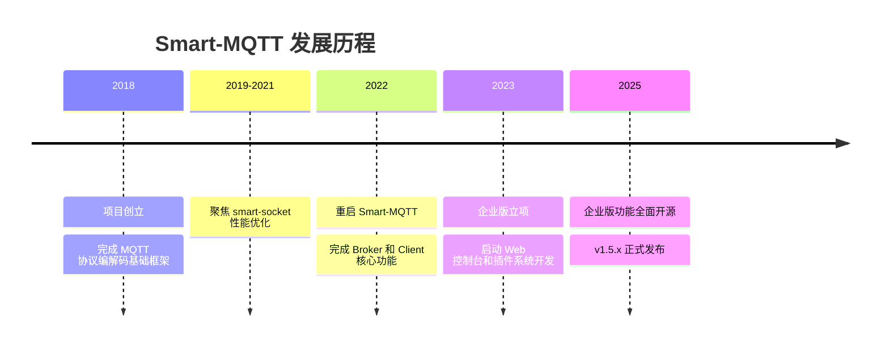

# Smart-MQTT

<p align="center">
  <a href="LICENSE"></a>
  <a href="https://gitee.com/smartboot/smart-mqtt/releases"></a>
  <a href="https://hub.docker.com/r/smartboot/smart-mqtt"></a>
  <a href="https://smartboot.tech/smart-mqtt/"></a>
</p>

<p align="center">
  <b>高性能、插件化的企业级 MQTT Broker</b><br>
  单机支持百万连接，千万级消息吞吐
</p>

<p align="center">
  <a href="#项目介绍">项目介绍</a> •
  <a href="#核心特性">核心特性</a> •
  <a href="#快速开始">快速开始</a> •
  <a href="#性能表现">性能表现</a> •
  <a href="#插件生态">插件生态</a> •
  <a href="#文档资源">文档资源</a>
</p>

---

## 项目介绍

Smart-MQTT 是一款面向企业级物联网场景的高性能 MQTT Broker，专为支撑**上万至百万级设备连接**而设计。作为 smartboot 开源组织推出的首款物联网基础设施解决方案，它采用 Java 语言开发，底层通信基于自研的异步非阻塞通信框架 [smart-socket](https://gitee.com/smartboot/smart-socket)，完整实现了 MQTT v3.1.1 和 v5.0 协议规范。


### 为什么选择 Smart-MQTT？

| 优势 | 业务价值 |
|:----:|:---------|
| 🚀 **超高性能** | 单机百万级并发连接，千万级消息吞吐，普通服务器即可支撑海量设备，规模越大成本优势越显著 |
| 🔧 **插件架构** | 模块化插件设计，按需扩展功能。南向适配多协议设备接入，北向桥接企业业务系统，避免功能冗余 |
| ☕ **Java 生态** | 与现有 Java 技术栈零门槛集成，团队快速上手，运维工具链成熟，降低长期维护成本 |
| 🔄 **标准兼容** | 完整遵循 MQTT 3.1.1/5.0 协议标准，无厂商锁定，业务自主可控，支持平滑迁移 |
| 🇨🇳 **自主可控** | 全栈自研核心组件（从通信框架到应用层），代码透明安全，符合政企信创合规要求 |

> ⚠️ **重要提示**：Smart-MQTT 代码仅供个人学习使用，**未经授权禁止用于商业目的**。商业使用请联系授权，详情请访问 [smartboot 官网](https://smartboot.tech/)。

---

## 核心特性

### 🛠️ 技术特性

- **极致轻量**：极少外部依赖，发行包体积小于 800KB
- **高性能低延迟**：采用异步非阻塞 I/O 设计和高效的算法实现，充分释放硬件性能
- **零配置启动**：开箱即用，无需复杂配置即可快速启动服务
- **完整协议支持**：完整实现 MQTT v3.1.1 和 v5.0 协议，支持 QoS 0/1/2 三种消息质量等级

### 🚀 部署运维

- **多种部署方式**：支持 Docker、Kubernetes、本地部署、源码编译等多种方式
- **集群高可用**：支持多节点集群部署，实现负载均衡和故障转移
- **Web 管理控制台**：内置企业级插件，提供可视化的监控、配置和管理能力
- **热插拔插件**：插件支持动态加载、启动和停止，无需重启服务

---

## 快速开始

### 📥 下载安装

| 下载渠道 | 链接 | 适用场景 |
|:---------|:-----|:---------|
| **Gitee 国内镜像** | [Releases](https://gitee.com/smartboot/smart-mqtt/releases) | 国内用户推荐 |
| **GitHub 国际源** | [Releases](https://github.com/smartboot/smart-mqtt/releases) | 国际用户 |
| **Docker Hub** | [smartboot/smart-mqtt](https://hub.docker.com/r/smartboot/smart-mqtt) | 容器化部署 |

**快速下载命令**（Linux/macOS）：
```bash
# 下载最新版本
curl -LO https://gitee.com/smartboot/smart-mqtt/releases/download/v1.5.3/smart-mqtt-full-v1.5.3.zip
```

### 方式一：Docker 部署（推荐）

**单机快速启动**：
```bash
docker run --name smart-mqtt \
  -p 1883:1883 \
  -p 18083:18083 \
  -e ENTERPRISE_ENABLE=true \
  -d smartboot/smart-mqtt:latest
```

**服务端口说明**：
- `1883`：MQTT 服务端口
- `18083`：Web 管理控制台端口（默认账号/密码：smart-mqtt / smart-mqtt）

<details>
<summary>📋 Docker Compose 部署（多节点集群）</summary>

```yaml
version: '3.8'
networks:
  mqtt-network:
    driver: bridge
services:
  mqtt-broker:
    container_name: smart-mqtt
    hostname: mqtt-broker
    image: smartboot/smart-mqtt:latest
    networks:
      - mqtt-network
    environment:
      ENTERPRISE_ENABLE: "true"
      BROKER_MAXINFLIGHT: "256"
    restart: always
    ports:
      - "18083:18083"
      - "1883:1883"
```

启动命令：
```bash
docker-compose up -d
```
</details>

### 方式二：本地安装包启动

```bash
# 1. 解压安装包
unzip smart-mqtt-full-v1.5.3.zip
cd smart-mqtt-full-v1.5.3

# 2. 启动服务
./bin/start.sh

# 3. 查看服务状态
./bin/status.sh

# 4. 停止服务
./bin/stop.sh
```

---

## 性能表现

Smart-MQTT 在标准测试环境下展现出卓越的性能指标：

### 测试环境
- **CPU**: Intel Xeon E5-2680 v4 @ 2.40GHz
- **内存**: 64GB DDR4
- **网络**: 10Gbps Ethernet
- **操作系统**: CentOS 7.9

### 性能指标

| 测试场景 | QoS 0 | QoS 1 | QoS 2 |
|:---------|:-----:|:-----:|:-----:|
| 消息订阅（2,000 订阅者，128 Topic） | 1,000 万/秒 | 540 万/秒 | 320 万/秒 |
| 消息发布（2,000 发布者，128 Topic） | 97 万/秒 | 63 万/秒 | 52 万/秒 |

### 资源占用
- **内存占用**：每 10 万连接约占用 2GB 内存
- **CPU 占用**：单核可处理约 10 万 QPS
- **启动时间**：冷启动 < 3 秒

---

## 项目结构

```
smart-mqtt/
├── smart-mqtt-broker/           # MQTT Broker 核心模块
│   └── src/
│       └── main/java/tech/smartboot/mqtt/broker/
├── smart-mqtt-client/           # MQTT 客户端 SDK
│   └── src/
│       └── main/java/tech/smartboot/mqtt/client/
├── smart-mqtt-common/           # 公共模块（协议定义、工具类）
│   └── src/
│       └── main/java/tech/smartboot/mqtt/common/
├── smart-mqtt-plugin-spec/      # 插件规范定义
│   └── src/
│       └── main/java/tech/smartboot/mqtt/plugin/spec/
├── smart-mqtt-maven-plugin/     # Maven 构建插件
├── smart-mqtt-bench/            # 性能测试工具
├── plugins/                     # 官方插件集合
│   ├── enterprise-plugin/       # 企业版插件（Web 控制台、RESTful API）
│   ├── cluster-plugin/          # 集群插件（负载均衡、高可用）
│   ├── websocket-plugin/        # WebSocket 协议支持
│   ├── mqtts-plugin/            # MQTT over SSL/TLS 安全通信
│   ├── redis-bridge-plugin/     # Redis 消息桥接
│   ├── simple-auth-plugin/      # 简单认证（用户名/密码）
│   ├── memory-session-plugin/   # 内存会话管理
│   └── bench-plugin/            # 内置压测工具
├── pages/                       # 文档网站源码
├── docker-compose.yml           # Docker 编排配置
└── Makefile                     # 构建脚本
```

---

## 插件生态

Smart-MQTT 采用插件化架构设计，通过 `enterprise-plugin` 提供企业级 Web 管理控制台和完整的插件生命周期管理能力。

### 官方插件清单

| 插件 | 功能描述 | 推荐场景 |
|:-----|:---------|:---------|
| **enterprise-plugin** | Web 管理控制台、RESTful API、用户管理、License 管理 | 生产环境必装 |
| **cluster-plugin** | 多节点集群、负载均衡、节点发现、状态同步 | 高可用部署 |
| **websocket-plugin** | WebSocket 协议支持，浏览器端 MQTT 通信 | Web 应用 |
| **mqtts-plugin** | SSL/TLS 加密通信、证书管理 | 安全敏感场景 |
| **redis-bridge-plugin** | 消息桥接至 Redis，支持发布/订阅 | 缓存集成 |
| **simple-auth-plugin** | 用户名/密码认证、ACL 权限控制 | 基础认证 |
| **memory-session-plugin** | 内存会话存储、会话状态管理 | 默认会话存储 |
| **bench-plugin** | 内置性能测试、压力测试工具 | 性能验证 |

### 插件管理能力

- **热插拔**：支持插件动态加载、启动和停止，无需重启 Broker 服务
- **在线配置**：通过 Web 控制台在线修改插件配置，实时生效
- **插件市场**：连接官方插件仓库，浏览、搜索并下载已发布的插件
- **自定义开发**：支持上传自定义开发的 JAR 包进行安装，提供完整的插件开发规范

---

## 文档资源

| 资源类型 | 链接 | 说明 |
|:---------|:-----|:-----|
| **官方文档** | [https://smartboot.tech/smart-mqtt/](https://smartboot.tech/smart-mqtt/) | 完整的使用文档和 API 参考 |
| **在线演示** | [http://115.190.30.166:8083/](http://115.190.30.166:8083/) | 账号/密码：smart-mqtt / smart-mqtt |
| **问题反馈** | [Gitee Issues](https://gitee.com/smartboot/smart-mqtt/issues) | 问题提交与功能建议 |
| **社区讨论** | [Gitee Discussions](https://gitee.com/smartboot/smart-mqtt/discussions) | 技术交流与经验分享 |

---

## 发版记录

### v1.5.3（2025-03-25）

- 优化：提升集群模式下消息转发性能
- 修复：修复 WebSocket 插件在连接数过多时的内存泄漏问题
- 新增：支持 MQTT 5.0 的 Topic Alias 特性
- 改进：增强企业版插件的监控指标采集能力

[查看完整发版记录](https://smartboot.tech/smart-mqtt/product/changelog/)

---

## 项目历程



---

## 技术参考

- [MQTT 协议 3.1.1 中文版](https://mqtt.org/mqtt-specification/)
- [MQTT 协议 5.0 规范](https://mqtt.org/mqtt-specification/)
- [moquette](https://github.com/moquette-io/moquette) - 另一款 Java MQTT Broker 实现

---

<p align="center">
  <b>License</b>: GNU Affero General Public License version 3 (AGPL-3.0)
</p>

<p align="center">
  商业使用请联系授权 | <a href="https://smartboot.tech/">smartboot 官网</a>
</p>

---

<p align="center">
  <a href="README_zh.md">🇨🇳 简体中文</a> | <a href="README.md">🇺🇸 English</a>
</p>
