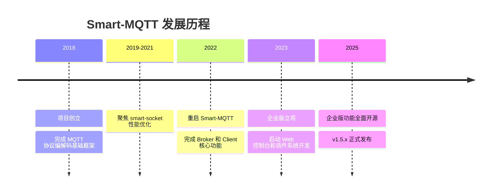

# Smart-MQTT

<p align="center">
  <a href="LICENSE"></a>
  <a href="https://gitee.com/smartboot/smart-mqtt/releases"></a>
  <a href="https://hub.docker.com/r/smartboot/smart-mqtt"></a>
  <a href="https://smartboot.tech/smart-mqtt/"></a>
</p>

<p align="center">
  <b>高性能、插件化的企业级 MQTT Broker</b><br>
  单机支持百万连接，千万级消息吞吐
</p>

---

## 简介

Smart-MQTT 是一款面向企业级物联网场景的高性能 MQTT Broker，采用 Java 语言开发，基于自研的异步非阻塞通信框架 [smart-socket](https://gitee.com/smartboot/smart-socket)，完整实现了 MQTT v3.1.1 和 v5.0 协议规范。


### 核心优势

- **超高性能** - 单机百万级并发连接，千万级消息吞吐
- **插件架构** - 模块化设计，按需扩展功能
- **Java 生态** - 与现有 Java 技术栈零门槛集成
- **标准兼容** - 完整遵循 MQTT 3.1.1/5.0 协议标准

> ⚠️ **授权声明**：Smart-MQTT 仅供个人学习使用，**未经授权禁止用于商业目的**。商业授权请联系 [smartboot 官网](https://smartboot.tech/)。

---

## 快速开始

### Docker 部署（推荐）

```bash
docker run --name smart-mqtt \
  -p 1883:1883 \
  -p 18083:18083 \
  -e ENTERPRISE_ENABLE=true \
  -d smartboot/smart-mqtt:latest
```

- `1883` - MQTT 服务端口
- `18083` - Web 控制台（默认账号/密码：smart-mqtt / smart-mqtt）

### 本地部署

```bash
# 下载并解压
curl -LO https://gitee.com/smartboot/smart-mqtt/releases/download/v1.5.3/smart-mqtt-full-v1.5.3.zip
unzip smart-mqtt-full-v1.5.3.zip && cd smart-mqtt-full-v1.5.3

# 启动服务
./bin/start.sh
```

---

## 核心特性

| 特性 | 说明 |
|------|------|
| 极致轻量 | 发行包体积小于 800KB，极少外部依赖 |
| 高性能低延迟 | 异步非阻塞 I/O，单机支持百万连接 |
| 零配置启动 | 开箱即用，无需复杂配置 |
| 完整协议支持 | MQTT v3.1.1 和 v5.0，支持 QoS 0/1/2 |
| 集群高可用 | 支持多节点集群，负载均衡和故障转移 |
| 热插拔插件 | 动态加载、启动和停止，无需重启服务 |

---

## 性能指标

| 测试场景 | QoS 0 | QoS 1 | QoS 2 |
|---------|:-----:|:-----:|:-----:|
| 消息订阅 | 1000 万/秒 | 540 万/秒 | 320 万/秒 |
| 消息发布 | 97 万/秒 | 63 万/秒 | 52 万/秒 |

**测试环境**：Intel Xeon E5-2680 v4, 64GB DDR4, CentOS 7.9

---

## 插件生态

Smart-MQTT 采用插件化架构，通过 `enterprise-plugin` 提供企业级 Web 管理控制台。

| 插件 | 功能 | 推荐场景 |
|------|------|----------|
| **enterprise-plugin** | Web 控制台、RESTful API、用户管理 | 生产环境必装 |
| **cluster-plugin** | 多节点集群、负载均衡、节点发现 | 高可用部署 |
| **websocket-plugin** | WebSocket 协议支持 | Web 应用 |
| **mqtts-plugin** | SSL/TLS 加密通信 | 安全敏感场景 |
| **redis-bridge-plugin** | 消息桥接至 Redis | 缓存集成 |
| **simple-auth-plugin** | 用户名/密码认证、ACL 权限控制 | 基础认证 |

---

## 项目历程



---

## 文档与资源

- 📚 [官方文档](https://smartboot.tech/smart-mqtt/) - 完整的使用文档和 API 参考
- 🖥️ [在线演示](http://115.190.30.166:8083/) - 账号/密码：smart-mqtt / smart-mqtt
- 🐛 [问题反馈](https://gitee.com/smartboot/smart-mqtt/issues) - Gitee Issues

---

<p align="center">
  License: <b>AGPL-3.0</b> | 
  <a href="https://smartboot.tech/">smartboot 官网</a> |
  <a href="README.md">🇺🇸 English</a>
</p>
