# 事件总线

smart-mqtt 所有的数据、服务都是依托于事件总线驱动的。数据总线造就了 smart-mqtt 极具灵活的扩展性，熟练掌握并运用该特性可以轻松应对各类复杂的场景需求。



## 接口设计

从消息总线的接口设计可以看出，它的运作原理就是经典的生产/消费模型。

```java
public interface EventBus {

    <T> void subscribe(EventType<T> type, EventBusSubscriber<T> subscriber);

    <T> void subscribe(List<EventType<T>> types, EventBusSubscriber<T> subscriber);

    <T> void publish(EventType<T> eventType, T object);
}
```

其中 `EventBus#publish` 已被安插在各个恰当的位置，当发生相应事件的时候会由 smart-mqtt 框架自动触发。

为了实现 MQTT Broker 的基础功能，smart-mqtt 已经通过 `EventBus#subscribe` 订阅了部分事件。

当然，当你[开发插件](/smart-mqtt/development/plugin/)的时候，也可以通过订阅关注的事件实现自己想要的功能。但在此之前，最好先了解下各个事件类型的特性及触发条件。

## 事件类型

### 接收消息（RECEIVE_MESSAGE）

**触发条件**：完成 MQTT 消息解码，并即将进行消息处理时。

**使用场景**：
- 消息审计日志
- 消息内容分析
- 自定义消息过滤

```java
brokerContext.getEventBus().subscribe(EventType.RECEIVE_MESSAGE, event -> {
    MqttMessage message = event.getObject();
    // 处理接收到的消息
});
```

### 输出消息（WRITE_MESSAGE）

**触发条件**：即将往 TCP 通道发送一条消息。

**使用场景**：
- 消息发送统计
- 消息加密/解密
- 流量控制

### Broker 启动服务（BROKER_STARTED）

**触发条件**：Broker 服务完成初始化，并启动成功。

**使用场景**：
- 初始化插件资源
- 启动辅助线程
- 注册外部服务

```java
brokerContext.getEventBus().subscribe(EventType.BROKER_STARTED, event -> {
    // Broker 已启动，可以执行初始化操作
    System.out.println("Broker started successfully!");
});
```

### Broker 停止服务（BROKER_DESTROY）

**触发条件**：Broker 停止服务。

**使用场景**：
- 释放资源
- 保存状态
- 通知外部系统

### CONNECT

**触发条件**：客户端发送的 ConnectMessage 认证通过。

**使用场景**：
- 连接数统计
- 客户端上线通知
- 连接日志记录

```java
brokerContext.getEventBus().subscribe(EventType.CONNECT, event -> {
    MqttSession session = event.getObject();
    System.out.println("Client connected: " + session.getClientId());
});
```

### DISCONNECT

**触发条件**：客户端与 Broker 的 TCP 连接断开。

**使用场景**：
- 连接数统计
- 客户端下线通知
- 清理客户端相关资源

### 会话初始化（SESSION_CREATE）

**触发条件**：建立了新的 TCP 连接，并完成 MQTT Session 初始化。

**与 CONNECT 的区别**：
- `SESSION_CREATE`：TCP 连接建立，Session 初始化完成
- `CONNECT`：MQTT 连接认证通过

### 创建 Topic 实例（TOPIC_CREATE）

**触发条件**：Broker 接收到一个新的 Topic 订阅。

**使用场景**：
- Topic 数量监控
- 动态 Topic 权限控制

### 订阅 Topic（SUBSCRIBE_TOPIC）

**触发条件**：客户端连接订阅了某个 Topic。

**使用场景**：
- 订阅关系统计
- 动态消息路由

```java
brokerContext.getEventBus().subscribe(EventType.SUBSCRIBE_TOPIC, event -> {
    SubscribeTopicEvent subscribeEvent = event.getObject();
    String clientId = subscribeEvent.getSession().getClientId();
    String topic = subscribeEvent.getTopic().getTopic();
    System.out.println("Client " + clientId + " subscribed to " + topic);
});
```

### 取消订阅 Topic（UNSUBSCRIBE_TOPIC）

**触发条件**：当 Topic 订阅关系解除时触发。

### 接收发布消息（RECEIVE_PUBLISH_MESSAGE）

**触发条件**：Broker 收到来自客户端发送的 PublishMessage。

**使用场景**：
- 消息持久化
- 消息桥接
- 消息分析

```java
brokerContext.getEventBus().subscribe(EventType.RECEIVE_PUBLISH_MESSAGE, event -> {
    MqttPublishMessage message = event.getObject();
    String topic = message.getTopic();
    byte[] payload = message.getPayload();
    // 处理消息，例如转发到 Redis/Kafka
});
```

### 推送发布消息（PUSH_PUBLISH_MESSAGE）

**触发条件**：Broker 向某个客户端连接推送一次订阅的消息。

**使用场景**：
- 消息推送统计
- 推送失败处理

## 事件处理模式

### 同步处理

默认情况下，事件处理是同步的，即发布者会等待订阅者处理完成后才继续执行。

```java
brokerContext.getEventBus().subscribe(EventType.CONNECT, event -> {
    // 同步处理，可能会阻塞发布线程
    doSomething(event.getObject());
});
```

### 异步处理

如果事件处理逻辑较重，建议采用异步方式：

```java
brokerContext.getEventBus().subscribe(EventType.RECEIVE_PUBLISH_MESSAGE, event -> {
    // 提交到线程池异步处理
    threadPool.submit(() -> {
        processMessage(event.getObject());
    });
});
```

### 条件订阅

可以通过条件判断来决定是否处理事件：

```java
brokerContext.getEventBus().subscribe(EventType.RECEIVE_PUBLISH_MESSAGE, event -> {
    MqttPublishMessage message = event.getObject();
    // 只处理特定 Topic 的消息
    if (message.getTopic().startsWith("sensor/")) {
        processSensorData(message);
    }
});
```

## 最佳实践

1. **轻量快速**：事件处理应尽可能快速完成，避免阻塞事件总线
2. **异常处理**：事件处理中的异常不应影响其他订阅者和 Broker 运行
3. **资源管理**：在 `BROKER_DESTROY` 事件中释放所有资源
4. **避免循环**：注意事件处理中不要触发同类事件，造成无限循环
5. **线程安全**：事件可能在多线程环境下触发，确保处理逻辑线程安全

## 完整示例

以下是一个完整的插件示例，展示如何使用事件总线实现客户端连接监控：

```java
public class ConnectionMonitorPlugin extends Plugin {
    
    private final AtomicInteger connectionCount = new AtomicInteger(0);
    private final Set<String> connectedClients = ConcurrentHashMap.newKeySet();
    
    @Override
    public void install(BrokerContext brokerContext) {
        // 监听连接事件
        brokerContext.getEventBus().subscribe(EventType.CONNECT, event -> {
            MqttSession session = event.getObject();
            connectedClients.add(session.getClientId());
            int count = connectionCount.incrementAndGet();
            System.out.println("Client connected: " + session.getClientId() 
                + ", Total connections: " + count);
        });
        
        // 监听断开连接事件
        brokerContext.getEventBus().subscribe(EventType.DISCONNECT, event -> {
            MqttSession session = event.getObject();
            connectedClients.remove(session.getClientId());
            int count = connectionCount.decrementAndGet();
            System.out.println("Client disconnected: " + session.getClientId() 
                + ", Total connections: " + count);
        });
    }
    
    @Override
    public void uninstall() {
        // 清理资源
        connectedClients.clear();
    }
    
    @Override
    public String pluginName() {
        return "ConnectionMonitorPlugin";
    }
}
```

## 更多事件类型

smart-mqtt 还提供了更多事件类型供开发者使用：

| 事件类型 | 说明 |
|---------|------|
| `SUBSCRIBE_ACCEPT` | Topic 订阅被接受 |
| `UNSUBSCRIBE_ACCEPT` | Topic 取消订阅被接受 |
| `CONNACK` | 发送连接响应 |
| `BROKER_CONFIGURE_LOADED` | 配置文件加载完成 |

完整的事件类型列表可以在 `EventType` 类中查看。