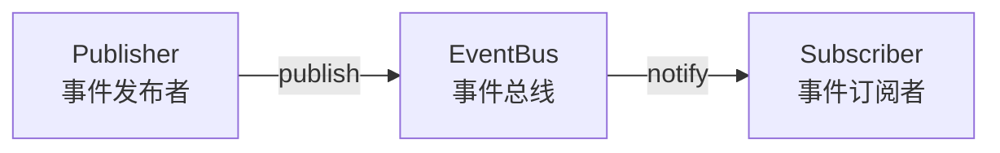
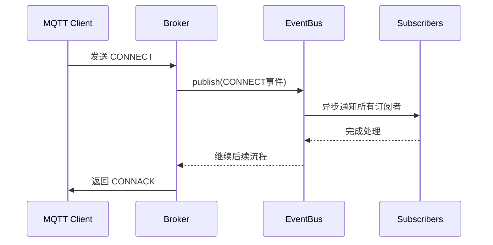

smart-mqtt 的事件总线是整个框架的核心组件，采用经典的生产/消费模型实现。所有 MQTT 消息处理、连接管理、订阅管理等都通过事件总线驱动，这为开发者提供了极强的扩展能力。


## 架构原理

### 核心模型

事件总线采用 **发布-订阅模式（Pub/Sub）**，由三个核心角色组成：



- **Publisher（发布者）**：在特定时机触发事件，如连接建立、消息接收等
- **EventBus（事件总线）**：负责事件的注册、分发和路由
- **Subscriber（订阅者）**：监听感兴趣的事件并执行相应处理逻辑

### 事件流转机制



事件总线支持**同步**和**异步**两种发布模式：

| 模式 | 特点 | 适用场景 |
|-----|------|---------|
| **同步模式** | 发布者阻塞等待所有订阅者处理完成 | 简单、快速的逻辑处理 |
| **异步模式** | 基于 CompletableFuture 链式处理 | 耗时操作（如认证、日志记录） |

## 事件类型列表

smart-mqtt 内置了丰富的事件类型，覆盖 Broker 生命周期的各个阶段：

### Broker 生命周期事件

| 事件类型 | 触发时机 | 数据对象 | 特性 |
|---------|---------|---------|------|
| `BROKER_CONFIGURE_LOADED` | Broker 配置加载完成时 | `Options` | 一次性事件 |
| `BROKER_STARTED` | Broker 启动成功时 | `BrokerContext` | 一次性事件 |
| `BROKER_DESTROY` | Broker 停止服务时 | `BrokerContext` | 一次性事件 |

**使用场景**：插件初始化、资源准备、优雅关闭等。

### 连接管理事件

| 事件类型 | 触发时机 | 数据对象 | 说明 |
|---------|---------|---------|------|
| `SESSION_CREATE` | TCP 连接建立，Session 初始化完成 | `MqttSession` | 连接建立但尚未认证 |
| `CONNECT` | 客户端 CONNECT 消息认证通过 | `AsyncEventObject<MqttConnectMessage>` | 异步事件，支持拦截 |
| `DISCONNECT` | TCP 连接断开时 | `AbstractSession` | 包含正常断开和异常断开 |

**SESSION_CREATE vs CONNECT 的区别**：
- `SESSION_CREATE`：仅表示 TCP 连接建立，MQTT Session 对象已创建
- `CONNECT`：表示 MQTT 连接认证通过，客户端可以开始正常通信

### 消息收发事件

| 事件类型 | 触发时机 | 数据对象 | 说明 |
|---------|---------|---------|------|
| `RECEIVE_MESSAGE` | 接收到客户端任何消息时 | `EventObject<MqttMessage>` | 高性能优化，独立存储 |
| `WRITE_MESSAGE` | 向客户端发送任何消息时 | `EventObject<MqttMessage>` | 高性能优化，独立存储 |
| `RECEIVE_CONN_ACK_MESSAGE` | 接收到 CONNACK 消息时 | `MqttConnAckMessage` | 客户端模式使用 |

**性能优化**：`RECEIVE_MESSAGE` 和 `WRITE_MESSAGE` 是高频事件，框架使用独立的 `CopyOnWriteArrayList` 存储订阅者，并做了空检查优化，无订阅者时零开销。

### Topic 管理事件

| 事件类型 | 触发时机 | 数据对象 | 说明 |
|---------|---------|---------|------|
| `TOPIC_CREATE` | 新 Topic 被创建时 | `String`（Topic名称） | 首次订阅触发 |
| `SUBSCRIBE_ACCEPT` | 服务端接受订阅请求时 | `EventObject<MqttTopicSubscription>` | 验证通过后触发 |
| `UNSUBSCRIBE_ACCEPT` | 服务端接受取消订阅时 | `EventObject<MqttUnsubscribeMessage>` | 验证通过后触发 |
| `SUBSCRIBE_TOPIC` | 客户端订阅 Topic 成功时 | `EventObject<MessageDeliver>` | 建立订阅关系后触发 |
| `UNSUBSCRIBE_TOPIC` | 客户端取消订阅 Topic 时 | `MessageDeliver` | 解除订阅关系时触发 |
| `SUBSCRIBE_REFRESH_TOPIC` | 刷新 Topic 订阅时 | `MessageDeliver` | 会话恢复时触发 |

**事件触发顺序**：
```
客户端发送 SUBSCRIBE
    ↓
SUBSCRIBE_ACCEPT（验证通过）
    ↓
TOPIC_CREATE（如果是新Topic）
    ↓
SUBSCRIBE_TOPIC（建立订阅关系）
```

### 一次性事件说明

标记为 **一次性事件**（`once=true`）的类型，其订阅者只会被执行一次，之后自动失效。这适用于初始化操作：

```java
// BROKER_STARTED 只会在 Broker 启动完成后触发一次
brokerContext.getEventBus().subscribe(EventType.BROKER_STARTED, (eventType, context) -> {
    // 执行一次性初始化操作
    initializePlugin();
});
```

## 使用示例

### 基本订阅

订阅客户端连接事件，统计在线连接数：

```java
AtomicInteger connectionCount = new AtomicInteger(0);

// CONNECT 是异步事件，需要使用 syncConsumer 包装
brokerContext.getEventBus().subscribe(EventType.CONNECT, 
    AsyncEventObject.syncConsumer((eventType, event) -> {
        MqttSession session = event.getSession();
        int count = connectionCount.incrementAndGet();
        System.out.println("Client " + session.getClientId() + " connected, total: " + count);
        event.getFuture().complete(null); // 完成异步处理
    })
);

// DISCONNECT 是同步事件
brokerContext.getEventBus().subscribe(EventType.DISCONNECT, (eventType, session) -> {
    int count = connectionCount.decrementAndGet();
    System.out.println("Client " + session.getClientId() + " disconnected, total: " + count);
});
```

### 消息审计日志

记录所有收发的消息：

```java
// 接收消息
brokerContext.getEventBus().subscribe(EventType.RECEIVE_MESSAGE, (eventType, event) -> {
    MqttMessage message = event.getObject();
    MqttSession session = event.getSession();
    logger.info("[RECV] client={}, message={}", session.getClientId(), message);
});

// 发送消息
brokerContext.getEventBus().subscribe(EventType.WRITE_MESSAGE, (eventType, event) -> {
    MqttMessage message = event.getObject();
    MqttSession session = event.getSession();
    logger.info("[SEND] client={}, message={}", session.getClientId(), message);
});
```

### 一次性初始化

在 Broker 启动时执行插件初始化：

```java
brokerContext.getEventBus().subscribe(EventType.BROKER_STARTED, 
    new DisposableEventBusSubscriber<BrokerContext>() {
        @Override
        public void consumer(EventType<BrokerContext> eventType, BrokerContext context) {
            // 只执行一次：初始化数据库连接、启动后台线程等
            plugin.initDatabase();
            plugin.startBackgroundTask();
        }
    }
);
```

### 资源释放

在 Broker 停止时释放资源：

```java
brokerContext.getEventBus().subscribe(EventType.BROKER_DESTROY, (eventType, context) -> {
    // 关闭线程池
    executorService.shutdown();
    // 关闭数据库连接
    database.close();
    // 清理临时文件
    cleanupTempFiles();
});
```

## 自定义事件

插件可以定义自己的事件类型，用于模块间通信：

```java
public class MyPlugin extends Plugin {
    // 定义自定义事件类型
    public static final EventType<MyCustomData> CUSTOM_EVENT = 
        new EventType<>("my_custom_event");

    @Override
    public void install(BrokerContext context) {
        // 订阅自定义事件
        context.getEventBus().subscribe(CUSTOM_EVENT, (eventType, data) -> {
            handleCustomEvent(data);
        });
    }

    private void someMethod() {
        // 触发自定义事件
        brokerContext.getEventBus().publish(CUSTOM_EVENT, myData);
    }
}
```

## 最佳实践

### 1. 选择合适的订阅模式

- **同步订阅**：处理逻辑简单、耗时短（< 1ms）的场景
- **异步订阅**：涉及 I/O 操作（数据库、网络请求）的场景，避免阻塞 Broker

### 2. 异常处理

订阅者内部的异常不应影响其他订阅者和 Broker 运行：

```java
brokerContext.getEventBus().subscribe(EventType.RECEIVE_MESSAGE, (eventType, event) -> {
    try {
        processMessage(event.getObject());
    } catch (Exception e) {
        logger.error("Process message failed", e);
        // 不要抛出异常
    }
});
```

### 3. 性能考虑

- 避免在 `RECEIVE_MESSAGE` 和 `WRITE_MESSAGE` 事件中进行耗时操作
- 如需处理，使用异步模式或将任务提交到独立的线程池
- 高频事件的订阅者应尽量轻量化

### 4. 线程安全

事件可能在多线程环境下触发，确保订阅者逻辑线程安全：

```java
// 使用线程安全的计数器
private final LongAdder messageCount = new LongAdder();

brokerContext.getEventBus().subscribe(EventType.RECEIVE_MESSAGE, (eventType, event) -> {
    messageCount.increment(); // 线程安全
});
```

### 5. 资源管理

- 在 `BROKER_STARTED` 中初始化资源
- 在 `BROKER_DESTROY` 中释放资源
- 避免内存泄漏：确保及时取消不再需要的事件订阅