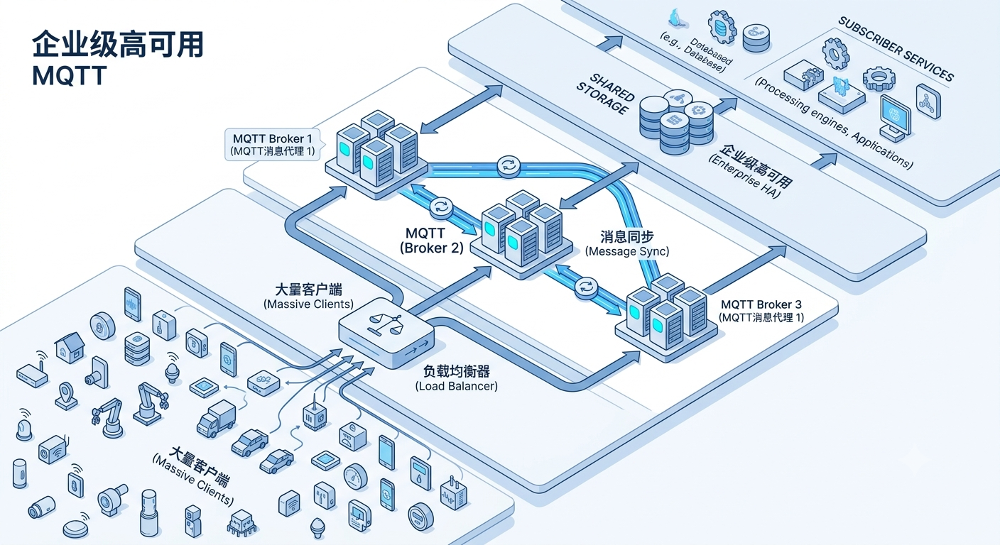
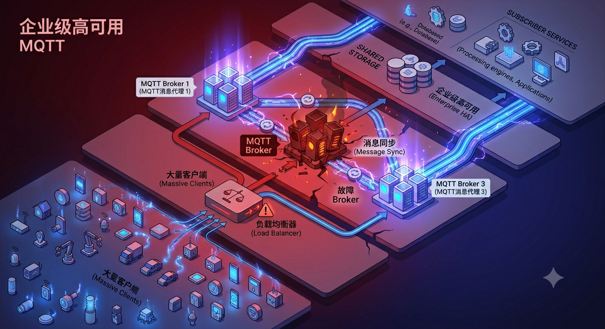
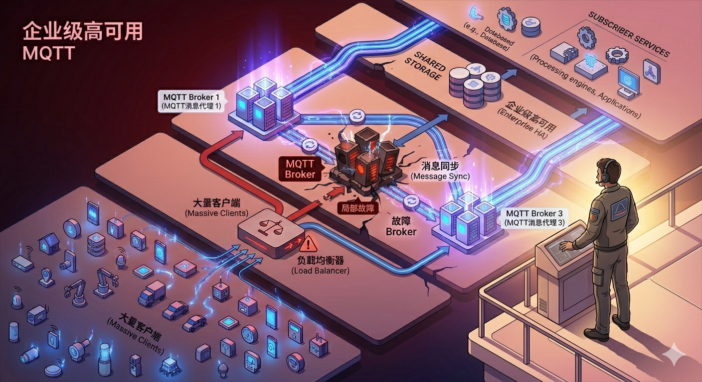

在维护 smart-mqtt 的这些年里，经常会有人问：

> “**这个 Broker 单机能支撑多少连接？**”

说实话，这并不是一个容易回答的问题。

因为不同业务场景、不同硬件配置，最终结果都不一样。

但前段时间，一位来自国内头部车企的技术人员提出的另一个问题，却让我印象更加深刻。

## 「单机已经够用了，但我们还是要做集群」

在沟通中，我询问了他们的业务规模。

对方回复：

> **大概几万，单机也能轻松顶住，只不过有单点故障问题。**

紧接着，他又补充了一句：

> **我们这边有高可用部署要求。**


这句话让我意识到：
**对于真正的生产系统而言，性能往往只是工程问题，而高可用才是业务问题。**

如果 Broker 所在服务器突然宕机怎么办？

如果系统升级需要重启服务怎么办？

如果某个节点异常退出，正在运行的业务是否会受到影响？

这些问题，远比「单机能扛多少连接」更加重要。

于是，我决定在本地完整复现这样一套高可用架构，并亲自验证：

> **当 Broker 真正发生故障时，smart-mqtt 是否还能正常工作？**

---

## 那些提前做的准备，终究会派上用场

其实，这次验证并没有让我感到特别意外。

因为在设计 [cluster-plugin](/smart-mqtt/plugins/cluster-plugin/) 的时候，我就一直在思考一个问题：

> 如果未来 smart-mqtt 被用于企业生产环境，他们最先遇到的问题会是什么？

答案并不是性能。

而是高可用。

设备连接到不同 Broker 后，消息如何跨节点投递？

节点发生故障后，业务如何持续运行？

如何在不停机的情况下完成系统升级？

正是基于这些预判，smart-mqtt 在设计之初便预留了集群扩展能力，并最终演化出了 `cluster-plugin`。

当初，它更像是一份面向未来的准备。

而这次来自车企的真实需求，也让我意识到：

> **那些曾经看似“暂时用不上”的设计，终究会在某个时刻体现出价值。**

---

## 真正的 MQTT 集群，不只是多启动几个 Broker



为了模拟实际生产环境，我在本地搭建了如下环境：

- 3 个 smart-mqtt Broker 节点；
- 1 个 HAProxy 负载均衡实例；
- 多个 MQTTX 客户端。

整体架构如下：

```text
                     MQTT Client
                           │
                           ▼
                    SLB / HAProxy
                           │
                  ┌────────┼────────┐
                  ▼        ▼        ▼
               Broker   Broker   Broker
                  ╲        │        ╱
                   ╲       │       ╱
                    cluster-plugin
```

需要说明的是：

生产环境中通常会使用云厂商提供的 SLB，本次实验采用 HAProxy，仅用于本地模拟负载均衡能力。

很多人第一次接触 MQTT 集群时，会误以为：

> 只要前面加一个负载均衡，后面多部署几个 Broker，就完成了集群。

但事实并非如此。

假设：

- Client-A 连接到 Broker-1，并订阅 `car/+/status`；
- Client-B 连接到 Broker-2，并发布 `car/001/status`。

如果 Broker 之间彼此独立，那么 Broker-2 根本不知道 Broker-1 上存在匹配的订阅关系。

最终结果就是：

> **Client-A 将无法收到 Client-B 发布的消息。**

因此，一个真正可用的 MQTT 集群，需要同时具备两种能力：

- **连接高可用；**
- **消息高可用。**

其中：

- HAProxy（SLB）负责客户端接入；
- cluster-plugin 负责跨节点消息同步。

换句话说：

> **SLB 负责把客户端送进来，而 cluster-plugin 负责把消息送过去。**

---

## 让三个“孤岛”真正成为集群

为了保证实验的可复现性，我将本次验证所使用的 `docker-compose.yaml` 和 `haproxy.cfg` 提交到了 smart-mqtt 官方仓库。

通过 Docker Compose，可以快速启动三个独立运行的 Broker 节点。

但此时，它们仍然是彼此独立的“孤岛”。

接下来，需要分别登录各 Broker 管理后台，启用 `cluster-plugin`。

由于本次实验运行于 Docker 内部网络，因此各节点可以直接通过容器名称进行通信。

完成配置并点击「保存并生效」后，各 Broker 节点之间便会建立集群连接。

至此，三个独立节点正式组成一个 MQTT 集群。

---

## 真正的考验：拔掉一个 Broker

环境准备完成后，我通过 MQTTX 创建多个客户端连接。

由于 HAProxy 会自动分发连接，这些客户端被均衡到了不同的 Broker 节点。

此时，整个系统看起来一切正常。

但真正的高可用，从来不是在一切正常的时候表现良好。

而是在故障发生时，依然能够持续提供服务。



于是，我执行了这样一条命令：

```bash
docker restart mqtt-broker-1
```

模拟生产环境中 Broker 节点异常退出的场景。

接下来的几秒钟里：

- HAProxy 自动识别故障节点；
- 新连接不再进入 Broker-1；
- MQTT 客户端依赖自动重连机制恢复连接；
- cluster-plugin 持续完成跨节点消息投递；
- 其他 Broker 节点继续提供服务。

待 Broker-1 恢复后，又重新加入了整个集群。

整个过程中，业务并未因为单个节点的故障而整体中断。

---

## 高可用，比性能更重要

这次验证让我更加确信：

对于企业用户而言，MQTT Broker 的价值不仅仅体现在性能指标上。

事实上，几万级连接对于现代 Broker 来说并不是特别困难的挑战。

真正决定其能否进入生产环境的，是面对故障时的表现。

当某个节点突然下线时：

- 业务是否会中断？
- 客户端是否能够恢复？
- 消息是否仍然能够正确送达？

这些问题，往往比「单机能支撑多少连接」更加重要。

---

## 写在最后

正如那位车企用户所说：

> “单机也能轻松顶住，只不过有单点故障问题。”

我想，这也是很多企业在推进 MQTT 落地时都会遇到的问题。

性能决定系统的上限。

而高可用，则决定系统能否真正承载业务。




做开源项目有时候就是这样。

很多能力在诞生的时候，未必有明确的使用场景。

但只要方向是正确的，总会在某个时刻，遇到真正需要它的人。

而对于 smart-mqtt 来说，`cluster-plugin` 的存在，或许正是这样一件提前做好的准备。

希望这次验证过程，能够为正在评估 MQTT 高可用方案的团队提供一些参考。

因为真正值得信赖的系统，不是在一切正常时运行良好，而是在故障发生时，依然保持可用。

---
如果你的团队正在评估 MQTT 技术选型，或者面临高可用、集群部署、性能优化等问题，也欢迎与我们交流。


扫描微信二维码备注：`smart-mqtt` 可加入 smartboot 社群。（PS：`若无备注将拒绝好友申请`）
