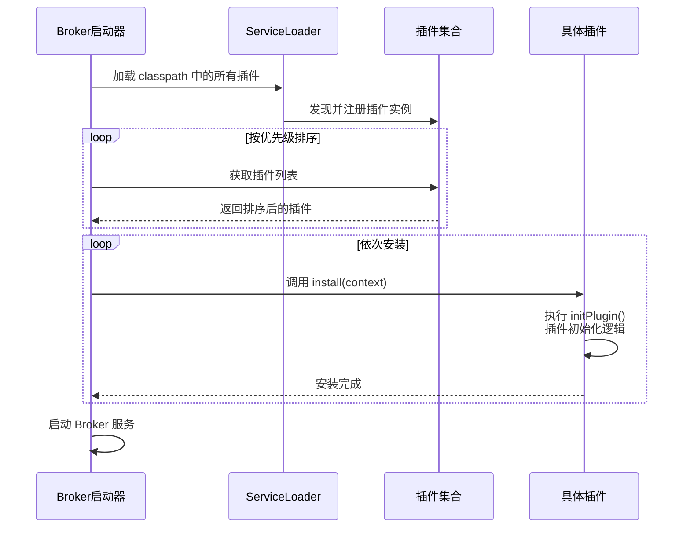
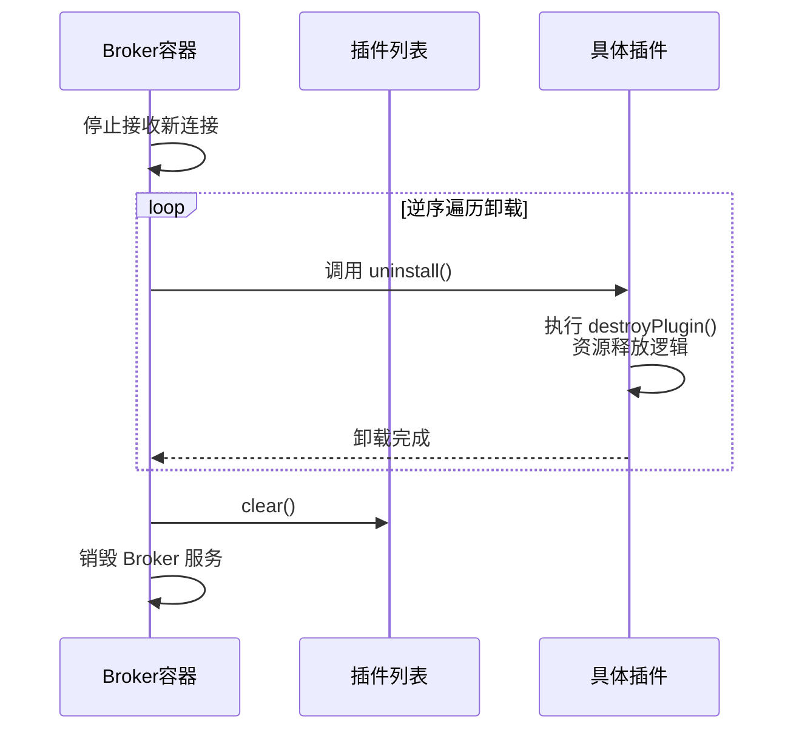

smart-mqtt 是一款非常开放的产品，在满足基本 MQTT 服务的同时，还能基于其插件化的能力衍生出多样化的功能，例如：服务指标统计、集群服务、数据路由等。

smart-mqtt 企业版的几乎每项特性都是一个插件，并且插件与插件之间各自独立自治。

在[事件总线](/smart-mqtt/development/eventbus/)章节中为大家展示了相对细致的 smart-mqtt 内部架构。但如果从**插件**视角重新审视 smart-mqtt，则会是另外一番景象（见下图）。


通过订阅事件总线上不同类型的事件，并配套不同的实现策略，可以实现很多实用的功能。当然，你也可以完全脱离事件总线做一些有意思的插件，譬如：插件的热插拔、Broker服务动态启停等。

## 工作原理

我们会持续为企业用户提供丰富且实用性的插件，同时也鼓励具备研发能力的企业通过自研插件支撑业务上需求。

或许在将来，我们会考虑建设一个插件市场，为企业自研的插件提供一个展示、分享的平台，让优质的作品可以惠及全行业。

### 启动流程

插件，在 smart-mqtt 中的侵入性是非常低的。如果结合代码的话，你应该能在几分钟内完全掌握它的精髓。



上图为 smart-mqtt 服务启动的完整流程，插件处于其中间环节。插件的启动分为两个步骤：

1. 通过 `ServiceLoader` 的方式加载 `classpath` 内的所有插件实例
2. 按插件的优先级进行排序，再执行 `install` 方法安装启用插件

```java
private void loadAndInstallPlugins() throws Throwable {
    for (Plugin plugin : ServiceLoader.load(Plugin.class, BrokerContextImpl.class.getClassLoader())) {
        System.out.println("load plugin: " + plugin.pluginName());
        plugins.add(plugin);
    }
    // 安装插件
    plugins.sort(Comparator.comparingInt(Plugin::order));
    for (Plugin plugin : plugins) {
        System.out.println("install plugin: " + plugin.pluginName());
        plugin.install(this);
    }
}
```

:::tip
只要遵循 ServiceLoader 模式开发的插件，都能非常轻松的自动扫描并加载进来。
:::

### 退出流程

卸载插件，是 smart-mqtt Broker 停止服务的一个必经过程，以此保证服务的优雅退出和资源的充分释放。



实现的代码如下：

```java
plugins.forEach(Plugin::uninstall);
plugins.clear();
```

## 演示示例

### 1. 创建插件项目

创建一个插件项目，JDK 为 1.8 的 Maven 工程。


### 2. 引入依赖

引入 smart-mqtt-broker 的 maven 依赖和 `build` 插件。

```xml
<dependencies>
    <dependency>
        <groupId>org.smartboot.mqtt</groupId>
        <artifactId>smart-mqtt-broker</artifactId>
        <version>1.5.0</version>
    </dependency>
</dependencies>

<build>
    <plugins>
        <plugin>
            <groupId>org.apache.maven.plugins</groupId>
            <artifactId>maven-compiler-plugin</artifactId>
            <version>3.10.1</version>
            <configuration>
                <source>1.8</source>
                <target>1.8</target>
                <debug>false</debug>
            </configuration>
        </plugin>
        <plugin>
            <artifactId>maven-shade-plugin</artifactId>
            <version>3.3.0</version>
            <executions>
                <execution>
                    <phase>package</phase>
                    <goals>
                        <goal>shade</goal>
                    </goals>
                    <configuration>
                        <createDependencyReducedPom>false</createDependencyReducedPom>
                        <transformers>
                            <!-- 采用追加的方式 -->
                            <transformer implementation="org.apache.maven.plugins.shade.resource.AppendingTransformer">
                                <resource>META-INF/services/tech.smartboot.mqtt.plugin.spec.Plugin</resource>
                            </transformer>
                        </transformers>
                    </configuration>
                </execution>
            </executions>
        </plugin>
    </plugins>
</build>
```

:::caution[重要]
`maven-shade-plugin` 插件中的 `AppendingTransformer` 配置非常重要，它确保了当多个插件同时存在时，ServiceLoader 能够正确加载所有插件。
:::

### 3. 编写插件代码

在 `resources/META-INF/services` 目录下创建名为 `tech.smartboot.mqtt.plugin.spec.Plugin` 的文件，内容为插件实现类的全限定名。

```
tech.smartboot.mqtt.plugin.demo.DemoPlugin
```

创建插件实现类：

```java
package tech.smartboot.mqtt.plugin.demo;

import tech.smartboot.mqtt.plugin.spec.BrokerContext;
import tech.smartboot.mqtt.plugin.spec.Options;
import tech.smartboot.mqtt.plugin.spec.Plugin;

public class DemoPlugin extends Plugin {

    @Override
    protected void initPlugin(BrokerContext brokerContext) throws Throwable {
        System.out.println("DemoPlugin initialized!");
        // 在这里编写插件初始化逻辑
        // 例如：订阅事件、注册服务、启动线程等
    }

    @Override
    protected void destroyPlugin() {
        System.out.println("DemoPlugin destroyed!");
        // 在这里编写插件卸载逻辑
        // 例如：释放资源、停止线程等
    }

    @Override
    public String pluginName() {
        return "DemoPlugin";
    }

    @Override
    public String getVersion() {
        return "1.0.0";
    }

    @Override
    public String getVendor() {
        return "Your Company";
    }

    @Override
    public int order() {
        // 插件加载顺序，值越小优先级越高
        return 0;
    }
}
```

:::tip[提示]
- `install()` 和 `uninstall()` 方法是 `final` 的，子类不能重写。
- 需要在 `initPlugin()` 中编写初始化逻辑，在 `destroyPlugin()` 中编写资源释放逻辑。
- `getVersion()` 和 `getVendor()` 是抽象方法，必须实现。
:::

### 4. 打包与部署

运行 `mvn clean package` 打包插件，将生成的 jar 文件放入 smart-mqtt 的 `plugins` 目录下，重启服务即可生效。

## 常用插件类型

### 认证插件

实现自定义的客户端认证逻辑：

```java
@Override
protected void initPlugin(BrokerContext brokerContext) {
    brokerContext.getProviders().setAuthenticationValidator((client, username, password) -> {
        // 自定义认证逻辑
        return "admin".equals(username) && "123456".equals(password);
    });
}
```

### 消息桥接插件

将 MQTT 消息转发到其他系统：

```java
@Override
protected void initPlugin(BrokerContext brokerContext) {
    // 订阅消息接收事件
    brokerContext.getEventBus().subscribe(EventType.RECEIVE_PUBLISH_MESSAGE, event -> {
        MqttPublishMessage message = event.getObject();
        // 将消息发送到 Redis、Kafka 等
    });
}
```

### 监控插件

收集和上报服务指标：

```java
@Override
protected void initPlugin(BrokerContext brokerContext) {
    // 定时上报指标
    ScheduledExecutorService scheduler = Executors.newSingleThreadScheduledExecutor();
    scheduler.scheduleAtFixedRate(() -> {
        // 收集连接数、消息量等指标
    }, 0, 60, TimeUnit.SECONDS);
}
```

## 插件配置

### 配置文件

插件支持通过 `plugin.yaml` 文件进行配置，放置在插件的存储目录中。

```java
@Override
protected void initPlugin(BrokerContext brokerContext) throws Throwable {
    // 加载插件配置
    PluginConfig config = loadPluginConfig(PluginConfig.class);
    if (config != null) {
        System.out.println("Server URL: " + config.getServerUrl());
    }
}
```

配置类定义：

```java
public class PluginConfig {
    private String serverUrl;
    private int timeout;
    // getter/setter
}
```

### 配置可视化（Schema）

插件可以通过重写 `schema()` 方法，定义配置项的可视化表单，便于在控制台中动态配置。

```java
import tech.smartboot.mqtt.plugin.spec.schema.Item;
import tech.smartboot.mqtt.plugin.spec.schema.Schema;

@Override
public Schema schema() {
    Schema schema = new Schema();
    // 添加字符串类型配置项
    schema.addItem(Item.String("host", "服务监听地址").col(6));
    // 添加整数类型配置项
    schema.addItem(Item.Int("port", "服务监听端口").col(6));
    // 添加密码类型配置项
    schema.addItem(Item.Password("password", "访问密码"));
    // 添加文本域配置项
    schema.addItem(Item.TextArea("pem", "证书内容").height(400));
    return schema;
}
```

支持的配置项类型：

| 类型 | 说明 | 示例 |
|------|------|------|
| `string` | 普通文本输入 | `Item.String("name", "名称")` |
| `int` | 整数输入 | `Item.Int("port", "端口")` |
| `password` | 密码输入（隐藏内容） | `Item.Password("pwd", "密码")` |
| `textarea` | 多行文本输入 | `Item.TextArea("content", "内容")` |
| `object` | 对象类型（可嵌套子项） | `Item.Object("server", "服务器配置")` |

:::tip[提示]
- 使用 `.col(n)` 设置表单项的列宽（将一行分为12列）
- 使用 `.height(n)` 设置文本域的高度
- 使用 `.tip("提示信息")` 为配置项添加提示说明
:::

## 最佳实践

1. **插件职责单一**：每个插件只负责一个明确的功能
2. **正确处理异常**：插件中的异常不应影响 Broker 的正常运行
3. **资源及时释放**：在 `destroyPlugin()` 方法中释放所有资源
4. **配置外部化**：将可变参数提取到配置文件中
5. **日志规范**：使用统一的日志框架，避免直接打印到控制台
6. **版本管理**：合理实现 `getVersion()` 方法，便于插件版本追踪

## 参考插件

smart-mqtt 官方提供了多个参考插件：

- **simple-auth-plugin**：简单的用户名密码认证
- **redis-bridge-plugin**：MQTT 消息与 Redis 集成
- **websocket-plugin**：WebSocket 连接支持
- **memory-session-plugin**：内存会话状态管理
- **cluster-plugin**：集群功能支持
- **enterprise-plugin**：企业版功能插件

你可以在 [Gitee 仓库](https://gitee.com/smartboot/smart-mqtt/tree/master/plugins) 查看这些插件的源码。
