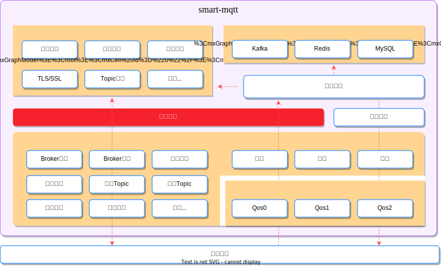
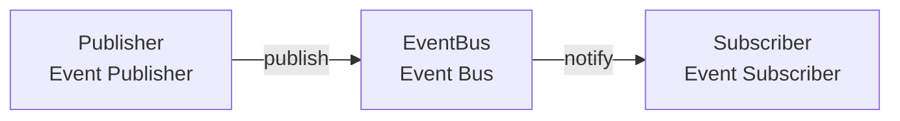
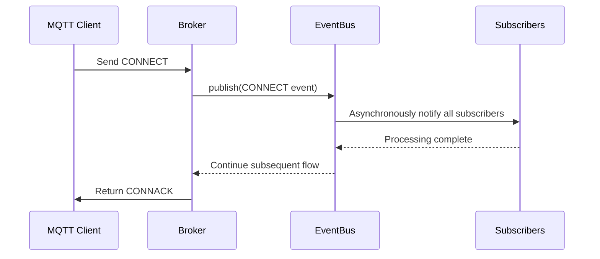

The event bus of smart-mqtt is the core component of the entire framework, implemented using the classic producer/consumer model. All MQTT message processing, connection management, subscription management, etc. are driven through the event bus, which provides developers with extremely strong extension capabilities.



## Architecture Principles

### Core Model

The event bus adopts the **Publish-Subscribe Pattern (Pub/Sub)**, composed of three core roles:



- **Publisher**: Triggers events at specific times, such as connection establishment, message reception, etc.
- **EventBus**: Responsible for event registration, distribution, and routing
- **Subscriber**: Listens to events of interest and executes corresponding processing logic

### Event Flow Mechanism



The event bus supports both **synchronous** and **asynchronous** publishing modes:

| Mode | Characteristics | Applicable Scenarios |
|-----|------|---------|
| **Synchronous Mode** | Publisher blocks waiting for all subscribers to complete processing | Simple, fast logic processing |
| **Asynchronous Mode** | Based on CompletableFuture chain processing | Time-consuming operations (such as authentication, log recording) |

## Event Type List

smart-mqtt has built-in rich event types, covering various stages of the Broker lifecycle:

### Broker Lifecycle Events

| Event Type | Trigger Timing | Data Object | Characteristics |
|---------|---------|---------|------|
| `BROKER_CONFIGURE_LOADED` | When Broker configuration loading is complete | `Options` | One-time event |
| `BROKER_STARTED` | When Broker starts successfully | `BrokerContext` | One-time event |
| `BROKER_DESTROY` | When Broker stops service | `BrokerContext` | One-time event |

**Usage Scenarios**: Plugin initialization, resource preparation, graceful shutdown, etc.

### Connection Management Events

| Event Type | Trigger Timing | Data Object | Description |
|---------|---------|---------|------|
| `SESSION_CREATE` | TCP connection established, Session initialization complete | `MqttSession` | Connection established but not yet authenticated |
| `CONNECT` | Client CONNECT message authentication passed | `AsyncEventObject<MqttConnectMessage>` | Async event, supports interception |
| `DISCONNECT` | When TCP connection disconnects | `AbstractSession` | Includes normal and abnormal disconnections |

**Difference between SESSION_CREATE and CONNECT**:
- `SESSION_CREATE`: Only indicates TCP connection established, MQTT Session object created
- `CONNECT`: Indicates MQTT connection authentication passed, client can start normal communication

### Message Send/Receive Events

| Event Type | Trigger Timing | Data Object | Description |
|---------|---------|---------|------|
| `RECEIVE_MESSAGE` | When any message is received from client | `EventObject<MqttMessage>` | High-performance optimization, independent storage |
| `WRITE_MESSAGE` | When any message is sent to client | `EventObject<MqttMessage>` | High-performance optimization, independent storage |
| `RECEIVE_CONN_ACK_MESSAGE` | When CONNACK message is received | `MqttConnAckMessage` | Used in client mode |

**Performance Optimization**: `RECEIVE_MESSAGE` and `WRITE_MESSAGE` are high-frequency events. The framework uses independent `CopyOnWriteArrayList` to store subscribers and has done null check optimization, with zero overhead when there are no subscribers.

### Topic Management Events

| Event Type | Trigger Timing | Data Object | Description |
|---------|---------|---------|------|
| `TOPIC_CREATE` | When a new Topic is created | `String` (Topic name) | Triggered on first subscription |
| `SUBSCRIBE_ACCEPT` | When server accepts subscription request | `EventObject<MqttTopicSubscription>` | Triggered after validation passes |
| `UNSUBSCRIBE_ACCEPT` | When server accepts unsubscription | `EventObject<MqttUnsubscribeMessage>` | Triggered after validation passes |
| `SUBSCRIBE_TOPIC` | When client successfully subscribes to Topic | `EventObject<MessageDeliver>` | Triggered after subscription relationship established |
| `UNSUBSCRIBE_TOPIC` | When client unsubscribes from Topic | `MessageDeliver` | Triggered when subscription relationship removed |
| `SUBSCRIBE_REFRESH_TOPIC` | When refreshing Topic subscription | `MessageDeliver` | Triggered during session recovery |

**Event Trigger Sequence**:
```
Client sends SUBSCRIBE
    ↓
SUBSCRIBE_ACCEPT (validation passed)
    ↓
TOPIC_CREATE (if new Topic)
    ↓
SUBSCRIBE_TOPIC (establish subscription relationship)
```

### One-time Event Explanation

Event types marked as **one-time events** (`once=true`) will only have their subscribers executed once, then automatically become invalid. This is suitable for initialization operations:

```java
// BROKER_STARTED will only trigger once after Broker startup completes
brokerContext.getEventBus().subscribe(EventType.BROKER_STARTED, (eventType, context) -> {
    // Execute one-time initialization operations
    initializePlugin();
});
```

## Usage Examples

### Basic Subscription

Subscribe to client connection events, count online connections:

```java
AtomicInteger connectionCount = new AtomicInteger(0);

// CONNECT is an async event, needs to be wrapped with syncConsumer
brokerContext.getEventBus().subscribe(EventType.CONNECT, 
    AsyncEventObject.syncConsumer((eventType, event) -> {
        MqttSession session = event.getSession();
        int count = connectionCount.incrementAndGet();
        System.out.println("Client " + session.getClientId() + " connected, total: " + count);
        event.getFuture().complete(null); // Complete async processing
    })
);

// DISCONNECT is a sync event
brokerContext.getEventBus().subscribe(EventType.DISCONNECT, (eventType, session) -> {
    int count = connectionCount.decrementAndGet();
    System.out.println("Client " + session.getClientId() + " disconnected, total: " + count);
});
```

### Message Audit Log

Record all sent and received messages:

```java
// Receive message
brokerContext.getEventBus().subscribe(EventType.RECEIVE_MESSAGE, (eventType, event) -> {
    MqttMessage message = event.getObject();
    MqttSession session = event.getSession();
    logger.info("[RECV] client={}, message={}", session.getClientId(), message);
});

// Send message
brokerContext.getEventBus().subscribe(EventType.WRITE_MESSAGE, (eventType, event) -> {
    MqttMessage message = event.getObject();
    MqttSession session = event.getSession();
    logger.info("[SEND] client={}, message={}", session.getClientId(), message);
});
```

### One-time Initialization

Execute plugin initialization when Broker starts:

```java
brokerContext.getEventBus().subscribe(EventType.BROKER_STARTED, 
    new DisposableEventBusSubscriber<BrokerContext>() {
        @Override
        public void consumer(EventType<BrokerContext> eventType, BrokerContext context) {
            // Execute only once: initialize database connection, start background threads, etc.
            plugin.initDatabase();
            plugin.startBackgroundTask();
        }
    }
);
```

### Resource Release

Release resources when Broker stops:

```java
brokerContext.getEventBus().subscribe(EventType.BROKER_DESTROY, (eventType, context) -> {
    // Close thread pool
    executorService.shutdown();
    // Close database connection
    database.close();
    // Clean up temporary files
    cleanupTempFiles();
});
```

## Custom Events

Plugins can define their own event types for inter-module communication:

```java
public class MyPlugin extends Plugin {
    // Define custom event type
    public static final EventType<MyCustomData> CUSTOM_EVENT = 
        new EventType<>("my_custom_event");

    @Override
    public void install(BrokerContext context) {
        // Subscribe to custom event
        context.getEventBus().subscribe(CUSTOM_EVENT, (eventType, data) -> {
            handleCustomEvent(data);
        });
    }

    private void someMethod() {
        // Trigger custom event
        brokerContext.getEventBus().publish(CUSTOM_EVENT, myData);
    }
}
```

## Best Practices

### 1. Choose Appropriate Subscription Mode

- **Synchronous Subscription**: Scenarios with simple processing logic and short duration (< 1ms)
- **Asynchronous Subscription**: Scenarios involving I/O operations (database, network requests), avoid blocking Broker

### 2. Exception Handling

Exceptions inside subscribers should not affect other subscribers and Broker operation:

```java
brokerContext.getEventBus().subscribe(EventType.RECEIVE_MESSAGE, (eventType, event) -> {
    try {
        processMessage(event.getObject());
    } catch (Exception e) {
        logger.error("Process message failed", e);
        // Do not throw exception
    }
});
```

### 3. Performance Considerations

- Avoid time-consuming operations in `RECEIVE_MESSAGE` and `WRITE_MESSAGE` events
- If processing is needed, use async mode or submit tasks to an independent thread pool
- Subscribers for high-frequency events should be as lightweight as possible

### 4. Thread Safety

Events may be triggered in multi-threaded environments, ensure subscriber logic is thread-safe:

```java
// Use thread-safe counter
private final LongAdder messageCount = new LongAdder();

brokerContext.getEventBus().subscribe(EventType.RECEIVE_MESSAGE, (eventType, event) -> {
    messageCount.increment(); // Thread-safe
});
```

### 5. Resource Management

- Initialize resources in `BROKER_STARTED`
- Release resources in `BROKER_DESTROY`
- Avoid memory leaks: Ensure timely cancellation of no longer needed event subscriptions
