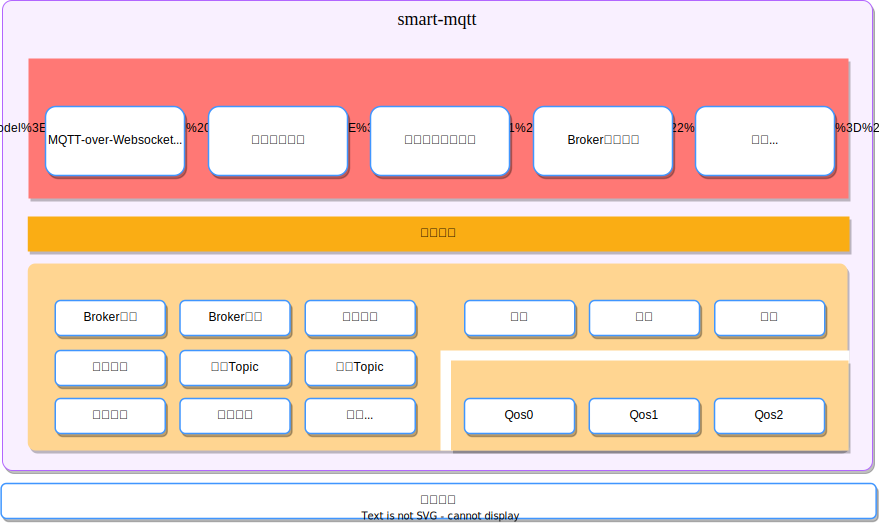
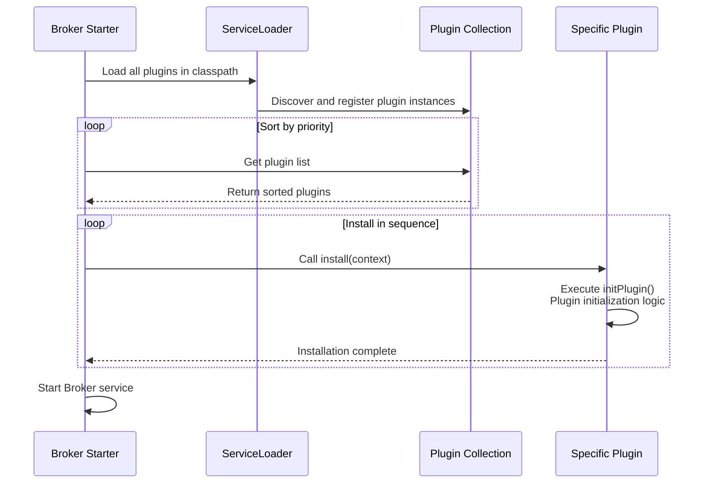
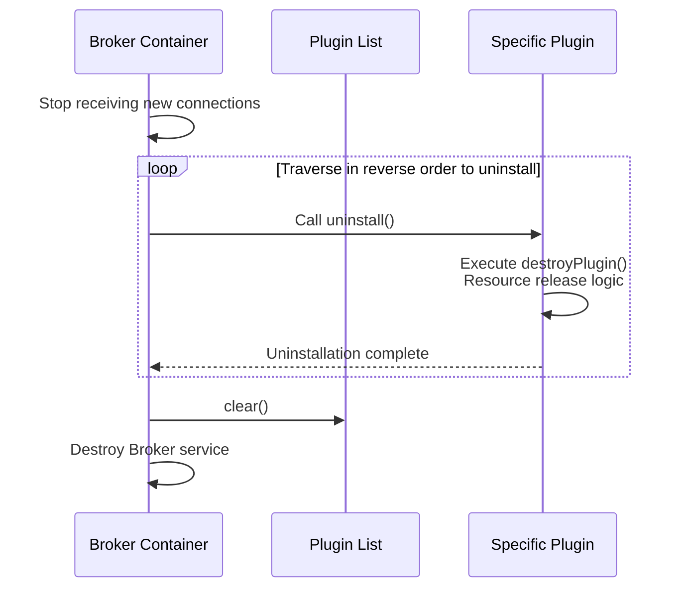
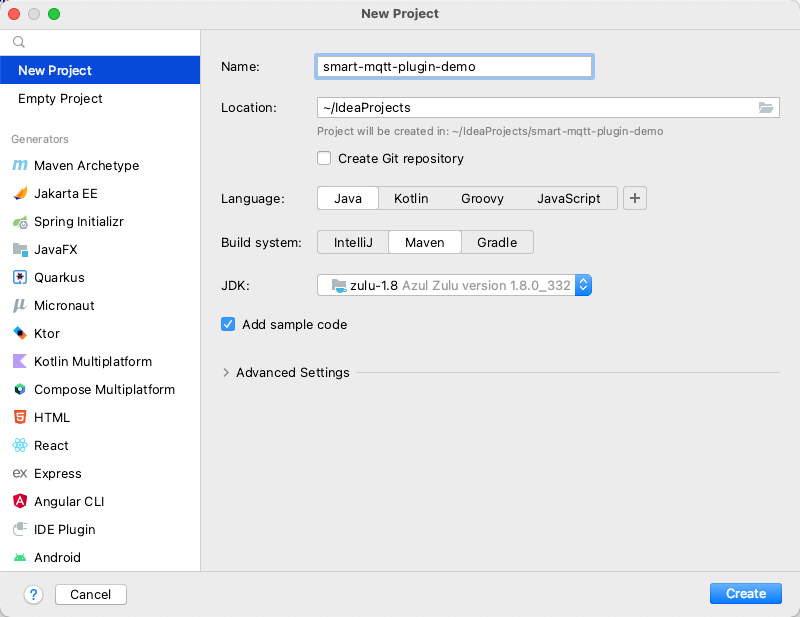

import { Aside, CardGrid, Card } from '@astrojs/starlight/components';

smart-mqtt adopts a plugin-based architecture design. While meeting basic MQTT services, it can derive diverse functions based on its plugin capabilities, such as: service metric statistics, cluster services, data routing, etc.

Almost every feature of the smart-mqtt enterprise edition is a plugin, and plugins are independent and self-governing from each other.

## Design Philosophy

smart-mqtt's plugin system follows these design principles:

- **Low Intrusiveness**: Plugins are completely decoupled from Broker core code, interacting through standardized interfaces
- **Pluggability**: Plugins can be independently deployed, upgraded, and uninstalled without affecting Broker core service operation
- **Event-Driven**: Plugins respond to system behaviors by subscribing to events on the event bus, achieving loosely coupled extensions

In the [Event Bus](/smart-mqtt/development/eventbus/) chapter, we showed you the relatively detailed internal architecture of smart-mqtt. But if we re-examine smart-mqtt from the **plugin** perspective, it will be a different scene (see diagram below).



By subscribing to different types of events on the event bus and matching different implementation strategies, many practical functions can be achieved. Of course, you can also completely detach from the event bus and create interesting plugins, such as: plugin hot-swapping, Broker service dynamic start/stop, etc.

## Core Components

### Plugin Abstract Class

[`Plugin`](https://gitee.com/smartboot/smart-mqtt/tree/master/smart-mqtt-plugin-spec/src/main/java/tech/smartboot/mqtt/plugin/spec/Plugin.java) is the base class for all plugins, defining plugin lifecycle methods:

| Method | Description |
|------|------|
| `pluginName()` | Returns plugin name, defaults to class name |
| `getVersion()` | Returns plugin version number |
| `getVendor()` | Returns plugin developer information |
| `order()` | Returns plugin loading priority, smaller value means higher priority |
| `install()` | Install plugin (final method, cannot be overridden) |
| `uninstall()` | Uninstall plugin (final method, cannot be overridden) |
| `initPlugin()` | Plugin initialization logic, subclass implementation |
| `destroyPlugin()` | Plugin destruction logic, subclass implementation |
| `schema()` | Define visualization form for plugin configuration items |

### BrokerContext Interface

[`BrokerContext`](https://gitee.com/smartboot/smart-mqtt/tree/master/smart-mqtt-plugin-spec/src/main/java/tech/smartboot/mqtt/plugin/spec/BrokerContext.java) is the core entry point for plugin interaction with Broker:

| Method | Description |
|------|------|
| `Options()` | Get Broker configuration options |
| `getSession()` | Get specified client's session |
| `getOrCreateTopic()` | Get or create topic |
| `getEventBus()` | Get event bus |
| `getMessageBus()` | Get message bus |
| `getProviders()` | Get extension point providers |
| `getTimer()` | Get timer |
| `bufferPagePool()` | Get buffer pool |

### Event Bus (EventBus)

The event bus is the core communication mechanism of the plugin system. Plugins respond to system behaviors by subscribing to events:

```java
// Subscribe to event
brokerContext.getEventBus().subscribe(EventType.CONNECT, event -> {
    // Handle connection event
});

// Publish event
brokerContext.getEventBus().publish(EventType.TOPIC_CREATE, "sensor/temperature");
```

#### Predefined Event Types

| Event Type | Description |
|----------|------|
| `CONNECT` | Client connection request |
| `DISCONNECT` | Client disconnect |
| `RECEIVE_MESSAGE` | Receive client message |
| `WRITE_MESSAGE` | Send message to client |
| `SESSION_CREATE` | Create session |
| `TOPIC_CREATE` | Create new topic |
| `SUBSCRIBE_ACCEPT` | Accept subscription request |
| `UNSUBSCRIBE_ACCEPT` | Accept unsubscription request |
| `BROKER_STARTED` | Broker startup complete |
| `BROKER_DESTROY` | Broker about to be destroyed |

### Provider Extension Points

[`Providers`](https://gitee.com/smartboot/smart-mqtt/tree/master/smart-mqtt-plugin-spec/src/main/java/tech/smartboot/mqtt/plugin/spec/provider/Providers.java) provides extension points for core functionality:

| Provider | Description |
|----------|------|
| `SessionStateProvider` | Session state storage extension |
| `SubscribeProvider` | Subscription management extension |

## Working Principle

We will continue to provide rich and practical plugins for enterprise users, and also encourage enterprises with R&D capabilities to support business needs through self-developed plugins.

Perhaps in the future, we will consider building a plugin marketplace to provide a platform for enterprises to showcase and share self-developed plugins, allowing quality work to benefit the entire industry.

### Startup Process

Plugins have very low intrusiveness in smart-mqtt. If combined with code, you should be able to fully master its essence within a few minutes.



The above diagram shows the complete startup process of smart-mqtt service, with plugins in the middle. Plugin startup is divided into two steps:

1. Load all plugin instances in `classpath` through `ServiceLoader` method
2. Sort by plugin priority, then execute `install` method to install and enable plugins

```java
private void loadAndInstallPlugins() throws Throwable {
    for (Plugin plugin : ServiceLoader.load(Plugin.class, BrokerContextImpl.class.getClassLoader())) {
        System.out.println("load plugin: " + plugin.pluginName());
        plugins.add(plugin);
    }
    // Install plugins
    plugins.sort(Comparator.comparingInt(Plugin::order));
    for (Plugin plugin : plugins) {
        System.out.println("install plugin: " + plugin.pluginName());
        plugin.install(this);
    }
}
```

:::tip
As long as plugins are developed following the ServiceLoader pattern, they can be very easily automatically scanned and loaded.
:::

### Exit Process

Uninstalling plugins is a necessary process for smart-mqtt Broker to stop service, ensuring graceful exit and full resource release.



The implementation code is as follows:

```java
plugins.forEach(Plugin::uninstall);
plugins.clear();
```

## Development Guide

### 1. Create Plugin Project

Create a plugin project, a JDK 1.8 Maven project.



### 2. Add Dependencies

Add smart-mqtt-broker maven dependency and `build` plugin.

```xml
<dependencies>
    <dependency>
        <groupId>org.smartboot.mqtt</groupId>
        <artifactId>smart-mqtt-broker</artifactId>
        <version>1.5.0</version>
    </dependency>
</dependencies>

<build>
    <plugins>
        <plugin>
            <groupId>org.apache.maven.plugins</groupId>
            <artifactId>maven-compiler-plugin</artifactId>
            <version>3.10.1</version>
            <configuration>
                <source>1.8</source>
                <target>1.8</target>
                <debug>false</debug>
            </configuration>
        </plugin>
        <plugin>
            <artifactId>maven-shade-plugin</artifactId>
            <version>3.3.0</version>
            <executions>
                <execution>
                    <phase>package</phase>
                    <goals>
                        <goal>shade</goal>
                    </goals>
                    <configuration>
                        <createDependencyReducedPom>false</createDependencyReducedPom>
                        <transformers>
                            <!-- Use append method -->
                            <transformer implementation="org.apache.maven.plugins.shade.resource.AppendingTransformer">
                                <resource>META-INF/services/tech.smartboot.mqtt.plugin.spec.Plugin</resource>
                            </transformer>
                        </transformers>
                    </configuration>
                </execution>
            </executions>
        </plugin>
    </plugins>
</build>
```

:::caution[Important]
The `AppendingTransformer` configuration in the `maven-shade-plugin` is very important, it ensures that when multiple plugins exist simultaneously, ServiceLoader can correctly load all plugins.
:::

### 3. Write Plugin Code

Create a file named `tech.smartboot.mqtt.plugin.spec.Plugin` in the `resources/META-INF/services` directory, with the content being the fully qualified name of the plugin implementation class.

```
tech.smartboot.mqtt.plugin.demo.DemoPlugin
```

Create plugin implementation class:

```java
package tech.smartboot.mqtt.plugin.demo;

import tech.smartboot.mqtt.plugin.spec.BrokerContext;
import tech.smartboot.mqtt.plugin.spec.Options;
import tech.smartboot.mqtt.plugin.spec.Plugin;

public class DemoPlugin extends Plugin {

    @Override
    protected void initPlugin(BrokerContext brokerContext) throws Throwable {
        System.out.println("DemoPlugin initialized!");
        // Write plugin initialization logic here
        // For example: subscribe to events, register services, start threads, etc.
    }

    @Override
    protected void destroyPlugin() {
        System.out.println("DemoPlugin destroyed!");
        // Write plugin uninstallation logic here
        // For example: release resources, stop threads, etc.
    }

    @Override
    public String pluginName() {
        return "DemoPlugin";
    }

    @Override
    public String getVersion() {
        return "1.0.0";
    }

    @Override
    public String getVendor() {
        return "Your Company";
    }

    @Override
    public int order() {
        // Plugin loading order, smaller value means higher priority
        return 0;
    }
}
```

:::tip[Note]
- `install()` and `uninstall()` methods are `final`, subclasses cannot override them.
- Need to write initialization logic in `initPlugin()`, and resource release logic in `destroyPlugin()`.
- `getVersion()` and `getVendor()` are abstract methods, must be implemented.
:::

### 4. Package and Deploy

Run `mvn clean package` to package the plugin, place the generated jar file in smart-mqtt's `plugins` directory, restart the service to take effect.

## Plugin Configuration

### Configuration File

Plugins support configuration through `plugin.yaml` file, placed in the plugin's storage directory.

```java
@Override
protected void initPlugin(BrokerContext brokerContext) throws Throwable {
    // Load plugin configuration
    PluginConfig config = loadPluginConfig(PluginConfig.class);
    if (config != null) {
        System.out.println("Server URL: " + config.getServerUrl());
    }
}
```

Configuration class definition:

```java
public class PluginConfig {
    private String serverUrl;
    private int timeout;
    // getter/setter
}
```

### Configuration Visualization (Schema)

Plugins can define visualization forms for configuration items by overriding the `schema()` method, facilitating dynamic configuration in the console.

```java
import tech.smartboot.mqtt.plugin.spec.schema.Item;
import tech.smartboot.mqtt.plugin.spec.schema.Schema;

@Override
public Schema schema() {
    Schema schema = new Schema();
    // Add string type configuration item
    schema.addItem(Item.String("host", "Service Listen Address").col(6));
    // Add integer type configuration item
    schema.addItem(Item.Int("port", "Service Listen Port").col(6));
    // Add password type configuration item
    schema.addItem(Item.Password("password", "Access Password"));
    // Add text area configuration item
    schema.addItem(Item.TextArea("pem", "Certificate Content").height(400));
    return schema;
}
```

Supported configuration item types:

| Type | Description | Example |
|------|------|------|
| `string` | Regular text input | `Item.String("name", "Name")` |
| `int` | Integer input | `Item.Int("port", "Port")` |
| `password` | Password input (hidden content) | `Item.Password("pwd", "Password")` |
| `textarea` | Multi-line text input | `Item.TextArea("content", "Content")` |
| `object` | Object type (can nest sub-items) | `Item.Object("server", "Server Configuration")` |

:::tip[Note]
- Use `.col(n)` to set form item column width (divide one row into 12 columns)
- Use `.height(n)` to set text area height
- Use `.tip("tip message")` to add prompt description for configuration item
:::

## Common Plugin Types

### Authentication Plugin

Implement custom client authentication logic:

```java
@Override
protected void initPlugin(BrokerContext brokerContext) {
    brokerContext.getProviders().setAuthenticationValidator((client, username, password) -> {
        // Custom authentication logic
        return "admin".equals(username) && "123456".equals(password);
    });
}
```

### Message Bridge Plugin

Forward MQTT messages to other systems:

```java
@Override
protected void initPlugin(BrokerContext brokerContext) {
    // Subscribe to message receive event
    brokerContext.getEventBus().subscribe(EventType.RECEIVE_PUBLISH_MESSAGE, event -> {
        MqttPublishMessage message = event.getObject();
        // Send message to Redis, Kafka, etc.
    });
}
```

### Monitoring Plugin

Collect and report service metrics:

```java
@Override
protected void initPlugin(BrokerContext brokerContext) {
    // Regularly report metrics
    ScheduledExecutorService scheduler = Executors.newSingleThreadScheduledExecutor();
    scheduler.scheduleAtFixedRate(() -> {
        // Collect metrics like connection count, message volume, etc.
    }, 0, 60, TimeUnit.SECONDS);
}
```

## Best Practices

1. **Single Plugin Responsibility**: Each plugin is responsible for only one clear function
2. **Proper Exception Handling**: Exceptions in plugins should not affect Broker's normal operation
3. **Timely Resource Release**: Release all resources in `destroyPlugin()` method
4. **Configuration Externalization**: Extract variable parameters to configuration files
5. **Logging Standards**: Use unified logging framework, avoid direct printing to console
6. **Version Management**: Reasonably implement `getVersion()` method, facilitate plugin version tracking

## Official Plugins

smart-mqtt officially provides multiple practical plugins. You can view the source code of these plugins in the [Gitee Repository](https://gitee.com/smartboot/smart-mqtt/tree/master/plugins).

<CardGrid>
  <Card title="Bench Plugin" icon="chart-line" href="/smart-mqtt/plugins/bench-plugin">
    General MQTT stress testing tool, supports publish and subscribe stress testing
  </Card>
  <Card title="Auth Plugin" icon="key" href="/smart-mqtt/plugins/simple-auth-plugin">
    Simple username/password authentication
  </Card>
  <Card title="WebSocket Plugin" icon="plug" href="/smart-mqtt/plugins/websocket-plugin">
    Provide WebSocket connection support
  </Card>
  <Card title="MQTTS Plugin" icon="lock" href="/smart-mqtt/plugins/mqtts-plugin">
    Provide SSL/TLS encrypted connection support
  </Card>
  <Card title="Redis Bridge Plugin" icon="database" href="/smart-mqtt/plugins/redis-bridge-plugin">
    MQTT message and Redis integration
  </Card>
  <Card title="Cluster Plugin" icon="server" href="/smart-mqtt/plugins/cluster-plugin">
    Cluster functionality support
  </Card>
</CardGrid>
