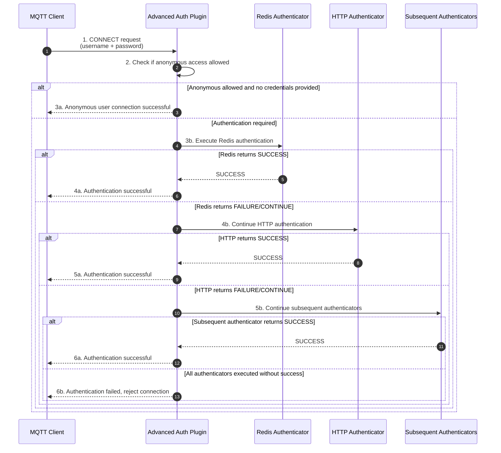

`advanced-auth-plugin` is an enterprise-level MQTT authentication plugin that provides authentication chains, multiple authentication methods, and password encoding functionality. **Both Redis and HTTP authentication in this plugin adopt a fully asynchronous design pattern, capable of efficiently handling massive instantaneous connection authentication requests, fully guaranteeing overall service stability.**

## Working Principle

The advanced authentication plugin adopts an **authentication chain** mechanism, supporting configuration of multiple authenticators to execute in priority order. When an MQTT client initiates a connection request, the plugin will try each authenticator in sequence until authentication succeeds or all authenticators have been tried.

**Authentication Result Types**

- **`SUCCESS`**: Authentication successful, immediately stop subsequent authentication, allow connection
- **`FAILURE`**: Authentication failed (e.g., wrong password), decide whether to continue based on `stopOnError` configuration
- **`CONTINUE`**: Current authenticator cannot handle (e.g., user doesn't exist), continue to next authenticator

**Authentication Flow**



## Core Features

**Both Redis and HTTP authenticators use fully asynchronous non-blocking implementation**, which is the core advantage of this plugin in handling massive concurrent scenarios:

- **Zero Thread Blocking**: Authentication operations complete through asynchronous callback mechanisms, won't occupy Broker worker threads
- **Massive Concurrency Support**: Single node can easily handle tens of thousands or even hundreds of thousands of instantaneous connection authentication requests
- **Service Stability Guarantee**: Even when external authentication services respond slowly, it won't cause Broker thread pool exhaustion

**Typical Application Scenario: Device Concentrated Reconnection**

When MQTT Broker restarts due to maintenance or failure, large numbers of devices will simultaneously initiate reconnections within a short time, forming a short-term **concentrated authentication peak**. At this time:

| Authentication Mode | Traditional Synchronous Mode | This Plugin's Async Mode |
|---------|-------------|---------------|
| Thread Occupation | Each auth request occupies one thread waiting for response | No waiting needed, release thread to handle other tasks |
| Throughput | Limited by thread pool size (usually hundreds to thousands) | Only limited by network IO (can reach 100K level) |
| Avalanche Risk | High - Thread pool exhaustion causes service unavailability | Low - Async queuing automatically buffers pressure |

## Configuration

### Basic Configuration

| Configuration Item | Type | Required | Default | Description |
|--------|------|------|--------|------|
| `stopOnError` | boolean | No | `true` | Whether to stop immediately on authentication failure. `true`: Authenticator exception immediately rejects connection; `false`: Exception treated as CONTINUE, continue to next authenticator |
| `allowAnonymous` | boolean | No | `false` | Whether to allow anonymous access. `true`: Allow anonymous connection when no credentials provided; `false`: Reject anonymous connection |
| `chain` | array | Yes | - | Authentication chain order, authenticators execute in this order. Options: `redis`, `http` (MySQL authenticator not yet implemented) |

### Redis Authentication Configuration

Query user credentials from Redis for authentication, suitable for distributed, high-concurrency scenarios.

| Configuration Item | Type | Required | Default | Description |
|--------|------|------|--------|------|
| `address` | string | Yes | - | Redis address, format: `redis://host:port` |
| `username` | string | No | `""` | Redis username (Redis 6.0+ ACL authentication) |
| `password` | string | No | `""` | Redis password |
| `database` | number | No | `0` | Database index |
| `timeout` | number | No | `3000` | Connection timeout, in milliseconds |

#### Redis Data Storage Format

Redis Key format: `smart-mqtt:auth:{username}`

Use Hash structure to store user credentials:

| Field | Description | Required |
|------|------|------|
| `pwd_hash` | Password hash value | Yes |
| `salt` | Salt value (when salt exists, password = salt + original password) | No |
| `encoder` | Password encoder name: `plain`, `md5`, `sha256` | No |

**Password Encoding Description:**

- `plain`: Plain text storage, not recommended for production environments
- `md5`: MD5 hash (Base64 encoded)
- `sha256`: SHA-256 hash (Base64 encoded, recommended)
- When `encoder` not specified, defaults to `plain`

### HTTP Authentication Configuration

Call external HTTP interface for authentication, suitable for microservice architecture and third-party authentication system integration.

| Configuration Item | Type | Required | Default | Description |
|--------|------|------|--------|------|
| `url` | string | Yes | - | Authentication interface URL |
| `timeout` | number | No | `5000` | Request timeout, in milliseconds |
| `headers` | object | No | - | Custom request headers |

#### HTTP Interface Specification

**Request:**

- Method: `POST`
- Content-Type: `application/json`
- Request body:

```json
{
  "username": "test",
  "password": "123456",
  "clientId": "client-001"
}
```

**Response:**

- Status code `200`: Authentication successful
- Other status codes: Authentication failed

## Configuration Examples

### Scenario 1: Pure Redis Authentication

```yaml
stopOnError: true
allowAnonymous: false

chain:
  - redis

redis:
  address: redis://localhost:6379
  database: 0
```

### Scenario 2: Redis + HTTP Fallback Authentication

Redis authentication first, when user doesn't exist in Redis or authentication fails, fallback to HTTP authentication.

```yaml
stopOnError: false
allowAnonymous: false

chain:
  - redis
  - http

redis:
  address: redis://localhost:6379
  database: 0

http:
  url: http://localhost:8080/api/auth
  timeout: 5000
```

### Scenario 3: Pure HTTP Authentication

```yaml
stopOnError: true
allowAnonymous: false

chain:
  - http

http:
  url: http://auth-service:8080/api/auth
  timeout: 5000
  headers:
    Authorization: Bearer ${AUTH_TOKEN}
```

## Redis Authentication Data Management

### Generate User Credentials

**Command Line Method:**

```bash
# Create plain text password user (not recommended)
HMSET smart-mqtt:auth:admin pwd_hash "admin123"

# Create MD5 user (Base64 encoded)
HMSET smart-mqtt:auth:user2 pwd_hash "4QrcOUm6Wau+VuBX8g+IPg==" encoder "md5"

# Create SHA-256 user with salt (recommended)
HMSET smart-mqtt:auth:user1 pwd_hash "5UQKTFfTc2G+pH1tHy3c8zJKuQdP8U3dJ8b7Y6h5fQE=" salt "mysalt" encoder "sha256"
```

**Generate Password Hash:**

```bash
# Generate SHA-256 (Python)
python3 -c "import hashlib,base64; print(base64.b64encode(hashlib.sha256(b'saltpassword').digest()).decode())"

# Generate MD5 (Python)
python3 -c "import hashlib,base64; print(base64.b64encode(hashlib.md5(b'password').digest()).decode())"
```

**Java Generation Example:**

```java
import java.nio.charset.StandardCharsets;
import java.security.MessageDigest;
import java.util.Base64;

public class PasswordEncoder {
    
    public static String sha256(String password, String salt) {
        try {
            String saltedPassword = salt != null ? salt + password : password;
            MessageDigest digest = MessageDigest.getInstance("SHA-256");
            byte[] hash = digest.digest(saltedPassword.getBytes(StandardCharsets.UTF_8));
            return Base64.getEncoder().encodeToString(hash);
        } catch (Exception e) {
            throw new RuntimeException(e);
        }
    }
}
```

### Query User Credentials

```bash
# Query all user fields
HMGET smart-mqtt:auth:admin pwd_hash salt encoder

# Query all fields (return key-value pairs)
HGETALL smart-mqtt:auth:admin

# Query single field
HGET smart-mqtt:auth:admin pwd_hash
HGET smart-mqtt:auth:admin encoder

# Check if user exists
EXISTS smart-mqtt:auth:admin
```

### Delete User Credentials

```bash
# Delete single user
DEL smart-mqtt:auth:admin

# Delete multiple users (using wildcard)
EVAL "return redis.call('del', unpack(redis.call('keys', 'smart-mqtt:auth:*')))" 0
```

## Why Choose Redis Authentication

Redis becomes an ideal choice for large-scale IoT authentication with the following features:

| Feature | Redis | Traditional Database |
|------|-------|-----------|
| Read/Write Performance | Memory-level operations, millisecond or even microsecond response | Disk IO, usually millisecond level |
| Concurrency Capability | Single node can reach 100K+ QPS | Usually thousands QPS |
| Connection Cost | Lightweight connections, low resource consumption | Connection pool resource occupation large |
| Horizontal Scaling | Native support for cluster sharding | Database sharding complexity high |

Combined with this plugin's **asynchronous authentication architecture**, Redis authenticator can fully leverage performance advantages in massive concurrent scenarios. It's recommended to cache user credentials in Redis, combined with HTTP authentication as a fallback solution, querying from main database when Redis misses.

## Notes

1. **Password Encoding**: MD5 and SHA-256 hashes are Base64 encoded for storage
2. **Exception Handling**: When `stopOnError=false`, authenticator exceptions are caught and treated as `CONTINUE`. HTTP/Redis authenticators have already handled exceptions internally, usually returning CONTINUE
3. **Configuration Hot Reload**: Need to restart MQTT service for configuration changes to take effect
4. **Redis Key Prefix**: Fixed as `smart-mqtt:auth:`, not configurable
5. **MySQL Authenticator**: Not yet implemented, stay tuned

## Troubleshooting

| Problem | Possible Cause | Solution |
|------|----------|----------|
| Authentication always fails | Password encoding mismatch | Check encoder configuration and hash calculation |
| HTTP authentication no response | Service unreachable | Check URL and timeout configuration |
| Anonymous user rejected | allowAnonymous is false | Set to true or provide valid credentials |
