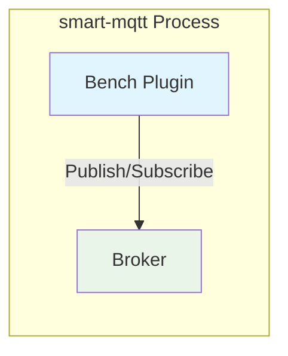
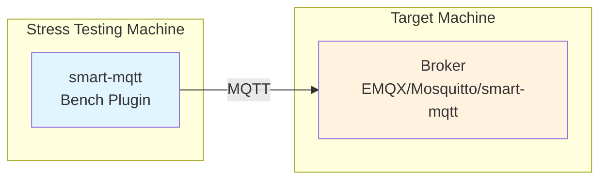
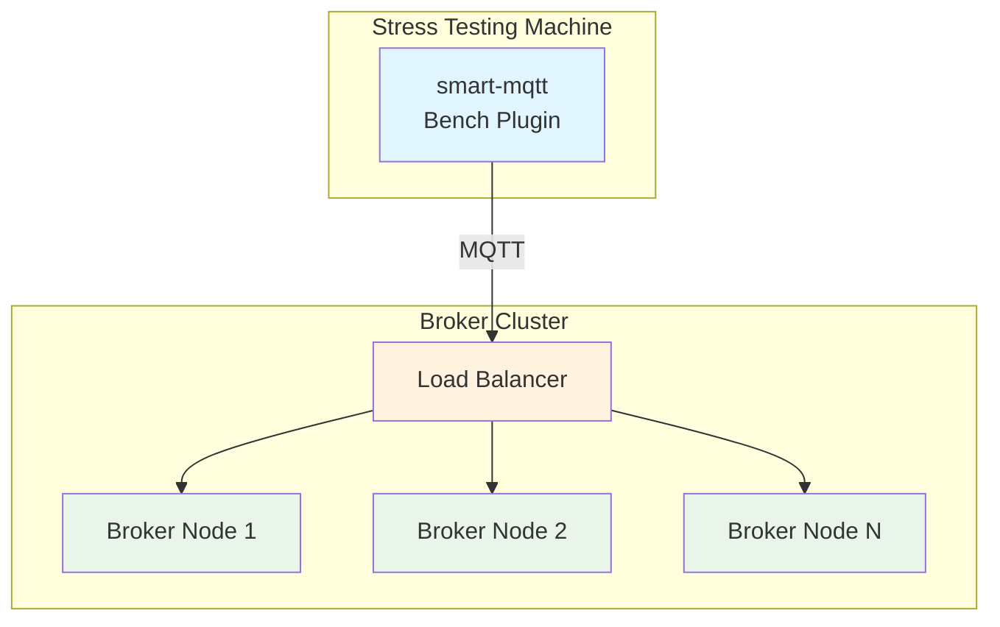
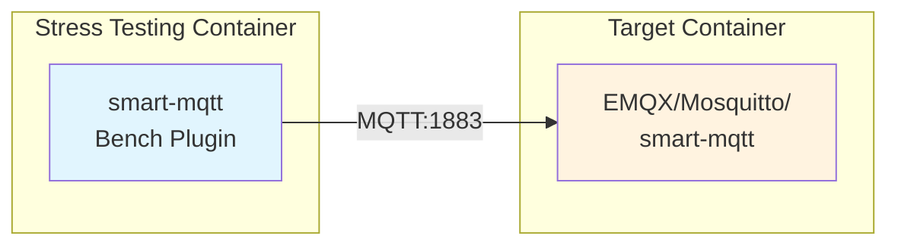

import { Aside } from '@astrojs/starlight/components';

`bench-plugin` is a general-purpose MQTT stress testing plugin that can be used to test any MQTT Broker (such as EMQX, Mosquitto, ActiveMQ, etc.), supporting both **publish stress testing** and **subscribe stress testing** scenarios, helping developers evaluate MQTT broker performance.

## Feature Overview

- **Publish Stress Testing**: Simulate large numbers of clients simultaneously publishing messages to MQTT broker, testing broker's message reception and processing capabilities
- **Subscribe Stress Testing**: Simulate large numbers of subscribers subscribing to topics, optionally starting publishers to publish messages to these topics, testing broker's message distribution capabilities
- Real-time output of TPS (transactions per second) statistics
- Support flexible stress testing parameter configuration

## Stress Testing Scenarios

bench-plugin supports three stress testing modes, suitable for different testing needs:

### Scenario 1: In-Process Stress Testing (Self-Testing Mode)



**Description**: smart-mqtt broker and plugin are in the same process, testing itself.

- **Advantages**: Simple architecture, easy deployment
- **Disadvantages**: Resource competition exists, causes fluctuation in test results, cannot measure ultimate capability
- **Applicable Scenarios**: Quick functionality verification, simple performance baseline

### Scenario 2: Single Node Stress Testing (Horizontal Comparison)



**Description**: Deploy separately, smart-mqtt starts bench plugin to stress test other node's broker. These brokers can be smart-mqtt or other types of brokers (such as EMQX, Mosquitto, ActiveMQ, etc.).

- **Advantages**: More accurate data, no resource competition interference
- **Applicable Scenarios**: Horizontal performance comparison of various broker products, single node performance evaluation

### Scenario 3: Cluster Stress Testing



**Description**: Deploy separately, the target being tested is a complete Broker cluster, usually including load balancer and multiple Broker nodes.

- **Advantages**: Truly simulate production environment, evaluate cluster overall throughput capability
- **Applicable Scenarios**: Cluster performance evaluation, capacity planning

| Scenario | Deployment Method | Accuracy | Applicable Scenarios |
|------|----------|--------|----------|
| In-Process Stress Testing | Same process | ⭐⭐ | Functionality verification, quick baseline |
| Single Node Stress Testing | Separate deployment | ⭐⭐⭐⭐ | Horizontal comparison, single node evaluation |
| Cluster Stress Testing | Separate deployment | ⭐⭐⭐⭐⭐ | Production environment evaluation, capacity planning |

## Core Components

- **BenchPlugin**: Plugin entry point, responsible for initializing stress testing tasks and scheduling
- **PluginConfig**: Stress testing plugin configuration, including common parameters and scenario-specific parameters
- **PublishConfig**: Publish stress testing configuration
- **SubscribeConfig**: Subscribe stress testing configuration

## Configuration Parameters

Configure the stress testing plugin in `plugin.yaml`, supporting the following parameters:

### Common Parameters

| Parameter | Type | Default | Description |
|------|------|--------|------|
| `scenario` | String | `publish` | Stress testing scenario: `publish`=publish stress testing, `subscribe`=subscribe stress testing |
| `host` | String | `127.0.0.1` | MQTT server address |
| `port` | int | `1883` | MQTT server port |
| `topicCount` | int | `128` | Number of topics |
| `qos` | int | `0` | QoS level: `0`=AtMostOnce, `1`=AtLeastOnce, `2`=ExactlyOnce |
| `payloadSize` | int | `1024` | Message payload size (bytes) |

### Publish Stress Testing Configuration (publish)

| Parameter | Type | Default | Description |
|------|------|--------|------|
| `connections` | int | `1000` | Number of publishers (concurrent connections) |
| `publishCount` | int | `1` | Number of messages per publish |
| `period` | int | `1` | Publish interval (milliseconds) |

### Subscribe Stress Testing Configuration (subscribe)

| Parameter | Type | Default | Description |
|------|------|--------|------|
| `connections` | int | `1000` | Number of subscribers (concurrent connections) |
| `publisherCount` | int | `1` | Number of publishers, set to `0` to not start publishers |
| `publishCount` | int | `1` | Number of messages per publish |
| `publishPeriod` | int | `1` | Publish interval (milliseconds) |


## Usage Instructions

Through smart-mqtt backend management console's plugin management function, you can conveniently set up and start/stop stress testing scenarios.

1. **Login to Management Console**: Access smart-mqtt management console (default port 18083), login to backend management system

2. **Enter Plugin Management**: Select "Plugin Management" menu in left navigation bar, find "Bench Plugin"

3. **Configure Stress Testing Parameters**:
   - Click plugin's "Configure" button
   - Set parameters according to stress testing needs (scenario, connection count, payload size, QoS, etc.)
   - Save configuration

4. **Start Stress Testing**:
   - Click plugin's "Start" button to begin stress testing
   - Plugin will automatically load configuration and start executing stress testing tasks

5. **View Stress Testing Data**:
   - Observe stress testing data in plugin details page or console logs
   - Includes: `total` (total messages), `TPS` (transactions per second)

6. **Stop Stress Testing**:
   - Click plugin's "Stop" button to end stress testing
   - Plugin will gracefully close all connections

## Performance Testing Data

The following is performance data from stress testing smart-mqtt using this bench plugin, for reference.

### Environment Preparation

A Linux server, Windows or Macbook with Docker installed.

> Supports mainstream amd64 and arm64 architectures.

<Aside type="tip">
For massive connection testing, need to configure file descriptor limit: **`ulimit -n 65535`**
</Aside>

### Message Subscribe Stress Testing

**Scenario Design**:
- MQTT Client subscriber count: 2000
- MQTT Client publisher count: 10 (each connection publishes 100 messages per second)
- Topic count: 128
- Message payload size: 128 bytes

| QoS Level | smart-mqtt | Third-party Broker |
|:--------:|:----------:|:----:|
| QoS0 | 10M/s | 8M/s |
| QoS1 | 5.4M/s | 4M/s |
| QoS2 | 3.2M/s | 2M/s |

### Message Publish Stress Testing

**Scenario Design**:
- MQTT Client publisher count: 2000 (each connection publishes 10000 messages per second)
- Topic count: 128
- Message payload size: 128 bytes

| QoS Level | smart-mqtt | Third-party Broker |
|:--------:|:----------:|:----:|
| QoS0 | 2.3M/s | 2.3M/s |
| QoS1 | 1M/s | 1M/s |
| QoS2 | 630K/s | 630K/s |


:::tip[Note]
The above performance data is for reference only, actual performance is affected by hardware configuration, network environment, JVM parameters, and other factors.
:::

## Horizontal Comparison Testing

Use the bench plugin to perform horizontal comparison testing on third-party MQTT Brokers. The project provides Docker Compose configuration files for quickly setting up test environments.

### Test Environment Architecture



### Docker Compose Configuration

Pre-configured test environment in project root [docker-compose.yml](https://gitee.com/smartboot/smart-mqtt/blob/master/docker-compose.yml):

```yaml
networks:
  mqtt-network:
    driver: bridge

services:
  # Stress testing side: run smart-mqtt bench plugin
  smart-mqtt:
    container_name: smart-mqtt
    image: smartboot/smart-mqtt:latest
    environment:
      ENTERPRISE_ENABLE: true      # Enable enterprise features
      BROKER_MAXINFLIGHT: 256
    ports:
      - 18083:18083                 # Management console
      - 1883:1883                   # MQTT port

  # Target side: MQTT Broker to be tested
  mqtt-broker:
    container_name: mqtt-broker
    image: smartboot/smart-mqtt:latest
    environment:
      ENTERPRISE_ENABLE: false
      BROKER_MAXINFLIGHT: 256
```

### Test Third-party Broker

To test other Brokers (such as EMQX), modify `mqtt-broker` service configuration:

```yaml
mqtt-broker:
  container_name: emqx
  hostname: mqtt-broker
  image: emqx/emqx:5.0.24
  networks:
    mqtt-network: null
  restart: always
  security_opt:
    - no-new-privileges:true
  user: root:root
  logging:
    driver: "json-file"
    options:
      max-size: "100m"
      max-file: "1"
```

<Aside type="note">
Only one container with service name `mqtt-broker` can exist at a time. When testing different Brokers, need to comment out other services with the same name.
</Aside>


### Execute Test Steps

1. **Start Test Environment**:

```bash
docker-compose up -d
```

2. **Configure Bench Plugin**:
   - Access smart-mqtt management console: http://localhost:18083
   - Go to "Plugin Management" → "Bench Plugin" → "Configure"
   - Set `host` to `mqtt-broker` (target container name)
   - Set `port` to `1883` (target container MQTT port)

3. **Start Stress Testing**:
   - Click "Start" button to begin stress testing
   - View real-time TPS data in console logs

4. **View Results**:

```bash
# View smart-mqtt container logs
docker-compose logs -f smart-mqtt
```

5. **Stop Testing**:

```bash
docker-compose down
```

## Notes

- Bench plugin will start executing 5 seconds after service startup, allowing broker to fully initialize
- During stress testing, smart-mqtt service can be stopped at any time, plugin will gracefully close all connections
- Recommend ensuring sufficient server resources before stress testing, avoid affecting test results due to resource exhaustion
- In subscribe stress testing scenario, when `publisherCount` is set to `0`, only subscriber connections are created, no messages sent, suitable for testing subscription performance
- During high concurrency stress testing, pay attention to adjusting system file descriptor limit (ulimit)
