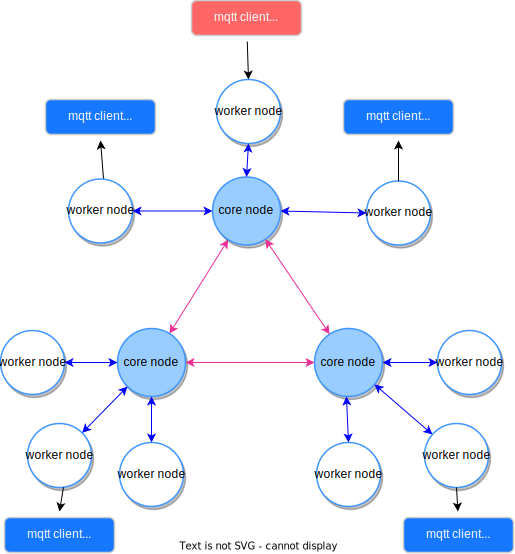
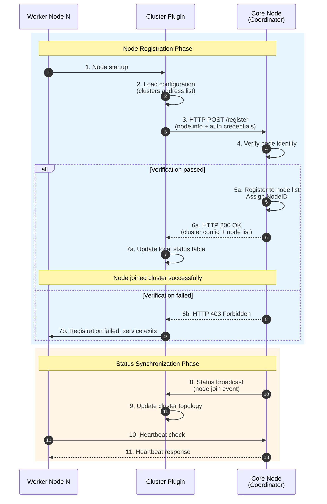
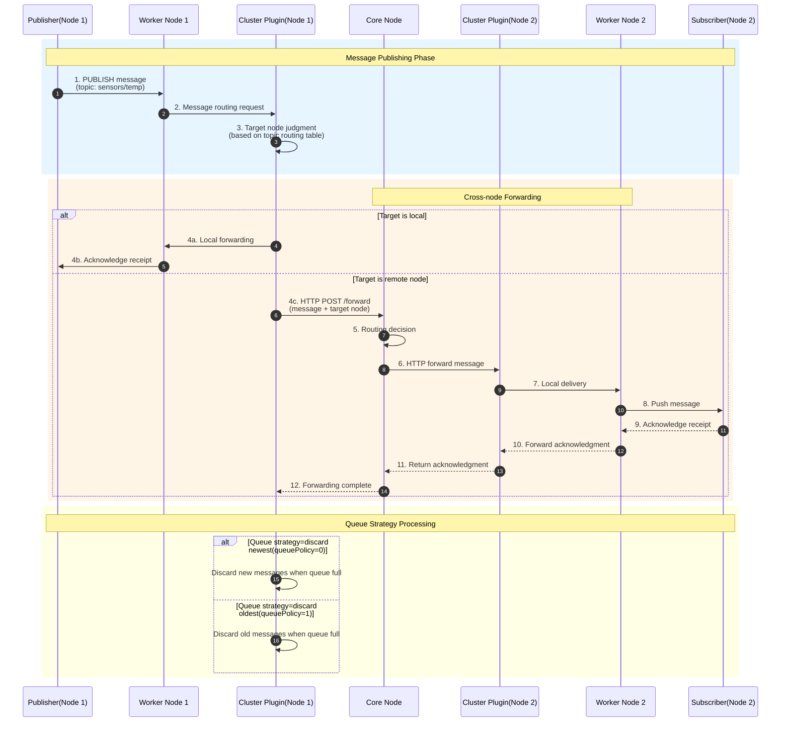

`cluster-plugin` provides HTTP-based cluster coordination capabilities for smart-mqtt broker, enabling multi-node cluster deployment, worker node access, and cluster status synchronization.




## Feature Overview
- Supports cluster deployment with core nodes and worker nodes
- Inter-node communication via HTTP for status synchronization and message forwarding
- Supports distributed message routing and queue strategies
- Dynamic discovery and management of cluster nodes

## Core Components
- **ClusterPlugin**: Plugin entry point, responsible for initializing cluster core service or worker node connections.
- **Coordinator**: Responsible for cluster node discovery, status maintenance, node join/leave event handling, and distributed message routing.
- **Distributor**: Message distributor, supports multiple queue strategies.
- **PluginConfig**: Plugin configuration management, supports core node, listen address, port, queue length, queue strategy, cluster node list, and other parameters.

## Configuration Parameters
Configure in `plugin.yaml`, example:

```yaml
core: true                # Whether it's a core node, true=core node, false=worker node
host: 0.0.0.0             # Cluster service listen address, only valid when core is true
port: 8884                # Cluster service listen port, only valid when core is true
queueLength: 1024         # Message queue length
queuePolicy: 0            # Queue strategy (0=discard newest, 1=discard oldest)
clusters:                 # Cluster node address list
  - http://core1:8884
  - http://core2:8884
```

## Usage Instructions
1. Place plugin and configuration file in smart-mqtt's plugins directory
2. Configure `plugin.yaml`, set core/host/port/clusters parameters according to actual deployment role
3. Start smart-mqtt service, plugin will automatically load and initialize cluster functionality


## Notes
- Network connectivity must be ensured between cluster nodes, port configuration must be consistent
- Each node's `plugin.yaml` configuration must be set separately according to actual role (core/worker)
- Recommended startup sequence: start core nodes first, then worker nodes

## Workflow Diagram

### Cluster Node Registration Swimlane Diagram



### Cross-node Message Forwarding Swimlane Diagram



### Flow Description
1. **Core Node Startup**: Core node starts HTTP service, waits for worker node connections
2. **Worker Node Registration**: Worker node connects to core node based on configured clusters address and completes registration
3. **Message Routing**:
   - Local clients forward directly
   - Remote clients forward to corresponding node via HTTP
4. **Status Synchronization**: Coordinator maintains cluster node status, handles node join/leave events
5. **Distributed Distribution**: Distributor manages message distribution based on queue strategy

## Technical Support
- Author: Sandao (zhengjunweimail@163.com)
- Vendor: smart-mqtt
