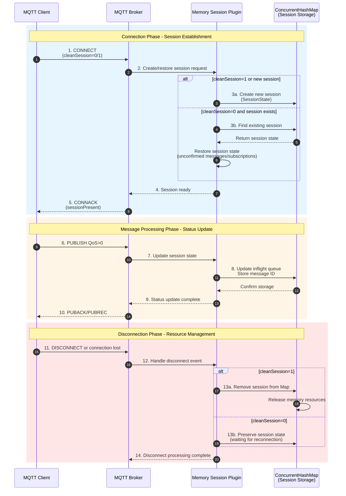

Memory Session Plugin provides memory-based session state management functionality for MQTT broker, using ConcurrentHashMap to implement thread-safe session storage.

## Core Implementation
- **MemorySessionStateProvider**:
- Uses ConcurrentHashMap to store session states (key=clientId, value=SessionState)
- Provides three core methods: store/get/remove to manage session lifecycle
- Thread-safe design, suitable for high-concurrency scenarios

- **SessionPlugin**:
- Plugin entry point, registers MemorySessionStateProvider during initialization
- Follows smartboot plugin specification, implements version and vendor information

## Usage Scenarios
Suitable for MQTT broker scenarios requiring lightweight, high-performance session management, features include:
- Memory storage, fast access speed
- No persistence requirements
- Single-machine deployment environment

## Configuration Instructions
No additional configuration required, automatically effective after introducing plugin.

## Workflow Diagram

### Session Management Swimlane Diagram

### Flow Description
1. **Session Storage**: Decide to create new session or restore existing session based on cleanSession flag
2. **Memory Management**: Use ConcurrentHashMap to implement thread-safe session data storage
3. **State Persistence**: For QoS>0 messages, update inflight queue and persist session state
4. **Resource Release**: When cleanSession=1, completely clean up session; otherwise preserve for reconnection recovery
