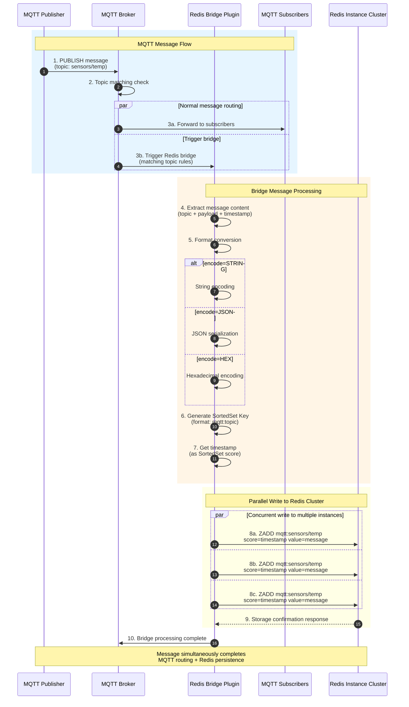

Redis Bridge Plugin is a bridge plugin for MQTT message and Redis integration. This plugin supports real-time storage of MQTT messages to Redis SortedSet, can configure multiple Redis instances, supports database selection and password authentication. Messages are stored using timestamps as scores, supporting custom message encoding formats.

## Main Features
- Support configuration of multiple Redis instances
- Support Redis database selection
- Support Redis password authentication
- Support custom message encoding formats
- Use timestamp as SortedSet score
- Real-time message storage

## Configuration Instructions
Plugin uses YAML format for configuration, main configuration parameters are as follows:

```yaml
redis:
  - address: "localhost:6379"    # Redis server address and port
    database: 0                  # Redis database number (0-15)
    password: "your_password"    # Redis access password (optional)
    encode: "STRING"            # Message encoding format (default: STRING)
  - address: "redis2:6379"      # Can configure multiple Redis instances
    database: 1
    password: "password2"
```

### Configuration Parameter Description
- `address`: Redis server address, format is "host:port"
- `database`: Redis database number, range 0-15
- `password`: Redis server access password, can be omitted if no password is set
- `encode`: Message encoding format, defaults to "STRING", supports multiple encoding methods

## Usage Scenarios
1. MQTT message persistent storage
2. Message history query service
3. Message data analysis and statistics
4. Real-time data monitoring system

## Notes
1. Ensure Redis server address is configured correctly and accessible
2. Avoid duplicate configuration of the same Redis address
3. Recommend choosing appropriate message encoding format based on actual needs
4. Pay attention to monitoring Redis storage capacity, clean up historical data timely

## Workflow Diagram

### Message Bridge Swimlane Diagram



### Flow Description
1. **Message Capture**: Intercept MQTT messages matching specified Topic rules
2. **Format Conversion**: Encode messages according to configured encode parameter
3. **Timestamp Marking**: Use current time as SortedSet score
4. **Multi-instance Write**: Asynchronously parallel write to all configured Redis instances
5. **Ordered Storage**: Utilize Redis SortedSet feature to achieve time-ordered message storage
