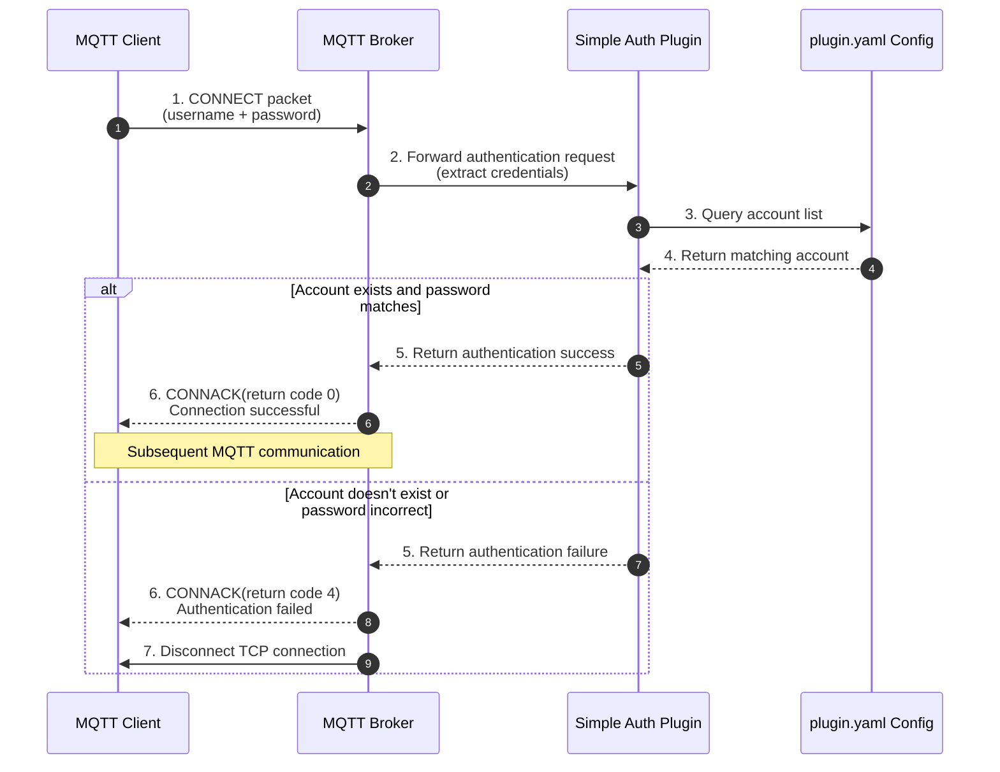

`simple auth plugin` is a simple MQTT authentication plugin that provides basic username/password authentication functionality.

## Features

- Support multi-user configuration
- Simple username/password authentication mechanism
- Easy to configure and use

## Configuration

Configure user account information in `plugin.yaml`, format as follows:

```yaml
accounts:
  - username: admin
    password: admin
```

## Usage Instructions

1. Install the plugin to the MQTT server
2. Configure user accounts in `plugin.yaml`
3. Restart the MQTT service for configuration to take effect

## Notes

- Passwords are stored in plain text, please keep the configuration file secure
- Recommend using more secure authentication methods in production environments

## Workflow Diagram

### Authentication Swimlane Diagram



### Flow Description
1. **CONNECT Packet**: Client sends connection request to Broker, carrying username and password
2. **Account Lookup**: Plugin looks up matching account from `plugin.yaml` configuration
3. **Identity Verification**: Compare username and password in request with configured account information
4. **Result Processing**:
   - Verification passed: Return connection successful, allow client subsequent communication
   - Verification failed: Reject connection and disconnect client
