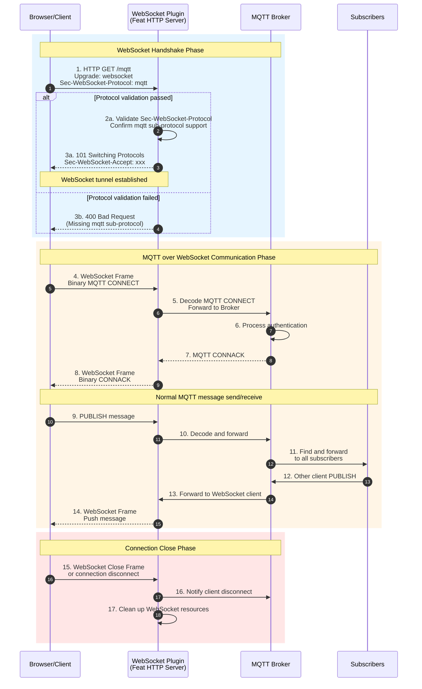

This plugin provides WebSocket protocol support for MQTT Broker, allowing clients to communicate via MQTT through WebSocket connections.

## Technical Implementation
- Implemented WebSocket upgrade based on Feat framework's HTTP server
- Supports MQTT over WebSocket protocol (Sec-WebSocket-Protocol: mqtt)
- Uses ByteBuffer to handle binary message streams
- Shares the same message processor and session management with core Broker

## Configuration Parameters
```yaml
port: 8084  # WebSocket listening port
```

## Usage Example
```javascript
// Using MQTT.js client connection example
const client = mqtt.connect('ws://localhost:8080/mqtt', {
  protocol: 'ws',
  path: '/mqtt'
})
```

## Workflow Diagram

### WebSocket Protocol Upgrade Swimlane Diagram



### Flow Description
1. **Protocol Upgrade**: Client sends HTTP upgrade request, must include `Sec-WebSocket-Protocol: mqtt` header
2. **Handshake Validation**: Server validates WebSocket protocol header, confirms MQTT sub-protocol support
3. **Tunnel Establishment**: WebSocket bidirectional communication tunnel established after successful handshake
4. **MQTT Encapsulation**: MQTT binary packets transmitted through WebSocket frames
5. **Data Flow**: Browser/client sends/receives MQTT messages through WebSocket, Broker processing logic same as regular MQTT
