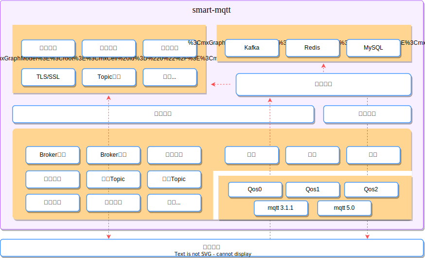
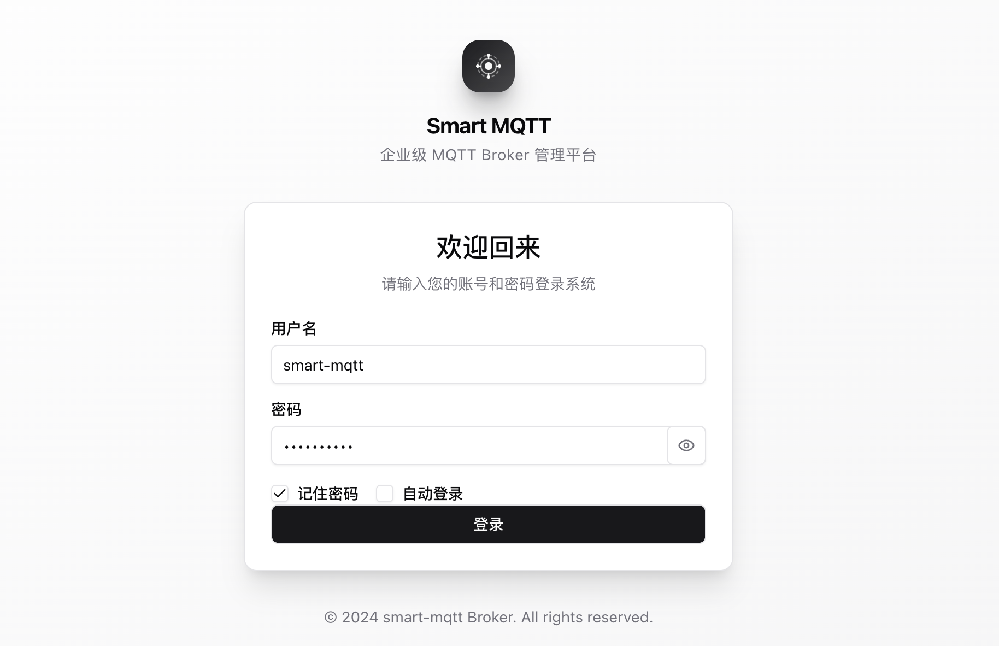
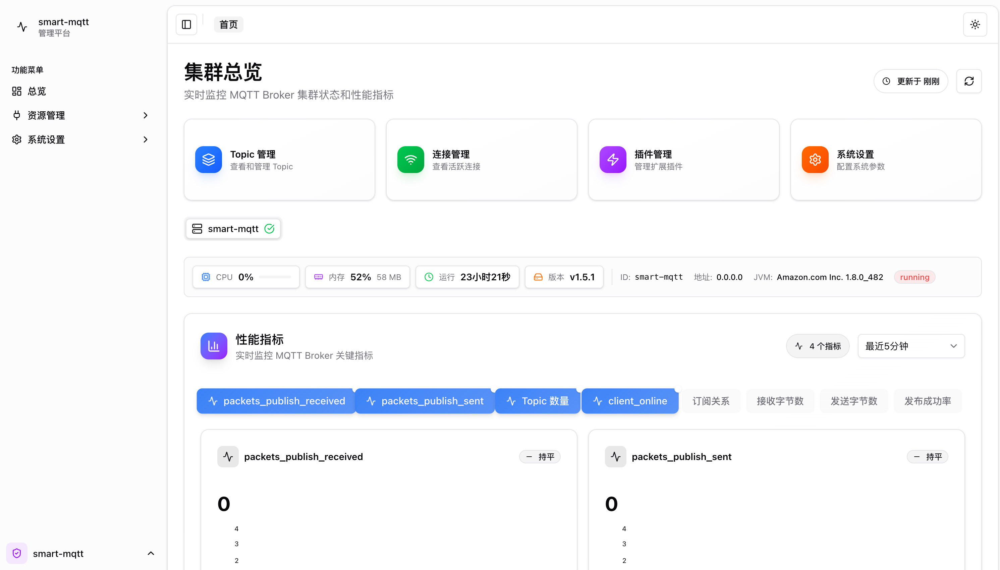
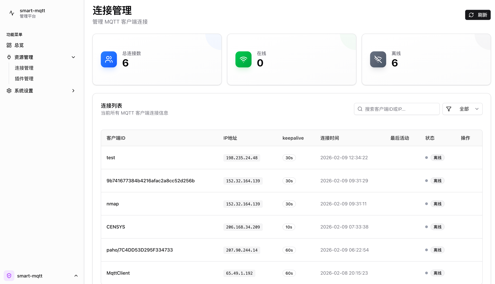
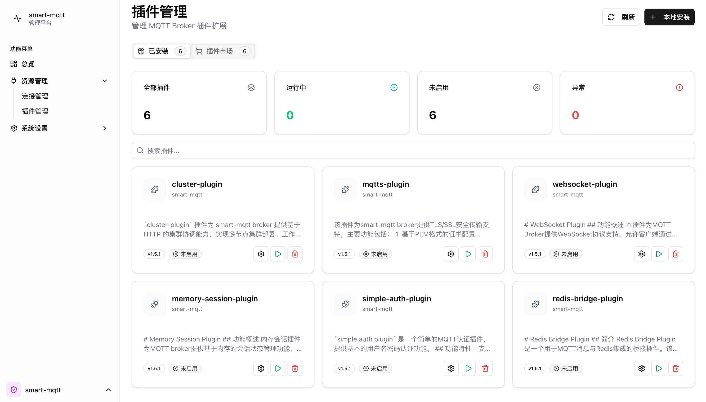
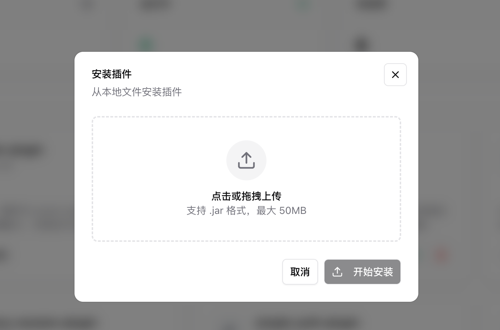
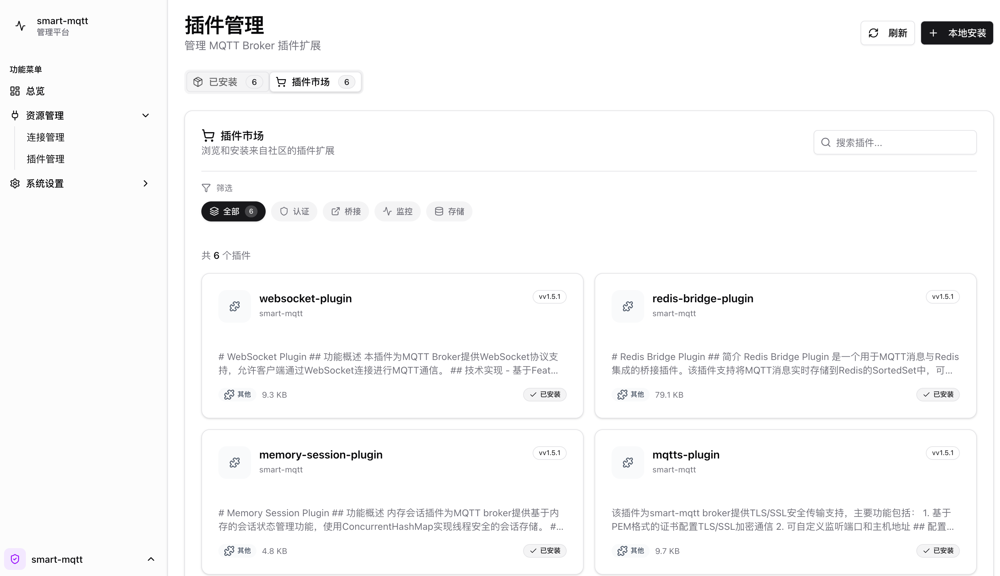
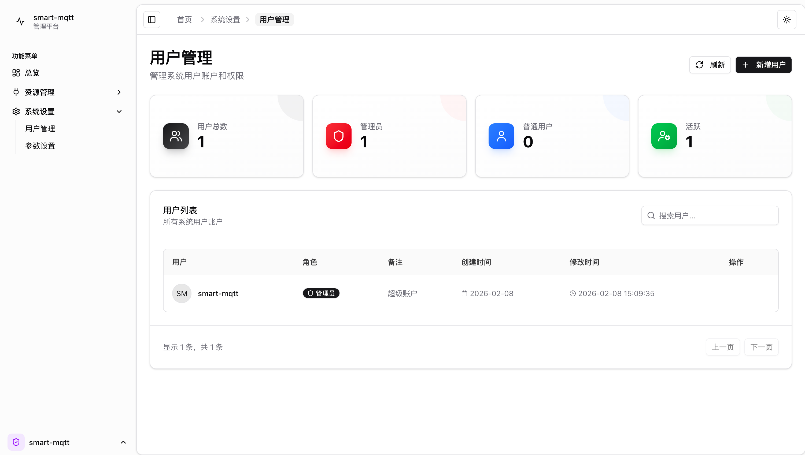
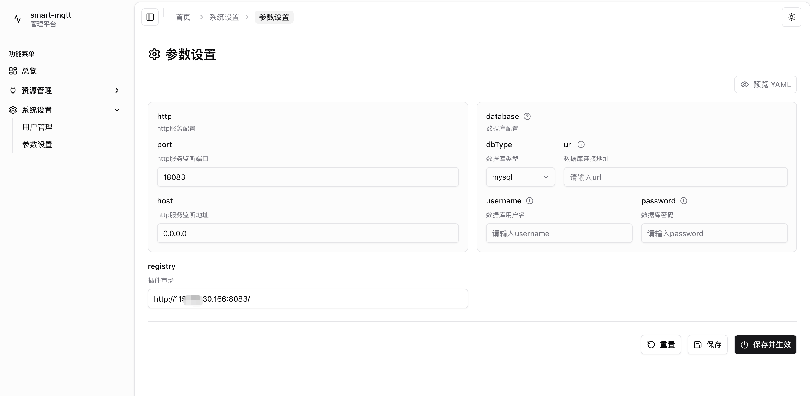
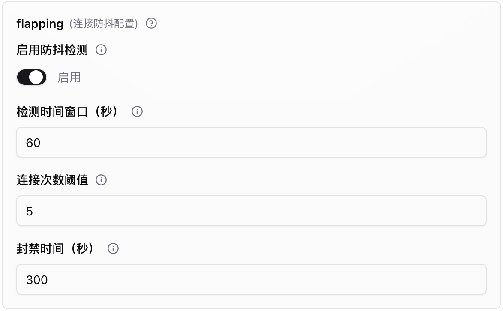

import { Aside } from '@astrojs/starlight/components';

## About smart-mqtt

smart-mqtt is designed for enterprise-level IoT scenarios with tens of thousands of device connections. It is also the first commercial product launched by the smartboot open-source organization, marking a significant strategic transformation from community-driven to sustainable development in the IoT field.

### Why Commercialization?

In the open-source world, we have witnessed many excellent projects gradually fade away due to lack of sustainable investment. The development of an enterprise-level MQTT Broker is no easy task - from protocol compatibility to massive connection support, from plugin ecosystem to operations toolchain, every aspect requires long-term investment from a professional team.

The essence of commercialization is to build a healthy value cycle: **users get stable and reliable products and services, and the team gets resource guarantees for continuous iteration**. This is not a departure from the open-source spirit, but a necessary choice to make open-source projects go further.

**Our Expectations**

- **Open Source Code**: All product features are open source, users can choose freely.
- **Quality Assurance**: Gradually stricter testing processes and SLA systems
- **Long-termism**: Reject short-term profit-taking, committed to building products that stand the test of time

> **We believe: Good products deserve to be priced, and continuous value deserves to be invested in.**

### Core Advantages

| Advantage | Business Value |
|------|----------|
| **🚀 Ultra High Performance** | Continuously optimized for 100K+ device access scenarios, featuring high throughput and low latency, the larger the connection volume, the more obvious the cost advantage |
| **🔧 Open Architecture** | Plugin-based design for on-demand expansion, southbound adaptation to multi-protocol devices, northbound bridging to enterprise systems, rejecting feature redundancy |
| **☕ Java Ecosystem** | Zero-barrier integration with existing tech stack, team gets up to speed quickly, mature operations toolchain, no burden for long-term maintenance |
| **🔄 Standard Protocol** | Fully compliant with MQTT 3.1.1/5.0, no vendor lock-in, business autonomy, smooth migration at any time |
| **🇨🇳 Self-controllable** | Full-stack self-developed core components, transparent and secure code, compliant with government and enterprise information innovation requirements |

## Main Features

smart-mqtt, through its built-in **enterprise-plugin**, serves as the foundational core component of the product, providing a fully-featured Web management console and powerful plugin lifecycle management capabilities.

After the service starts normally, you can access the platform login page through a browser at http://localhost:18083/ (adjust IP according to actual situation).

The management platform provides RESTful APIs based on HTTP services, with the frontend built using the Shadcn UI framework. Main functional modules include:

| Functional Module | Description |
|----------|------|
| **User Authentication** | Session-based user login, supports username + password authentication |
| **License Management** | Authorization verification, License import, status display |
| **Broker Management** | Cluster node list query |
| **Connection Management** | MQTT client connection query, forced disconnection |
| **Topic Management** | Subscription relationship query, Topic statistics query |
| **Plugin Management** | Plugin list, start/stop control, configuration management, plugin marketplace, local upload installation |
| **System Settings** | User management, system parameter configuration |

### Dashboard

The dashboard is the visual data display center of the management platform, providing real-time monitoring capabilities for Broker running status:

- **Connection Metrics**: Real-time display of current active connections, historical connection peaks, connection rates, and other key indicators
- **Message Metrics**: Monitor message send/receive rates, throughput, message backlog, etc.
- **System Resources**: Display server CPU, memory, disk, and other basic resource usage
- **Trend Charts**: Support displaying metric change trends by time dimension for analyzing business patterns

---
### Connection Management

Provides real-time monitoring and management capabilities for MQTT client connections:

- **Connection List Query**: Supports paginated queries, fuzzy search by ClientID
- **Connection Information Display**: ClientID, username, IP address, connection time, last activity time, status
- **Forced Disconnection**: Can actively disconnect specified client connections

<Aside type="tip">
    For scenarios with massive devices, it is recommended to use MySQL storage.
</Aside>

---

### Plugin Management

IoT business from POC to mass production, from single device access to multi-protocol fusion, requirements are always in dynamic change. smart-mqtt's plugin management system allows enterprises to build and evolve their own MQTT platform like building blocks, on-demand.

#### Solving Three Core Pain Points

| Pain Point | Solution |
|------|----------|
| **Feature Redundancy or Missing** | Enable WebSocket, cluster, data bridging and other capabilities on-demand, use as much as needed |
| **Change Means Downtime** | Plugin hot-plugging, configuration takes effect in real-time, version seamless upgrade |
| **Custom Requirements Hard to Implement** | Standardized interface supports private plugin development, enjoying the same management experience as official plugins |

#### Layered Capabilities, On-demand Expansion

- **Connection Layer**: WebSocket, SSL/TLS, multi-protocol gateway
- **Security Layer**: Simple authentication, enterprise-level authorization, ACL permission control
- **Data Layer**: MySQL persistence, Redis bridging, message queue integration
- **Architecture Layer**: Cluster expansion, session persistence, monitoring and alerting

> **One Sentence Summary**: Plugin management transforms smart-mqtt from a standardized Broker into an IoT communication platform that can flexibly evolve with business, making technology truly serve business.

#### Plugin Discovery and Acquisition

Plugins provided officially by smart-mqtt are all built into the product. smart-mqtt also provides two plugin integration methods to meet different scenario needs:

1. **Local Upload**
Supports uploading custom-developed JAR packages for installation, meeting privatization deployment and secondary development needs

2. **Plugin Marketplace**
Connect to remote official plugin repository, browse, search and download published plugins

---

### User Management

| Function | Description |
|------|------|
| **User List** | Paginated display of user information (username, role, description, creation time) |
| **Add User** | Create new user, set username, password, role |
| **Update User** | Modify user information, supports password reset |
| **Delete User** | Batch delete user accounts |
| **Role Management** | Supports two roles: administrator and regular user |

### System Parameters

System parameters are used to configure the core operating parameters of the smart-mqtt management platform, provided through the **enterprise-plugin** plugin.

| Parameter | Description | Default Value |
|--------|------|--------|
| **http.port** | HTTP service listening port, used to access Web management console and RESTful API | 18083 |
| **http.host** | HTTP service listening address, `0.0.0.0` means listening on all network interfaces | 0.0.0.0 |
| **database.dbType** | Database type, supports `h2` (file mode), `h2_mem` (memory mode), `mysql` | h2 |
| **database.url** | MySQL database connection address, only takes effect when `dbType` is `mysql` | - |
| **database.username** | MySQL database username, only takes effect when `dbType` is `mysql` | - |
| **database.password** | MySQL database password, only takes effect when `dbType` is `mysql` | - |
| **registry** | Plugin marketplace address, used to browse and download official plugins (currently experience server) |  |

<Aside type="tip">
    For production environments or massive device scenarios, it is recommended to set `dbType` to `mysql` for better stability and performance.
</Aside>

### Connection Flapping Protection

When MQTT clients frequently connect/disconnect due to network anomalies or program defects, it consumes a large amount of server resources and affects other normal clients. The connection flapping protection function protects the system through the following mechanisms:

**Configuration Entry**: System Settings -> Parameter Settings -> Connection Flapping Protection

- **Time Window Statistics**: Count each client's connection attempts within `thresholdDuration` seconds
- **Threshold Determination**: When connection attempts exceed `thresholdCount`, the client is determined to be flapping
- **Automatic Ban**: Ban flapping clients for `banTime` seconds, rejecting all their connection requests during this period
- **Automatic Unban**: Automatically lift the ban after the ban period expires, no manual intervention required

---

## Cost Comparison
The procurement cost of cloud products grows almost linearly with connection volume, while smart-mqtt inherently has performance overflow advantages, so **the larger the connection volume, the higher the cost-effectiveness**.

| Specification | SaaS Cloud Product Annual Fee | smart-mqtt Self-built Cost (Annual) |
|------|-------------|------------|
| 1000 connections/1000TPS/1000 subscriptions | 17K | 3K~5K (hardware) + license fee |
| 50000 connections/20000TPS/1000 subscriptions | 370K | 10K~20K (hardware) + license fee |
| 1M connections/200K TPS/1M subscriptions | 3.768M | 150K~300K (hardware estimate) + license fee |

> Data source: [Alibaba Cloud IoT](https://www.aliyun.com/product/mq4iot), [Huawei Cloud IoT](https://www.huaweicloud.com/pricing.html#/iothub)
> 
> **Note**: smart-mqtt self-built cost is an estimate of server hardware costs (3-year depreciation), including server, bandwidth, operations and other infrastructure costs. Actual costs vary by configuration, region, and operations strategy, for reference only.
