`advanced-auth-plugin` 是一个企业级 MQTT 认证插件，提供认证链、多种认证方式和密码编码功能。**该插件的 Redis 和 HTTP 认证均采用完全异步模式设计，能够高效应对瞬间海量连接认证请求，充分保障服务整体稳定性。**

## 工作原理

高级认证插件采用**认证链**机制，支持配置多个认证器按优先级顺序执行。当 MQTT 客户端发起连接请求时，插件会依次尝试各个认证器，直到认证成功或所有认证器都尝试完毕。

**认证结果类型**

- **`SUCCESS`**：认证成功，立即停止后续认证，允许连接
- **`FAILURE`**：认证失败（如密码错误），根据 `stopOnError` 配置决定是否继续
- **`CONTINUE`**：当前认证器无法处理（如用户不存在），继续执行下一个认证器

**认证流程**

```mermaid
sequenceDiagram
    autonumber
    participant C as MQTT 客户端
    participant A as 高级认证插件
    participant R as Redis 认证器
    participant H as HTTP 认证器
    participant S as 后续认证器
    
    C->>A: 1. CONNECT 请求<br/>(username + password)
    A->>A: 2. 检查是否允许匿名访问
    
    alt 允许匿名且未提供凭证
        A-->>C: 3a. 匿名用户连接成功
    else 需要认证
        A->>R: 3b. 执行 Redis 认证
        
        alt Redis 返回 SUCCESS
            R-->>A: SUCCESS
            A-->>C: 4a. 认证成功
        else Redis 返回 FAILURE/CONTINUE
            A->>H: 4b. 继续执行 HTTP 认证
            
            alt HTTP 返回 SUCCESS
                H-->>A: SUCCESS
                A-->>C: 5a. 认证成功
            else HTTP 返回 FAILURE/CONTINUE
                A->>S: 5b. 继续执行后续认证器
                
                alt 后续认证器返回 SUCCESS
                    S-->>A: SUCCESS
                    A-->>C: 6a. 认证成功
                else 所有认证器执行完毕未成功
                    A-->>C: 6b. 认证失败，拒绝连接
                end
            end
        end
    end
```



## 核心特性

**Redis 和 HTTP 认证器均采用全异步非阻塞实现**，这是本插件应对海量并发场景的核心优势：

- **零线程阻塞**：认证操作通过异步回调机制完成，不会占用 Broker 工作线程
- **海量并发支撑**：单个节点可轻松应对数万甚至数十万级别的瞬时连接认证请求
- **服务稳定性保障**：即使外部认证服务响应缓慢，也不会导致 Broker 线程池耗尽

**典型应用场景：设备集中重连**

当 MQTT Broker 因维护或故障重启后，大量设备会在短时间内同时发起重连，形成短时间的**集中认证高峰**。此时：

| 认证模式 | 传统同步模式 | 本插件异步模式 |
|---------|-------------|---------------|
| 线程占用 | 每个认证请求占用一个线程等待响应 | 无需等待，释放线程处理其他任务 |
| 吞吐量 | 受限于线程池大小（通常几百至几千） | 仅受网络 IO 限制（可达十万级） |
| 雪崩风险 | 高 - 线程池耗尽导致服务不可用 | 低 - 异步排队自动缓冲压力 |

## 配置方式

### 基础配置

| 配置项 | 类型 | 必填 | 默认值 | 说明 |
|--------|------|------|--------|------|
| `stopOnError` | boolean | 否 | `true` | 认证失败时是否立即停止。`true`：认证器异常立即拒绝连接；`false`：异常当作 CONTINUE 处理，继续下一个认证器 |
| `allowAnonymous` | boolean | 否 | `false` | 是否允许匿名访问。`true`：未提供凭证时允许匿名连接；`false`：拒绝匿名连接 |
| `chain` | array | 是 | - | 认证链顺序，按此顺序执行认证器。可选值：`redis`、`http`（MySQL 认证器暂未实现） |

### Redis 认证配置

从 Redis 查询用户凭证进行认证，适用于分布式、高并发场景。

| 配置项 | 类型 | 必填 | 默认值 | 说明 |
|--------|------|------|--------|------|
| `address` | string | 是 | - | Redis 地址，格式：`redis://host:port` |
| `username` | string | 否 | `""` | Redis 用户名（Redis 6.0+ ACL 认证） |
| `password` | string | 否 | `""` | Redis 密码 |
| `database` | number | 否 | `0` | 数据库索引 |
| `timeout` | number | 否 | `3000` | 连接超时时间，单位毫秒 |

#### Redis 数据存储格式

Redis Key 格式：`smart-mqtt:auth:{username}`

使用 Hash 结构存储用户凭证：

| 字段 | 说明 | 必填 |
|------|------|------|
| `pwd_hash` | 密码哈希值 | 是 |
| `salt` | 盐值（有盐值时密码 = salt + 原始密码） | 否 |
| `encoder` | 密码编码器名称：`plain`、`md5`、`sha256` | 否 |

**密码编码说明：**

- `plain`：明文存储，不推荐生产环境使用
- `md5`：MD5 哈希（Base64 编码）
- `sha256`：SHA-256 哈希（Base64 编码，推荐）
- 不指定 `encoder` 时，默认使用 `plain`

### HTTP 认证配置

调用外部 HTTP 接口进行认证，适用于微服务架构和第三方认证系统集成。

| 配置项 | 类型 | 必填 | 默认值 | 说明 |
|--------|------|------|--------|------|
| `url` | string | 是 | - | 认证接口 URL |
| `timeout` | number | 否 | `5000` | 请求超时时间，单位毫秒 |
| `headers` | object | 否 | - | 自定义请求头 |

#### HTTP 接口规范

**请求：**

- 方法：`POST`
- Content-Type：`application/json`
- 请求体：

```json
{
  "username": "test",
  "password": "123456",
  "clientId": "client-001"
}
```

**响应：**

- 状态码 `200`：认证成功
- 其他状态码：认证失败

## 配置示例

### 场景 1：纯 Redis 认证

```yaml
stopOnError: true
allowAnonymous: false

chain:
  - redis

redis:
  address: redis://localhost:6379
  database: 0
```

### 场景 2：Redis + HTTP 降级认证

Redis 优先认证，当 Redis 中不存在用户或认证失败时，降级到 HTTP 认证。

```yaml
stopOnError: false
allowAnonymous: false

chain:
  - redis
  - http

redis:
  address: redis://localhost:6379
  database: 0

http:
  url: http://localhost:8080/api/auth
  timeout: 5000
```

### 场景 3：纯 HTTP 认证

```yaml
stopOnError: true
allowAnonymous: false

chain:
  - http

http:
  url: http://auth-service:8080/api/auth
  timeout: 5000
  headers:
    Authorization: Bearer ${AUTH_TOKEN}
```

## Redis 认证数据管理

### 生成用户凭证

**命令行方式：**

```bash
# 创建明文密码用户（不推荐）
HMSET smart-mqtt:auth:admin pwd_hash "admin123"

# 创建 MD5 用户（Base64 编码）
HMSET smart-mqtt:auth:user2 pwd_hash "4QrcOUm6Wau+VuBX8g+IPg==" encoder "md5"

# 创建带盐值的 SHA-256 用户（推荐）
HMSET smart-mqtt:auth:user1 pwd_hash "5UQKTFfTc2G+pH1tHy3c8zJKuQdP8U3dJ8b7Y6h5fQE=" salt "mysalt" encoder "sha256"
```

**生成密码哈希：**

```bash
# 生成 SHA-256（Python）
python3 -c "import hashlib,base64; print(base64.b64encode(hashlib.sha256(b'saltpassword').digest()).decode())"

# 生成 MD5（Python）
python3 -c "import hashlib,base64; print(base64.b64encode(hashlib.md5(b'password').digest()).decode())"
```

**Java 生成示例：**

```java
import java.nio.charset.StandardCharsets;
import java.security.MessageDigest;
import java.util.Base64;

public class PasswordEncoder {
    
    public static String sha256(String password, String salt) {
        try {
            String saltedPassword = salt != null ? salt + password : password;
            MessageDigest digest = MessageDigest.getInstance("SHA-256");
            byte[] hash = digest.digest(saltedPassword.getBytes(StandardCharsets.UTF_8));
            return Base64.getEncoder().encodeToString(hash);
        } catch (Exception e) {
            throw new RuntimeException(e);
        }
    }
}
```

### 查询用户凭证

```bash
# 查询用户所有字段
HMGET smart-mqtt:auth:admin pwd_hash salt encoder

# 查询所有字段（返回键值对）
HGETALL smart-mqtt:auth:admin

# 查询单个字段
HGET smart-mqtt:auth:admin pwd_hash
HGET smart-mqtt:auth:admin encoder

# 检查用户是否存在
EXISTS smart-mqtt:auth:admin
```

### 删除用户凭证

```bash
# 删除单个用户
DEL smart-mqtt:auth:admin

# 删除多个用户（使用通配符）
EVAL "return redis.call('del', unpack(redis.call('keys', 'smart-mqtt:auth:*')))" 0
```

### 批量导入用户

可使用 `redis-cli` 配合脚本批量导入用户数据。

## HTTP 认证服务示例（Feat Cloud）

```java
import tech.smartboot.feat.cloud.FeatCloud;
import tech.smartboot.feat.cloud.annotation.Autowired;
import tech.smartboot.feat.cloud.annotation.Bean;
import tech.smartboot.feat.cloud.annotation.Controller;
import tech.smartboot.feat.cloud.annotation.RequestMapping;
import tech.smartboot.feat.cloud.annotation.RequestParam;
import tech.smartboot.feat.core.common.HeaderValue;
import tech.smartboot.feat.core.common.logging.Log;
import tech.smartboot.feat.core.common.logging.LogFactory;
import tech.smartboot.feat.core.server.HttpResponse;

/**
 * MQTT 认证服务 - Feat Cloud 实现
 */
@Controller
public class MqttAuthController {
    
    private static final Log LOG = LogFactory.getLog(MqttAuthController.class);
    
    @Autowired
    private UserService userService;
    
    /**
     * MQTT 认证端点
     *
     * @param username 用户名
     * @param password 密码
     * @param clientId 客户端 ID
     * @param response HTTP 响应
     */
    @RequestMapping("/api/auth")
    public void authenticate(
            @RequestParam String username,
            @RequestParam String password,
            @RequestParam(required = false) String clientId,
            HttpResponse response) {
        
        LOG.info("Auth request: username={}, clientId={}", username, clientId);
        
        // 验证参数
        if (username == null || password == null) {
            response.setStatus(400);
            response.write("Missing username or password");
            return;
        }
        
        // 执行认证逻辑
        boolean authenticated = userService.validateCredentials(username, password, clientId);
        
        if (authenticated) {
            response.setStatus(200);
            response.setHeader(HeaderValue.ContentType.TEXT_PLAIN);
            response.write("OK");
            LOG.info("Auth success: username={}", username);
        } else {
            response.setStatus(401);
            response.setHeader(HeaderValue.ContentType.TEXT_PLAIN);
            response.write("Authentication failed");
            LOG.warn("Auth failed: username={}", username);
        }
    }
}
```

## 为什么选择 Redis 认证

Redis 凭借以下特性成为大规模物联网认证的理想选择：

| 特性 | Redis | 传统数据库 |
|------|-------|-----------|
| 读写性能 | 内存级操作，毫秒甚至微秒级响应 | 磁盘 IO，通常毫秒级 |
| 并发能力 | 单节点可达 10 万+ QPS | 通常数千 QPS |
| 连接成本 | 轻量级连接，资源消耗低 | 连接池资源占用大 |
| 水平扩展 | 原生支持集群分片 | 分库分表复杂度高 |

结合本插件的**异步认证架构**，Redis 认证器能够在海量并发场景下充分发挥性能优势。建议将用户凭证缓存在 Redis 中，配合 HTTP 认证作为降级方案，在 Redis 未命中时回源到主数据库查询。

## 注意事项

1. **密码编码**：MD5 和 SHA-256 哈希后会进行 Base64 编码存储
2. **异常处理**：当 `stopOnError=false` 时，认证器异常会被捕获并当作 `CONTINUE` 处理。HTTP/Redis 认证器内部已对异常进行了处理，通常返回 CONTINUE
3. **配置热加载**：修改配置后需要重启 MQTT 服务生效
4. **Redis Key 前缀**：固定为 `smart-mqtt:auth:`，不可配置
5. **MySQL 认证器**：暂未实现，敬请期待

## 故障排查

| 问题 | 可能原因 | 解决方案 |
|------|----------|----------|
| 认证总是失败 | 密码编码不匹配 | 检查 encoder 配置和哈希计算 |
| HTTP 认证无响应 | 服务不可达 | 检查 URL 和 timeout 配置 |
| 匿名用户被拒 | allowAnonymous 为 false | 设置为 true 或提供有效凭证 |
