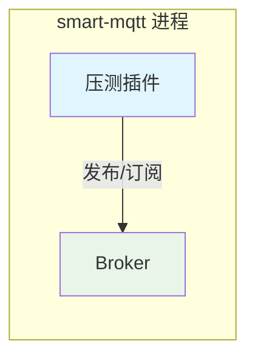
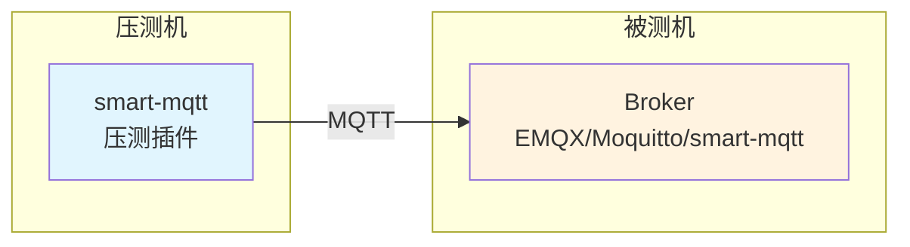
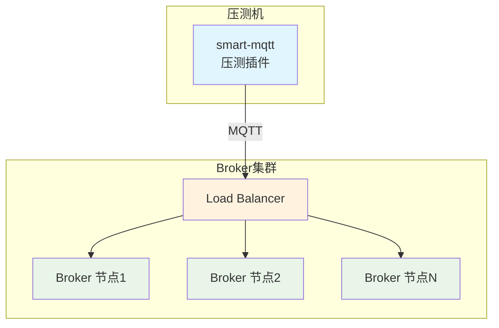

`bench-plugin` 是一款通用的 MQTT 压测插件，可用于测试任意 MQTT Broker（如 EMQX、Moquitto、ActiveMQ 等），支持 **发布压测** 和 **订阅压测** 两种场景，帮助开发者评估 MQTT broker 的性能表现。

## 功能概述

- **发布压测**：模拟大量客户端同时向 MQTT broker 发布消息，测试 broker 的消息接收和处理能力
- **订阅压测**：模拟大量订阅者订阅主题，同时可选启动发布者向这些主题发布消息，测试 broker 的消息分发能力
- 实时输出 TPS（每秒事务数）统计数据
- 支持灵活的压测参数配置

## 压测场景

bench-plugin 支持三种压测模式，适用于不同的测试需求：

### 场景一：进程内压测（自测模式）



**说明**：smart-mqtt broker 和插件处于同一个进程中，即自己压测自己。

- **优点**：架构简单，部署方便
- **缺点**：存在资源竞争，会对测试结果造成波动，无法测出极限能力
- **适用场景**：快速验证功能、简单的性能摸底

### 场景二：单节点压测（横向对比）



**说明**：分开部署，smart-mqtt 启动压测插件对其他节点的 broker 进行压测。这些 broker 可以是 smart-mqtt，也可以是其他类型的 broker（如 EMQX、Moquitto、ActiveMQ 等）。

- **优点**：数据更准确，无资源竞争干扰
- **适用场景**：各 broker 产品的横向性能对比、单节点性能评估

### 场景三：集群压测



**说明**：分开部署，被压测对象是一套完整的 Broker 集群，通常包含负载均衡器和多个 Broker 节点。

- **优点**：真实模拟生产环境，评估集群整体吞吐能力
- **适用场景**：集群性能评估、容量规划

| 场景 | 部署方式 | 准确性 | 适用场景 |
|------|----------|--------|----------|
| 进程内压测 | 同一进程 | ⭐⭐ | 功能验证、快速摸底 |
| 单节点压测 | 分开部署 | ⭐⭐⭐⭐ | 横向对比、单节点评估 |
| 集群压测 | 分开部署 | ⭐⭐⭐⭐⭐ | 生产环境评估、容量规划 |

## 核心组件

- **BenchPlugin**：插件入口，负责初始化压测任务和调度
- **PluginConfig**：压测插件配置，包含公共参数和场景特定参数
- **PublishConfig**：发布压测配置
- **SubscribeConfig**：订阅压测配置

## 配置参数

在 `plugin.yaml` 中配置压测插件，支持以下参数：

### 公共参数

| 参数 | 类型 | 默认值 | 说明 |
|------|------|--------|------|
| `scenario` | String | `publish` | 压测场景：`publish`=发布压测，`subscribe`=订阅压测 |
| `host` | String | `127.0.0.1` | MQTT 服务器地址 |
| `port` | int | `1883` | MQTT 服务器端口 |
| `topicCount` | int | `128` | 主题数量 |
| `qos` | int | `0` | QoS 等级：`0`=AtMostOnce，`1`=AtLeastOnce，`2`=ExactlyOnce |
| `payloadSize` | int | `1024` | 消息负载大小（字节） |

### 发布压测配置 (publish)

| 参数 | 类型 | 默认值 | 说明 |
|------|------|--------|------|
| `connections` | int | `1000` | 发布者数量（并发连接数） |
| `publishCount` | int | `1` | 每次发布的消息数量 |
| `period` | int | `1` | 发布间隔（毫秒） |

### 订阅压测配置 (subscribe)

| 参数 | 类型 | 默认值 | 说明 |
|------|------|--------|------|
| `connections` | int | `1000` | 订阅者数量（并发连接数） |
| `publisherCount` | int | `1` | 发布者数量，设为 `0` 表示不启动发布者 |
| `publishCount` | int | `1` | 每次发布的消息数量 |
| `publishPeriod` | int | `1` | 发布间隔（毫秒） |

## 配置示例

### 发布压测配置

```yaml
# 压测场景: publish-发布压测, subscribe-订阅压测
scenario: publish

# MQTT服务器地址
host: 127.0.0.1
# MQTT服务器端口
port: 1883
# 消息负载大小（字节）
payloadSize: 128
# 主题数量
topicCount: 128
# QoS等级: 0-AtMostOnce, 1-AtLeastOnce, 2-ExactlyOnce
qos: 0

# 发布压测配置
publish:
  # 发布者数量
  connections: 1000
  # 每次发布的消息数量
  publishCount: 1
  # 发布间隔（毫秒）
  period: 1
```

### 订阅压测配置

```yaml
# 压测场景: subscribe-订阅压测
scenario: subscribe

# MQTT服务器地址
host: 127.0.0.1
# MQTT服务器端口
port: 1883
# 消息负载大小（字节）
payloadSize: 128
# 主题数量
topicCount: 128
# QoS等级
qos: 0

# 订阅压测配置
subscribe:
  # 订阅者数量
  connections: 2000
  # 发布者数量（0表示不启动发布者）
  publisherCount: 10
  # 每次发布的消息数量
  publishCount: 1
  # 发布间隔（毫秒）
  publishPeriod: 1
```

## 使用说明

1. 将压测插件及其配置文件放置于 smart-mqtt 的 `plugins` 目录下
2. 根据压测需求编辑 `plugin.yaml` 配置文件
3. 启动 smart-mqtt 服务，插件会自动加载并延迟 5 秒后开始压测
4. 观察控制台输出的压测数据，包括：
   - `total`: 消息总数
   - `TPS`: 每秒处理的事务数

## 输出示例

```
[bench-plugin] 压测场景: publish
[bench-plugin] 启动发布压测:
  发布者数: 1000
  负载大小: 128 bytes
  主题数: 128
  每次发布数: 1
  发布间隔: 1ms
  QoS: 0
total: 50000	TPS: 10000
total: 50000	TPS: 10000
total: 50000	TPS: 10000
```

## 注意事项

- 压测插件会在服务启动后延迟 5 秒开始执行，以便 broker 完全初始化
- 压测过程中可以随时停止 smart-mqtt 服务，插件会优雅关闭所有连接
- 建议在压测前确保服务器资源充足，避免因资源耗尽影响测试结果
- 订阅压测场景下，`publisherCount` 设为 `0` 时只会创建订阅者连接，不会发送消息，适用于测试订阅性能
- 高并发压测时注意调整系统文件描述符限制（ulimit）