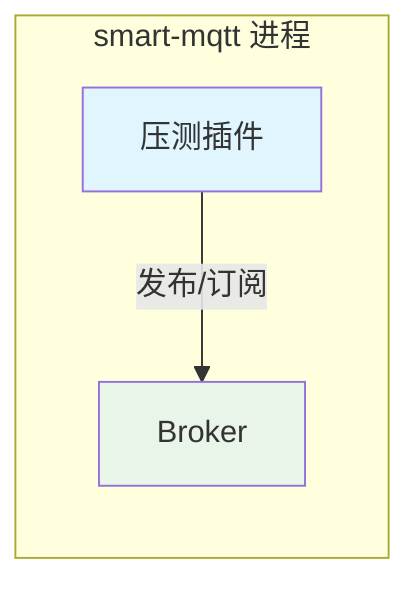
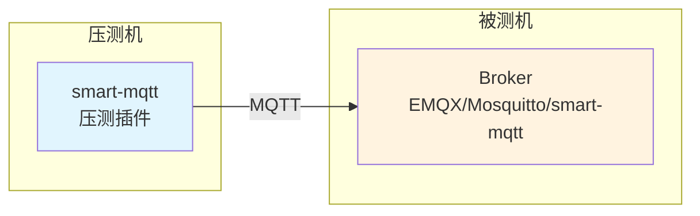
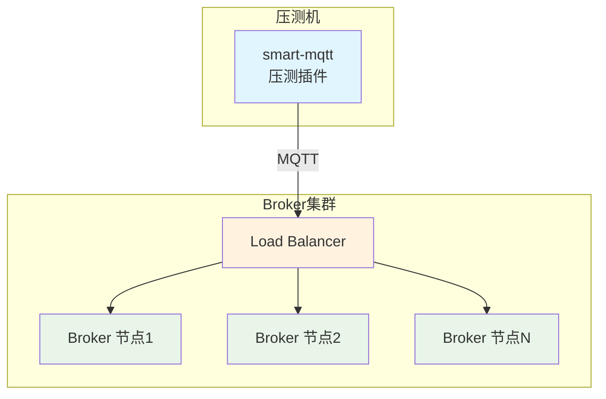
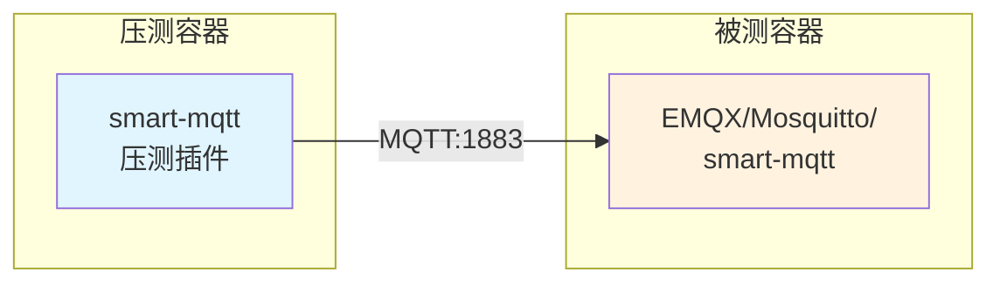

import { Aside } from '@astrojs/starlight/components';

`bench-plugin` 是一款通用的 MQTT 压测插件，可用于测试任意 MQTT Broker（如 EMQX、Mosquitto、ActiveMQ 等），支持 **发布压测** 和 **订阅压测** 两种场景，帮助开发者评估 MQTT broker 的性能表现。

## 功能概述

- **发布压测**：模拟大量客户端同时向 MQTT broker 发布消息，测试 broker 的消息接收和处理能力
- **订阅压测**：模拟大量订阅者订阅主题，同时可选启动发布者向这些主题发布消息，测试 broker 的消息分发能力
- 实时输出 TPS（每秒事务数）统计数据
- 支持灵活的压测参数配置

## 压测场景

bench-plugin 支持三种压测模式，适用于不同的测试需求：

### 场景一：进程内压测（自测模式）



**说明**：smart-mqtt broker 和插件处于同一个进程中，即自己压测自己。

- **优点**：架构简单，部署方便
- **缺点**：存在资源竞争，会对测试结果造成波动，无法测出极限能力
- **适用场景**：快速验证功能、简单的性能摸底

### 场景二：单节点压测（横向对比）



**说明**：分开部署，smart-mqtt 启动压测插件对其他节点的 broker 进行压测。这些 broker 可以是 smart-mqtt，也可以是其他类型的 broker（如 EMQX、Mosquitto、ActiveMQ 等）。

- **优点**：数据更准确，无资源竞争干扰
- **适用场景**：各 broker 产品的横向性能对比、单节点性能评估

### 场景三：集群压测



**说明**：分开部署，被压测对象是一套完整的 Broker 集群，通常包含负载均衡器和多个 Broker 节点。

- **优点**：真实模拟生产环境，评估集群整体吞吐能力
- **适用场景**：集群性能评估、容量规划

| 场景 | 部署方式 | 准确性 | 适用场景 |
|------|----------|--------|----------|
| 进程内压测 | 同一进程 | ⭐⭐ | 功能验证、快速摸底 |
| 单节点压测 | 分开部署 | ⭐⭐⭐⭐ | 横向对比、单节点评估 |
| 集群压测 | 分开部署 | ⭐⭐⭐⭐⭐ | 生产环境评估、容量规划 |

## 核心组件

- **BenchPlugin**：插件入口，负责初始化压测任务和调度
- **PluginConfig**：压测插件配置，包含公共参数和场景特定参数
- **PublishConfig**：发布压测配置
- **SubscribeConfig**：订阅压测配置

## 配置参数

在 `plugin.yaml` 中配置压测插件，支持以下参数：

### 公共参数

| 参数 | 类型 | 默认值 | 说明 |
|------|------|--------|------|
| `scenario` | String | `publish` | 压测场景：`publish`=发布压测，`subscribe`=订阅压测 |
| `host` | String | `127.0.0.1` | MQTT 服务器地址 |
| `port` | int | `1883` | MQTT 服务器端口 |
| `topicCount` | int | `128` | 主题数量 |
| `qos` | int | `0` | QoS 等级：`0`=AtMostOnce，`1`=AtLeastOnce，`2`=ExactlyOnce |
| `payloadSize` | int | `1024` | 消息负载大小（字节） |

### 发布压测配置 (publish)

| 参数 | 类型 | 默认值 | 说明 |
|------|------|--------|------|
| `connections` | int | `1000` | 发布者数量（并发连接数） |
| `publishCount` | int | `1` | 每次发布的消息数量 |
| `period` | int | `1` | 发布间隔（毫秒） |

### 订阅压测配置 (subscribe)

| 参数 | 类型 | 默认值 | 说明 |
|------|------|--------|------|
| `connections` | int | `1000` | 订阅者数量（并发连接数） |
| `publisherCount` | int | `1` | 发布者数量，设为 `0` 表示不启动发布者 |
| `publishCount` | int | `1` | 每次发布的消息数量 |
| `publishPeriod` | int | `1` | 发布间隔（毫秒） |


## 使用说明

通过 smart-mqtt 后台管理控制台的插件管理功能，可以方便地进行压测场景的设置和启停。

1. **登录管理控制台**：访问 smart-mqtt 管理控制台（默认端口 18083），登录后台管理系统

2. **进入插件管理**：在左侧导航栏选择「插件管理」菜单，找到「压测插件」

3. **配置压测参数**：
   - 点击插件的「配置」按钮
   - 根据压测需求设置参数（场景、连接数、payload 大小、QoS 等）
   - 保存配置

4. **启动压测**：
   - 点击插件的「启动」按钮开始压测
   - 插件会自动加载配置并开始执行压测任务

5. **查看压测数据**：
   - 在插件详情页或控制台日志中观察压测数据
   - 包括：`total`（消息总数）、`TPS`（每秒事务数）

6. **停止压测**：
   - 点击插件的「停止」按钮结束压测
   - 插件会优雅关闭所有连接

## 性能测试数据

以下是通过本压测插件对 smart-mqtt 进行压测的性能数据，供参考。

### 环境准备

一台装有 Docker 的 Linux 服务器、Windows 或者 Macbook。

> 支持主流的 amd64 和 arm64 架构。

<Aside type="tip">
若进行海量连接测试，需要配置文件描述符限制：**`ulimit -n 65535`**
</Aside>

### 消息订阅压测

**场景设计**：
- MQTT Client 订阅者数量：2000
- MQTT Client 发布者数量：10（每个连接每秒发布 100 条消息）
- Topic 数量：128
- 消息 payload 大小：128 字节

| 消息质量 | smart-mqtt | 某三方Broker |
|:--------:|:----------:|:----:|
| QoS0 | 1000W/s | 800W/s |
| QoS1 | 540W/s | 400W/s |
| QoS2 | 320W/s | 200W/s |

### 消息发布压测

**场景设计**：
- MQTT Client 发布者数量：2000（每个连接每秒发布 1000 条消息）
- Topic 数量：128
- 消息 payload 大小：128 字节

| 消息质量 | smart-mqtt | 某三方Broker |
|:--------:|:----------:|:----:|
| QoS0 | 140W/s | 45W/s |
| QoS1 | 80W/s | 10W/s |
| QoS2 | 76W/s | 7W/s |


:::tip[说明]
以上性能数据仅供参考，实际性能受硬件配置、网络环境、JVM 参数等多种因素影响。
:::

## 横向对比测试

使用压测插件可以对第三方 MQTT Broker 进行横向对比测试。项目提供了 Docker Compose 配置文件，方便快速搭建测试环境。

### 测试环境架构



### Docker Compose 配置

在项目根目录的 [docker-compose.yml](https://gitee.com/smartboot/smart-mqtt/blob/master/docker-compose.yml) 中预置了测试环境：

```yaml
networks:
  mqtt-network:
    driver: bridge

services:
  # 压测端：运行 smart-mqtt 压测插件
  smart-mqtt:
    container_name: smart-mqtt
    image: smartboot/smart-mqtt:latest
    environment:
      ENTERPRISE_ENABLE: true      # 启用企业版特性
      BROKER_MAXINFLIGHT: 256
    ports:
      - 18083:18083                 # 管理控制台
      - 1883:1883                   # MQTT 端口

  # 被测端：待测试的 MQTT Broker
  mqtt-broker:
    container_name: mqtt-broker
    image: smartboot/smart-mqtt:latest
    environment:
      ENTERPRISE_ENABLE: false
      BROKER_MAXINFLIGHT: 256
```

### 测试第三方 Broker

如需测试其他 Broker（如 EMQX），修改 `mqtt-broker` 服务配置：

```yaml
mqtt-broker:
  container_name: emqx
  hostname: mqtt-broker
  image: emqx/emqx:5.0.24
  networks:
    mqtt-network: null
  restart: always
  security_opt:
    - no-new-privileges:true
  user: root:root
  logging:
    driver: "json-file"
    options:
      max-size: "100m"
      max-file: "1"
```

<Aside type="note">
同一时刻只能存在一个服务名为 `mqtt-broker` 的容器，测试不同 Broker 时需注释掉其他同名服务。
</Aside>


### 执行测试步骤

1. **启动测试环境**：

```bash
docker-compose up -d
```

2. **配置压测插件**：
   - 访问 smart-mqtt 管理控制台：http://localhost:18083
   - 进入「插件管理」→「压测插件」→「配置」
   - 设置 `host` 为 `mqtt-broker`（被测容器名称）
   - 设置 `port` 为 `1883`（被测容器 MQTT 端口）

3. **启动压测**：
   - 点击「启动」按钮开始压测
   - 在控制台日志中查看实时 TPS 数据

4. **查看结果**：

```bash
# 查看 smart-mqtt 容器日志
docker-compose logs -f smart-mqtt
```

5. **停止测试**：

```bash
docker-compose down
```

## 注意事项

- 压测插件会在服务启动后延迟 5 秒开始执行，以便 broker 完全初始化
- 压测过程中可以随时停止 smart-mqtt 服务，插件会优雅关闭所有连接
- 建议在压测前确保服务器资源充足，避免因资源耗尽影响测试结果
- 订阅压测场景下，`publisherCount` 设为 `0` 时只会创建订阅者连接，不会发送消息，适用于测试订阅性能
- 高并发压测时注意调整系统文件描述符限制（ulimit）