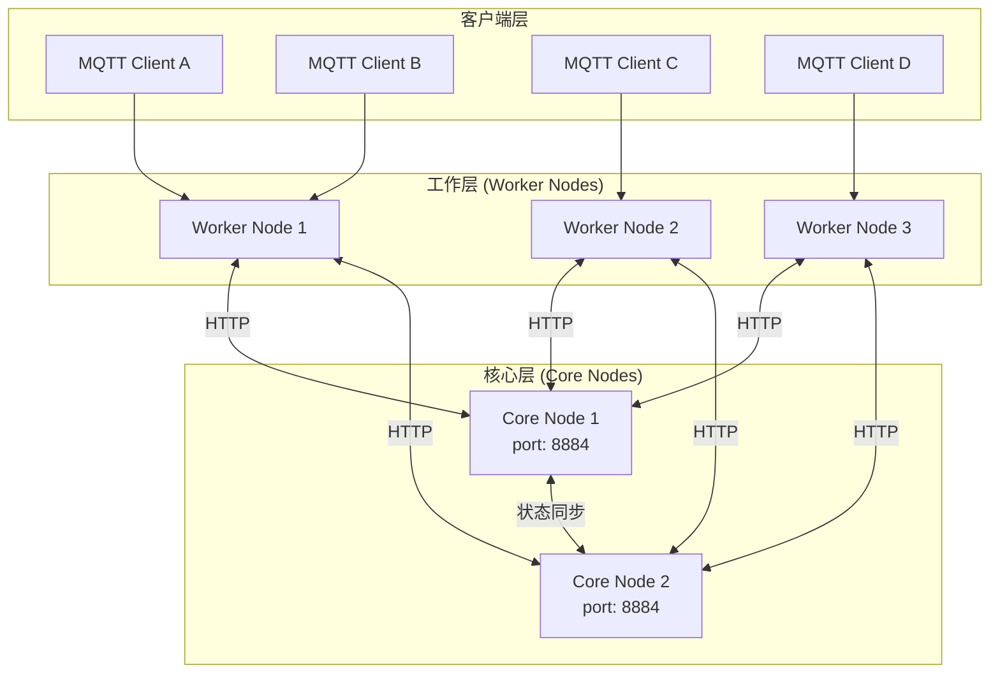
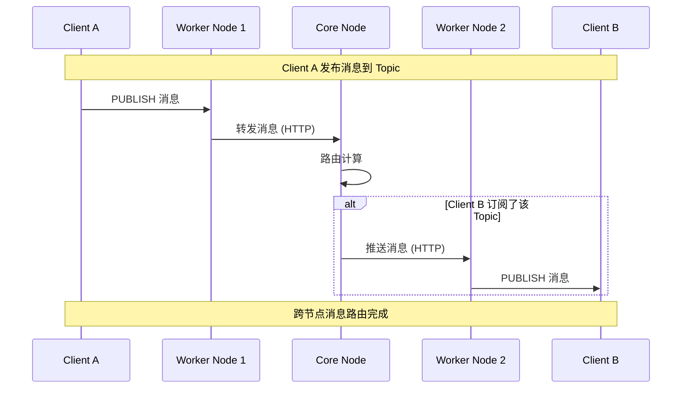
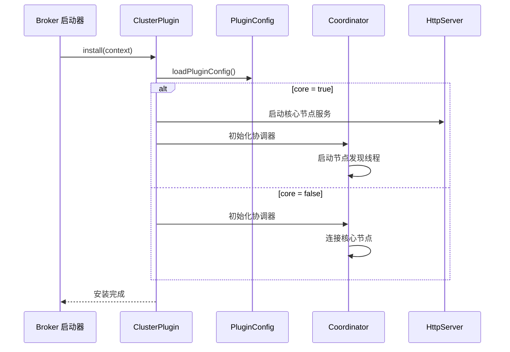

`cluster-plugin` 为 smart-mqtt broker 提供基于 HTTP 的集群协调能力，实现多节点集群部署、工作节点接入和集群状态同步。

## 概述

在分布式 MQTT 场景中，单节点部署往往无法满足高可用和高并发的需求。cluster-plugin 通过集群架构将多个 broker 节点组织起来，提供统一的消息路由和状态同步能力。

### 适用场景

- **高可用部署**: 多节点冗余，单点故障自动切换
- **负载均衡**: 客户端连接分散到多个工作节点
- **水平扩展**: 根据业务规模动态增加节点
- **异地多活**: 跨地域部署，就近服务

### 核心特性

- 支持核心节点(Core)与工作节点(Worker)的集群部署
- 节点间通过 HTTP 通信进行状态同步与消息转发
- 支持分布式消息路由与队列策略
- 动态发现与管理集群节点

## 架构原理

### 集群拓扑



### 消息流转



### 启动流程



## 核心组件

| 组件 | 类名 | 职责 |
|------|------|------|
| 插件入口 | [`ClusterPlugin`](https://gitee.com/smartboot/smart-mqtt/blob/master/plugins/cluster-plugin/src/main/java/tech/smartboot/mqtt/plugin/cluster/ClusterPlugin.java) | 初始化集群核心服务或工作节点连接 |
| 协调器 | [`Coordinator`](https://gitee.com/smartboot/smart-mqtt/blob/master/plugins/cluster-plugin/src/main/java/tech/smartboot/mqtt/plugin/cluster/Coordinator.java) | 节点发现、状态维护、分布式消息路由 |
| 消息分发 | [`Distributor`](https://gitee.com/smartboot/smart-mqtt/blob/master/plugins/cluster-plugin/src/main/java/tech/smartboot/mqtt/plugin/cluster/Coordinator.java) | 支持多种队列策略的消息分发 |
| 配置管理 | [`PluginConfig`](https://gitee.com/smartboot/smart-mqtt/blob/master/plugins/cluster-plugin/src/main/java/tech/smartboot/mqtt/plugin/cluster/PluginConfig.java) | 管理集群相关配置参数 |
| 虚拟会话 | [`VirtualMqttSession`](https://gitee.com/smartboot/smart-mqtt/blob/master/plugins/cluster-plugin/src/main/java/tech/smartboot/mqtt/plugin/cluster/VirtualMqttSession.java) | 集群节点间的虚拟会话代理 |

## 配置参数

在 `plugin.yaml` 中配置，示例：

```yaml
# 是否为核心节点，true=核心节点，false=工作节点
core: true

# 集群服务监听地址，仅当 core 为 true 时有效
host: 0.0.0.0

# 集群服务监听端口，仅当 core 为 true 时有效  
port: 8884

# 消息队列长度，达到阈值会触发丢弃策略
queue_length: 1024

# 队列数据丢弃策略：0=丢弃最新数据(默认)，1=丢弃最早的数据
queue_discard_policy: 0

# 集群节点地址列表
clusters:
  - http://core1:8884
  - http://core2:8884
```

### 参数详解

| 参数名 | 类型 | 默认值 | 必填 | 说明 |
|--------|------|--------|------|------|
| `core` | boolean | false | 是 | 节点角色，true为核心节点，false为工作节点 |
| `host` | string | 0.0.0.0 | 否 | 核心节点监听地址 |
| `port` | int | 8884 | 否 | 核心节点监听端口 |
| `queue_length` | int | 1024 | 否 | 消息队列长度阈值 |
| `queue_discard_policy` | int | 0 | 否 | 队列满时的丢弃策略 |
| `clusters` | array | [] | 是 | 集群核心节点地址列表 |

## 部署示例

### 核心节点配置

```yaml
# plugin.yaml - Core Node
core: true
host: 0.0.0.0
port: 8884
queue_length: 2048
queue_discard_policy: 1
clusters:
  - http://192.168.1.10:8884
  - http://192.168.1.11:8884
```

### 工作节点配置

```yaml
# plugin.yaml - Worker Node
core: false
queue_length: 1024
queue_discard_policy: 0
clusters:
  - http://192.168.1.10:8884
  - http://192.168.1.11:8884
```

### Docker Compose 部署

```yaml
version: '3.8'

services:
  core1:
    image: smartboot/smart-mqtt:latest
    ports:
      - "1883:1883"
      - "8884:8884"
    volumes:
      - ./core1-plugin.yaml:/app/plugins/cluster-plugin/plugin.yaml
    
  core2:
    image: smartboot/smart-mqtt:latest
    ports:
      - "1884:1883"
      - "8885:8884"
    volumes:
      - ./core2-plugin.yaml:/app/plugins/cluster-plugin/plugin.yaml
    
  worker1:
    image: smartboot/smart-mqtt:latest
    ports:
      - "1885:1883"
    volumes:
      - ./worker-plugin.yaml:/app/plugins/cluster-plugin/plugin.yaml
```

## 使用说明

1. **准备工作**
   - 确保所有节点网络互通
   - 规划好核心节点和工作节点角色
   - 配置防火墙开放集群端口

2. **配置步骤**
   - 将插件 JAR 文件放置于 smart-mqtt 的 `plugins` 目录下
   - 根据节点角色创建对应的 `plugin.yaml`
   - 配置 `clusters` 列表包含所有核心节点地址

3. **启动顺序**
   ```bash
   # 1. 先启动所有核心节点
   ./start.sh core1
   ./start.sh core2
   
   # 2. 再启动工作节点
   ./start.sh worker1
   ./start.sh worker2
   ```

4. **验证集群**
   - 查看核心节点日志确认工作节点接入
   - 使用 MQTT 客户端测试跨节点消息收发

## 注意事项

:::caution[重要提示]
- 集群节点间需保证网络互通，端口配置需一致
- 各节点 `plugin.yaml` 配置需根据实际角色（核心/工作）分别设置
- 启动顺序建议先启动核心节点，再启动工作节点
- 核心节点承担消息路由重任，建议部署在高性能服务器上
- 工作节点故障时，连接该节点的客户端需要重新连接
:::

## 性能优化

| 场景 | 建议配置 |
|------|----------|
| 高吞吐量 | 增加 `queue_length` 值，使用 SSD 磁盘 |
| 低延迟 | 核心节点和工作节点部署在同一机房 |
| 高可用 | 至少部署 2 个核心节点，避免单点故障 |

## 故障排查

| 现象 | 可能原因 | 解决方案 |
|------|---------|---------|
| 工作节点无法连接核心 | 网络不通或端口未开放 | 检查防火墙和网络配置 |
| 消息丢失 | 队列溢出 | 增加 `queue_length` 或调整丢弃策略 |
| 集群状态不一致 | 时钟不同步 | 同步所有节点系统时间 |

## 技术支持

- **作者**: 三刀（zhengjunweimail@163.com）
- **供应商**: smart-mqtt
- **版本**: 与 MQTT Broker 版本保持一致
