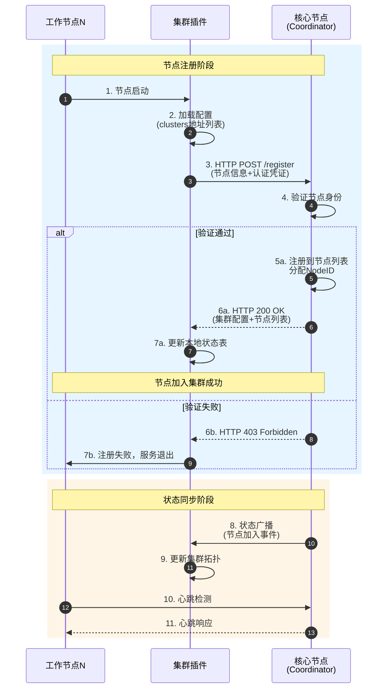
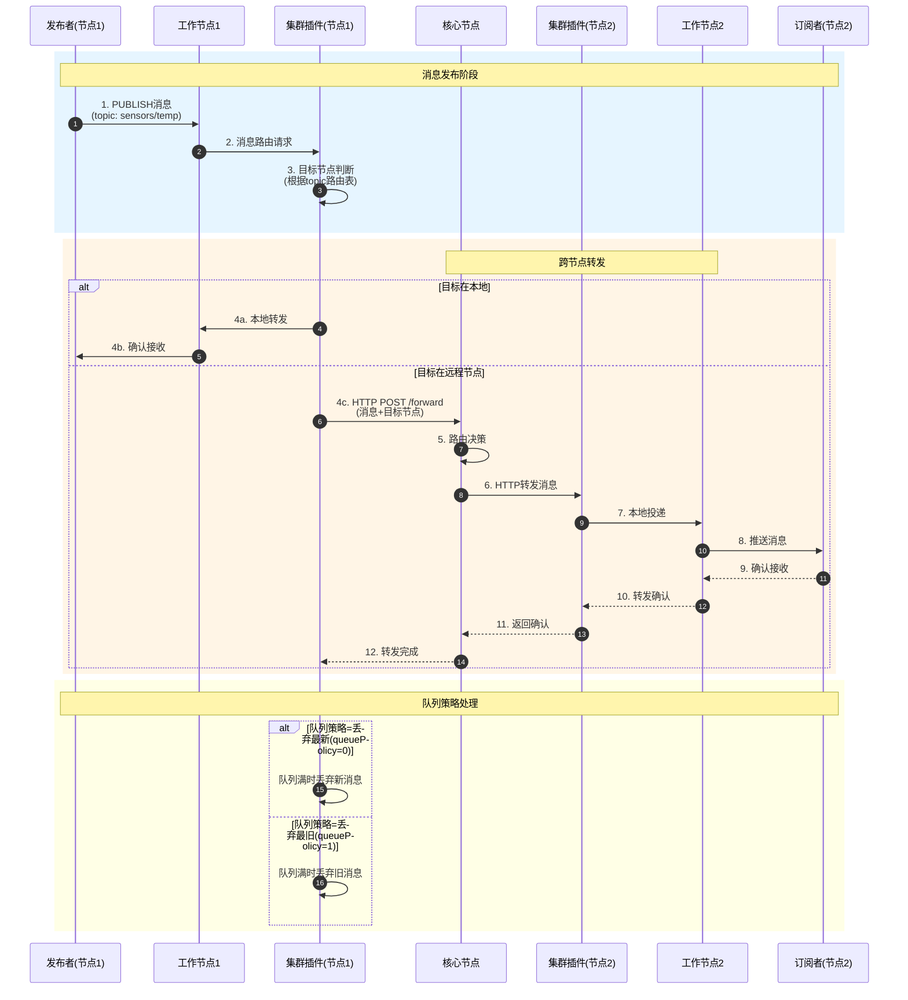

`cluster-plugin` 插件为 smart-mqtt broker 提供基于 HTTP 的集群协调能力，实现多节点集群部署、工作节点接入和集群状态同步。


## 功能概述
- 支持核心节点与工作节点的集群部署
- 节点间通过 HTTP 通信进行状态同步与消息转发
- 支持分布式消息路由与队列策略
- 动态发现与管理集群节点

## 核心组件
- **ClusterPlugin**：插件入口，负责初始化集群核心服务或工作节点连接。
- **Coordinator**：负责集群节点发现、状态维护、节点加入/退出事件处理及分布式消息路由。
- **Distributor**：消息分发器，支持多种队列策略。
- **PluginConfig**：插件配置管理，支持核心节点、监听地址、端口、队列长度、队列策略、集群节点列表等参数。

## 配置参数
在 `plugin.yaml` 中配置，示例：

```yaml
core: true                # 是否为核心节点，true=核心节点，false=工作节点
host: 0.0.0.0             # 集群服务监听地址，仅当core为true时有效
port: 8884                # 集群服务监听端口，仅当core为true时有效
queueLength: 1024         # 消息队列长度
queuePolicy: 0            # 队列策略（0=丢弃最新，1=丢弃最旧）
clusters:                 # 集群节点地址列表
  - http://core1:8884
  - http://core2:8884
```

## 使用说明
1. 将插件及配置文件放置于 smart-mqtt 的 plugins 目录下
2. 配置好 `plugin.yaml`，根据实际部署角色设置 core/host/port/clusters 等参数
3. 启动 smart-mqtt 服务，插件会自动加载并初始化集群功能


## 注意事项
- 集群节点间需保证网络互通，端口配置需一致
- 各节点 `plugin.yaml` 配置需根据实际角色（核心/工作）分别设置
- 启动顺序建议先启动核心节点，再启动工作节点

## 运行流程图

### 集群节点注册泳道图



### 跨节点消息转发泳道图



### 流程说明
1. **核心节点启动**: 核心节点启动HTTP服务，等待工作节点连接
2. **工作节点注册**: 工作节点根据配置的clusters地址连接到核心节点并完成注册
3. **消息路由**:
   - 本地客户端直接转发
   - 远程客户端通过HTTP转发到对应节点
4. **状态同步**: Coordinator维护集群节点状态，处理节点加入/退出事件
5. **分布式分发**: Distributor根据队列策略管理消息分发

## 技术支持
- 作者：三刀（zhengjunweimail@163.com）
- 供应商：smart-mqtt