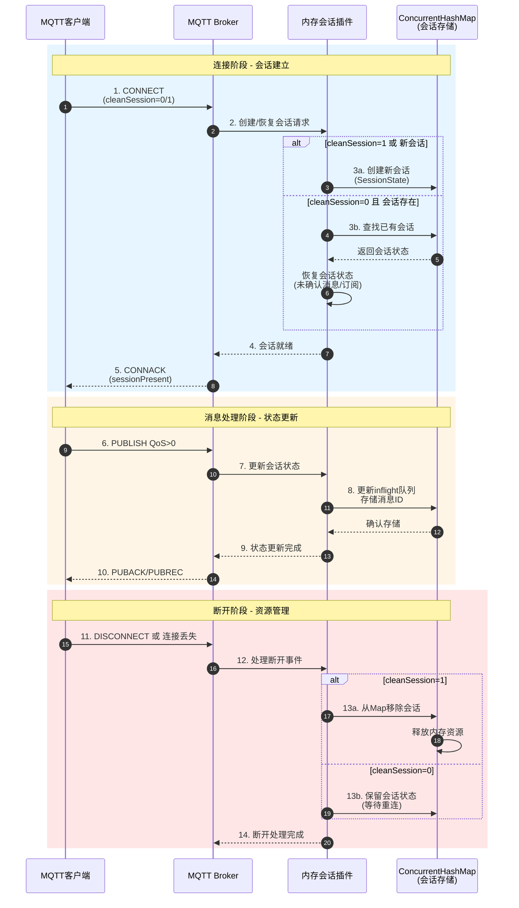

内存会话插件为MQTT broker提供基于内存的会话状态管理功能，使用ConcurrentHashMap实现线程安全的会话存储。

## 核心实现
- **MemorySessionStateProvider**:
- 使用ConcurrentHashMap存储会话状态(key=clientId, value=SessionState)
- 提供store/get/remove三个核心方法管理会话生命周期
- 线程安全设计，适合高并发场景

- **SessionPlugin**:
- 插件入口，初始化时注册MemorySessionStateProvider
- 遵循smartboot插件规范，实现版本和厂商信息

## 使用场景
适用于需要轻量级、高性能会话管理的MQTT broker场景，特点包括：
- 内存存储，访问速度快
- 无持久化需求
- 单机部署环境

## 配置说明
无需额外配置，引入插件后自动生效。

## 运行流程图

### 会话管理泳道图

### 流程说明
1. **会话存储**: 根据cleanSession标志决定创建新会话或恢复已有会话
2. **内存管理**: 使用ConcurrentHashMap实现线程安全的会话数据存储
3. **状态持久**: 对于QoS>0的消息，更新inflight队列并持久化会话状态
4. **资源释放**: cleanSession=1时完全清理会话，否则保留以供重连恢复