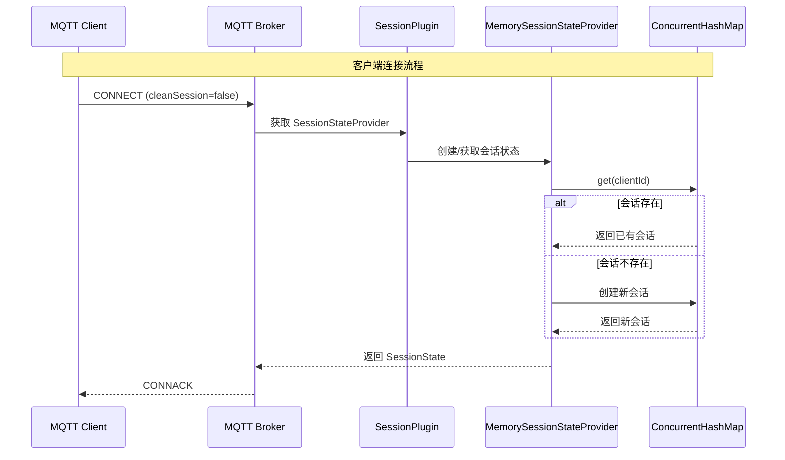
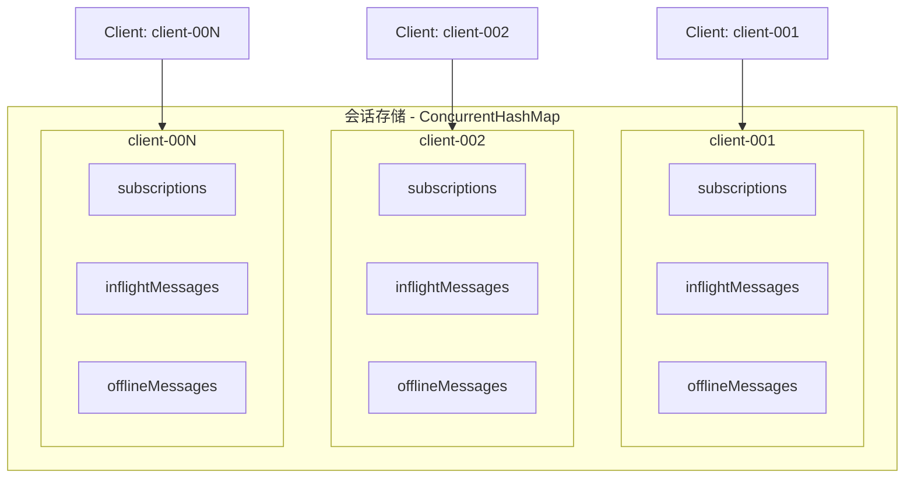
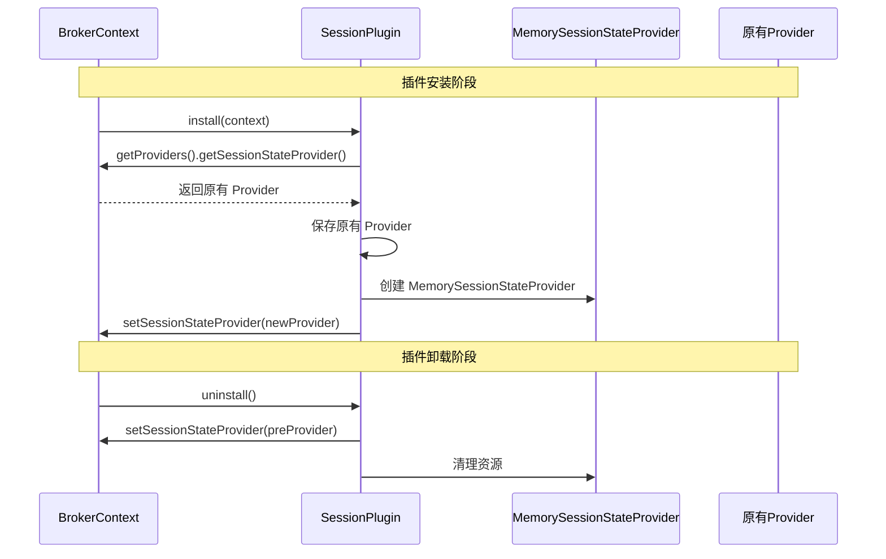

`memory-session-plugin` 为 MQTT broker 提供基于内存的会话状态管理功能，使用 [`ConcurrentHashMap`](https://gitee.com/smartboot/smart-mqtt/blob/master/plugins/memory-session-plugin/src/main/java/tech/smartboot/mqtt/session/MemorySessionStateProvider.java) 实现线程安全的会话存储。

## 概述

在 MQTT 协议中，会话状态管理是核心功能之一。当客户端以持久会话(Clean Session = false)连接时，broker 需要保存其订阅信息和未送达的消息。memory-session-plugin 提供了轻量级的内存存储方案。

### 适用场景

- **单机部署**: 不需要持久化的轻量级场景
- **开发测试**: 快速启动，无需外部依赖
- **高并发场景**: 内存访问速度远快于磁盘或网络存储
- **临时会话**: 会话数据可接受随服务重启丢失

### 核心特性

- 基于 [`ConcurrentHashMap`](https://gitee.com/smartboot/smart-mqtt/blob/master/plugins/memory-session-plugin/src/main/java/tech/smartboot/mqtt/session/MemorySessionStateProvider.java) 实现线程安全存储
- 无外部依赖，部署简单
- 内存访问，性能优异
- 自动集成到 broker 会话管理

## 架构原理

### 会话管理流程



### 会话存储结构



### 插件生命周期



## 核心组件

| 组件 | 类名 | 职责 |
|------|------|------|
| 插件入口 | [`SessionPlugin`](https://gitee.com/smartboot/smart-mqtt/blob/master/plugins/memory-session-plugin/src/main/java/tech/smartboot/mqtt/session/SessionPlugin.java) | 插件生命周期管理，Provider 注册 |
| 会话提供者 | [`MemorySessionStateProvider`](https://gitee.com/smartboot/smart-mqtt/blob/master/plugins/memory-session-plugin/src/main/java/tech/smartboot/mqtt/session/MemorySessionStateProvider.java) | 内存会话存储的具体实现 |
| 存储引擎 | `ConcurrentHashMap` | 线程安全的键值存储 |

### MemorySessionStateProvider 核心方法

```java
// 存储会话状态
void store(String clientId, SessionState sessionState);

// 获取会话状态
SessionState get(String clientId);

// 移除会话状态
void remove(String clientId);
```

## 配置参数

memory-session-plugin 无需额外配置，引入插件后自动生效。

```yaml
# plugin.yaml - 无需配置内容
# memory-session-plugin
```

## 使用说明

### 1. 安装插件

将 `memory-session-plugin-*.jar` 放置于 smart-mqtt 的 `plugins` 目录下：

```bash
plugins/
├── memory-session-plugin-1.5.0.jar
└── plugin.yaml
```

### 2. 配置 broker.yaml（可选）

```yaml
# broker.yaml
# 启用会话保持功能
session:
  # 会话过期时间（秒）
  expiryInterval: 3600
```

### 3. 启动服务

```bash
./start.sh
```

启动日志中将显示插件加载信息：

```
load plugin: memory-session-plugin
install plugin: memory-session-plugin
```

## 注意事项

:::caution[重要提示]
- **数据易失性**: 会话数据存储在内存中，服务重启后所有会话将丢失
- **单机限制**: 仅适用于单机部署，不支持分布式场景
- **内存占用**: 高并发场景下会话数据会占用较多内存，请监控内存使用
- **持久化替代**: 如需持久化会话，请使用其他会话存储插件
:::

## 与其他存储方案对比

| 特性 | 内存存储 | 数据库存储 | Redis 存储 |
|------|----------|------------|------------|
| 访问速度 | ⚡⚡⚡ 极快 | ⚡ 一般 | ⚡⚡ 快 |
| 数据持久化 | ❌ 不支持 | ✅ 支持 | ✅ 支持 |
| 部署复杂度 | 🟢 简单 | 🟡 中等 | 🟡 中等 |
| 集群支持 | ❌ 不支持 | ✅ 支持 | ✅ 支持 |
| 适用场景 | 单机/测试 | 生产环境 | 高可用环境 |

## 性能指标

在标准测试环境下（8核16G内存）：

| 指标 | 数值 |
|------|------|
| 会话创建速率 | > 100,000 ops/sec |
| 会话查询延迟 | < 1 μs |
| 内存占用 | 约 1KB / 会话 |

## 故障排查

| 现象 | 可能原因 | 解决方案 |
|------|---------|---------|
| 会话数据丢失 | 服务重启 | 这是预期行为，如需持久化请更换存储方案 |
| 内存溢出 | 会话数过多 | 限制最大会话数或增加 JVM 内存 |
| 会话不一致 | 多 broker 实例 | 确保同一 clientId 只连接一个 broker 实例 |

## 版本信息

| 属性 | 值 |
|------|-----|
| 当前版本 | v1.0 |
| 兼容版本 | smart-mqtt 1.5.0+ |
| 供应商 | smartboot |
| 作者 | 三刀（zhengjunweimail@163.com）|
