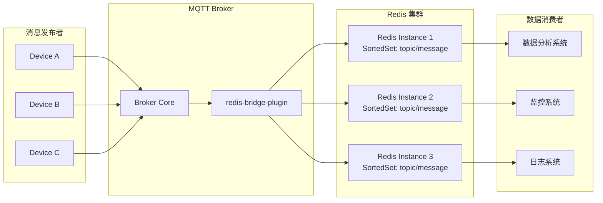
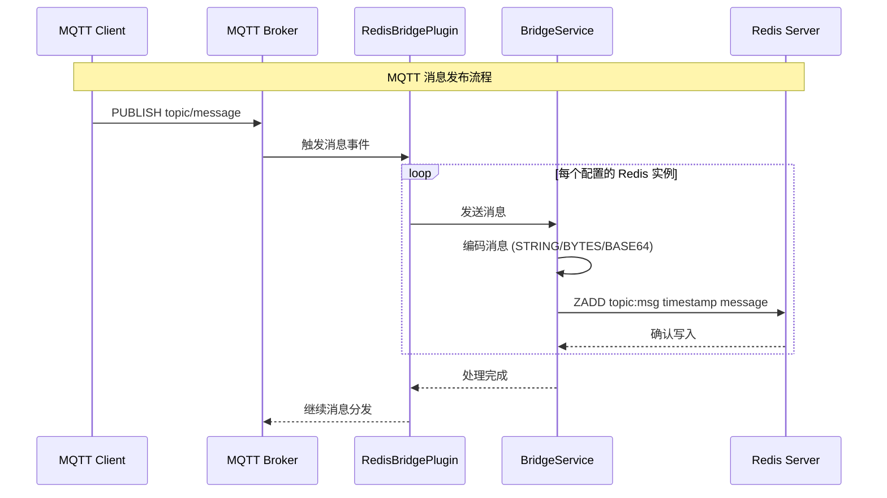
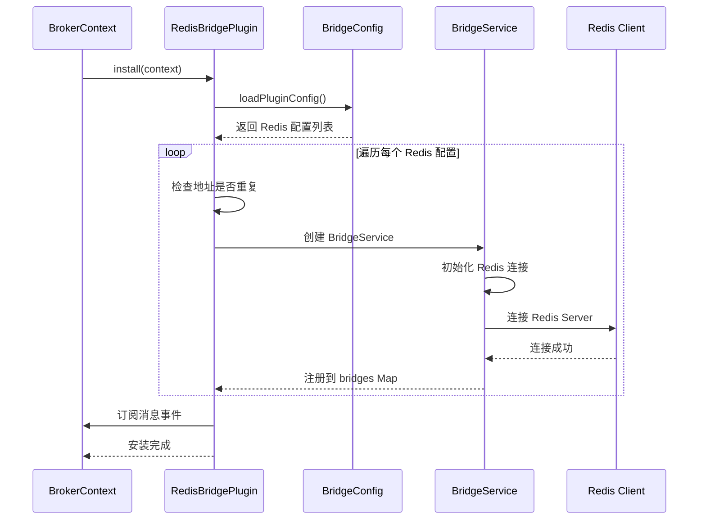

`redis-bridge-plugin` 是一个用于 MQTT 消息与 Redis 集成的桥接插件，支持将 MQTT 消息实时存储到 Redis 的 SortedSet 中。

## 概述

在物联网数据处理场景中，经常需要将 MQTT 消息持久化用于后续分析、监控或回溯。redis-bridge-plugin 提供了 MQTT 到 Redis 的实时数据桥接能力。

### 适用场景

- **消息持久化**: 将 MQTT 消息存储到 Redis 供后续查询
- **实时分析**: 基于 Redis 进行消息统计和分析
- **消息回溯**: 按时间范围查询历史消息
- **数据同步**: 多系统间的数据同步中转

### 核心特性

- 支持配置多个 Redis 实例，实现数据多副本
- 支持 Redis 数据库选择（0-15）
- 支持 Redis 密码认证
- 支持多种消息编码格式（STRING、BYTES、BASE64）
- 使用时间戳作为 SortedSet 分数，支持时间范围查询
- 实时消息存储，低延迟

## 架构原理

### 数据流向



### 消息处理流程



### 插件启动流程



## 核心组件

| 组件 | 类名 | 职责 |
|------|------|------|
| 插件入口 | [`RedisBridgePlugin`](https://gitee.com/smartboot/smart-mqtt/blob/master/plugins/redis-bridge-plugin/src/main/java/tech/smartboot/mqtt/bridge/redis/RedisBridgePlugin.java) | 管理多个 Redis 桥接服务实例 |
| 桥接服务 | [`BridgeService`](https://gitee.com/smartboot/smart-mqtt/blob/master/plugins/redis-bridge-plugin/src/main/java/tech/smartboot/mqtt/bridge/redis/BridgeService.java) | 处理 MQTT 消息到 Redis 的转发逻辑 |
| 配置管理 | [`BridgeConfig`](https://gitee.com/smartboot/smart-mqtt/blob/master/plugins/redis-bridge-plugin/src/main/java/tech/smartboot/mqtt/bridge/redis/BridgeConfig.java) | 解析 Redis 连接和编码配置 |

## 配置参数

在 `plugin.yaml` 中配置：

```yaml
redis:
  # Redis 服务器地址，格式: host:port
  - address: "localhost:6379"
    # Redis 数据库编号（0-15）
    database: 0
    # Redis 访问密码（可选）
    password: ""
    # 消息编码格式：string, bytes, base64
    encode: "string"
    
  # 可配置多个 Redis 实例
  - address: "redis2:6379"
    database: 1
    password: "password2"
    encode: "base64"
```

### 参数详解

| 参数名 | 类型 | 默认值 | 必填 | 说明 |
|--------|------|--------|------|------|
| `address` | string | - | 是 | Redis 服务器地址，格式 `host:port` |
| `database` | int | 0 | 否 | Redis 数据库编号，范围 0-15 |
| `password` | string | "" | 否 | Redis 访问密码，无密码留空 |
| `encode` | string | "string" | 否 | 消息编码格式 |

### 编码格式说明

| 编码格式 | 说明 | 适用场景 |
|----------|------|----------|
| `string` | 以 UTF-8 字符串存储 | 文本消息 |
| `bytes` | 以二进制字节存储 | 二进制消息 |
| `base64` | 以 Base64 编码存储 | 兼容性要求高的场景 |

## Redis 数据结构

### SortedSet 存储格式

```
Key: mqtt:msg:{topic}
Score: 消息时间戳 (毫秒)
Member: 消息内容 (根据 encode 配置编码)
```

### 查询示例

```bash
# 查询指定 Topic 的最新 10 条消息
ZREVRANGE mqtt:msg:sensor/temp 0 9 WITHSCORES

# 查询时间范围内的消息（Unix 时间戳毫秒）
ZRANGEBYSCORE mqtt:msg:sensor/temp 1704067200000 1704153600000

# 获取消息总数
ZCARD mqtt:msg:sensor/temp

# 删除 7 天前的消息（保留最近一周）
ZREMRANGEBYSCORE mqtt:msg:sensor/temp 0 1703462400000
```

## 部署示例

### 单 Redis 实例配置

```yaml
# plugin.yaml
redis:
  - address: "127.0.0.1:6379"
    database: 0
    password: ""
    encode: "string"
```

### 多 Redis 实例配置（数据多副本）

```yaml
# plugin.yaml
redis:
  - address: "redis-master:6379"
    database: 0
    password: "master_password"
    encode: "string"
  - address: "redis-slave:6379"
    database: 0
    password: "slave_password"
    encode: "string"
```

### Docker Compose 部署

```yaml
version: '3.8'

services:
  mqtt-broker:
    image: smartboot/smart-mqtt:latest
    ports:
      - "1883:1883"
    volumes:
      - ./plugin.yaml:/app/plugins/redis-bridge-plugin/plugin.yaml
    depends_on:
      - redis
      
  redis:
    image: redis:7-alpine
    ports:
      - "6379:6379"
    volumes:
      - redis-data:/data
      
volumes:
  redis-data:
```

## 数据消费示例

### Python 读取消息

```python
import redis
import json

# 连接 Redis
r = redis.Redis(host='localhost', port=6379, db=0)

# 获取最近 10 条消息
topic = "sensor/temp"
key = f"mqtt:msg:{topic}"
messages = r.zrevrange(key, 0, 9, withscores=True)

for msg, timestamp in messages:
    print(f"Time: {timestamp}, Message: {msg.decode('utf-8')}")
```

### 数据统计分析

```python
# 统计每小时的平均温度
import redis
from datetime import datetime, timedelta

r = redis.Redis(host='localhost', port=6379, db=0)

# 获取过去 1 小时的消息
now = datetime.now()
hour_ago = now - timedelta(hours=1)

messages = r.zrangebyscore(
    "mqtt:msg:sensor/temp",
    hour_ago.timestamp() * 1000,
    now.timestamp() * 1000
)

# 计算平均值
temps = [float(m.decode()) for m in messages]
avg_temp = sum(temps) / len(temps) if temps else 0
print(f"平均温度: {avg_temp}°C")
```

## 注意事项

:::caution[重要提示]
- **存储容量**: Redis 是内存数据库，注意监控存储容量，适时清理历史数据
- **网络延迟**: 确保 MQTT Broker 与 Redis 之间的网络延迟较低
- **重复配置**: 避免配置重复的 Redis 地址，会导致数据重复写入
- **消息大小**: 过大的消息可能影响 Redis 性能，建议控制单条消息大小
- **连接池**: 插件内部使用连接池，无需担心连接数过多问题
:::

## 性能优化

| 优化项 | 建议 |
|--------|------|
| 批量写入 | 插件内部已实现批量写入优化 |
| 分片存储 | 对高频 Topic 使用多个 Redis 实例分担压力 |
| 过期清理 | 使用 Redis 过期策略或定期任务清理旧数据 |
| 压缩编码 | 大数据量场景可使用 Base64 编码减少存储 |

## 故障排查

| 现象 | 可能原因 | 解决方案 |
|------|---------|---------|
| 消息未写入 | Redis 连接失败 | 检查 Redis 地址和密码配置 |
| 内存不足 | Redis 数据过多 | 清理历史数据或增加内存 |
| 写入延迟高 | 网络延迟大 | 就近部署 Redis 实例 |
| 数据重复 | 配置了相同 Redis 多次 | 检查配置文件中是否有重复地址 |

## 技术支持

- **作者**: 三刀（zhengjunweimail@163.com）
- **版本**: 与 MQTT Broker 版本保持一致
- **供应商**: smart-mqtt
