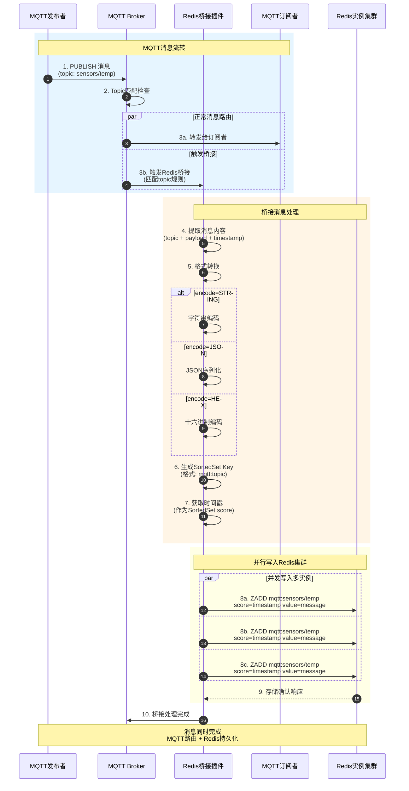

Redis Bridge Plugin 是一个用于MQTT消息与Redis集成的桥接插件。该插件支持将MQTT消息实时存储到Redis的SortedSet中，可配置多个Redis实例，支持数据库选择和密码认证。消息存储时使用时间戳作为分数，支持自定义消息编码格式。

## 主要特性
- 支持配置多个Redis实例
- 支持Redis数据库选择
- 支持Redis密码认证
- 支持自定义消息编码格式
- 使用时间戳作为SortedSet分数
- 实时消息存储

## 配置说明
插件使用YAML格式进行配置，主要配置参数如下：

```yaml
redis:
  - address: "localhost:6379"    # Redis服务器地址和端口
    database: 0                  # Redis数据库编号（0-15）
    password: "your_password"    # Redis访问密码（可选）
    encode: "STRING"            # 消息编码格式（默认：STRING）
  - address: "redis2:6379"      # 可配置多个Redis实例
    database: 1
    password: "password2"
```

### 配置参数说明
- `address`: Redis服务器地址，格式为 "host:port"
- `database`: Redis数据库编号，范围0-15
- `password`: Redis服务器访问密码，如果没有设置密码可以省略
- `encode`: 消息编码格式，默认为"STRING"，支持多种编码方式

## 使用场景
1. MQTT消息持久化存储
2. 消息历史查询服务
3. 消息数据分析和统计
4. 实时数据监控系统

## 注意事项
1. 确保Redis服务器地址配置正确且可访问
2. 避免重复配置相同的Redis地址
3. 建议根据实际需求选择合适的消息编码格式
4. 注意监控Redis存储容量，适时清理历史数据

## 运行流程图

### 消息桥接泳道图



### 流程说明
1. **消息捕获**: 拦截匹配指定Topic规则的MQTT消息
2. **格式转换**: 根据配置的encode参数对消息进行编码
3. **时间戳标记**: 使用当前时间作为SortedSet的分数(score)
4. **多实例写入**: 异步并行写入所有配置的Redis实例
5. **有序存储**: 利用Redis SortedSet特性实现按时间排序的消息存储
