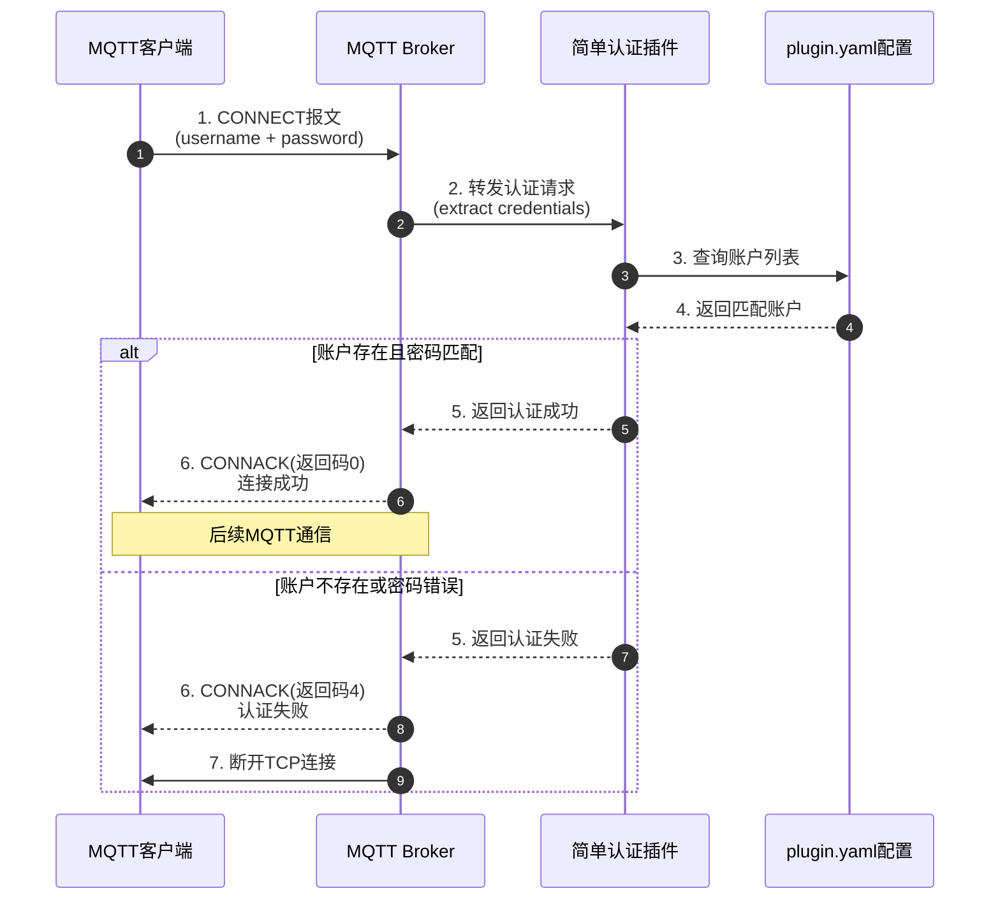

`simple auth plugin` 是一个简单的MQTT认证插件，提供基本的用户名密码认证功能。

## 功能特性

- 支持多用户配置
- 简单的用户名/密码认证机制
- 易于配置和使用

## 配置方式

在`plugin.yaml`中配置用户账号信息，格式如下：

```yaml
accounts:
  - username: admin
    password: admin
```

## 使用说明

1. 将插件安装到MQTT服务器
2. 在`plugin.yaml`中配置用户账号
3. 重启MQTT服务使配置生效

## 注意事项

- 密码以明文形式存储，请妥善保管配置文件
- 建议在生产环境中使用更安全的认证方式

## 运行流程图

### 认证泳道图



### 流程说明
1. **CONNECT报文**: 客户端向Broker发送连接请求，携带用户名和密码
2. **账户查找**: 插件从`plugin.yaml`配置中查找匹配的账户
3. **身份验证**: 对比请求中的用户名密码与配置的账户信息
4. **结果处理**:
   - 验证通过：返回连接成功，允许客户端后续通信
   - 验证失败：拒绝连接并断开客户端