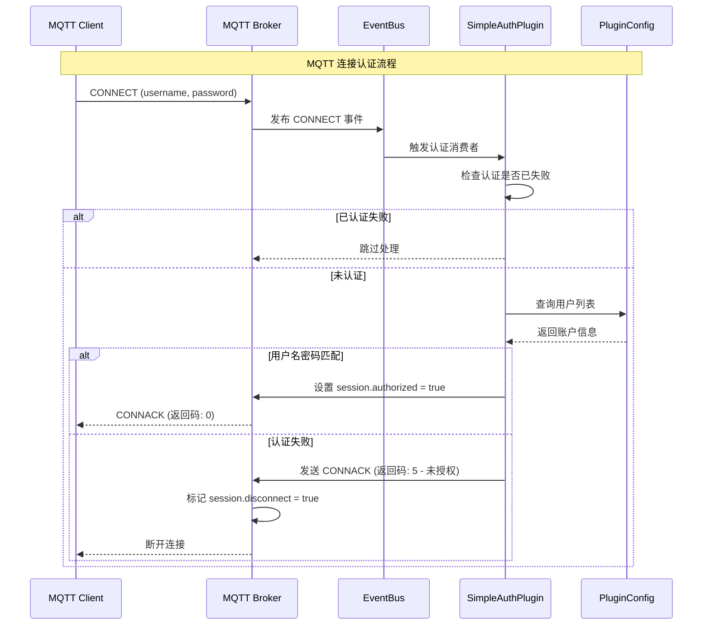
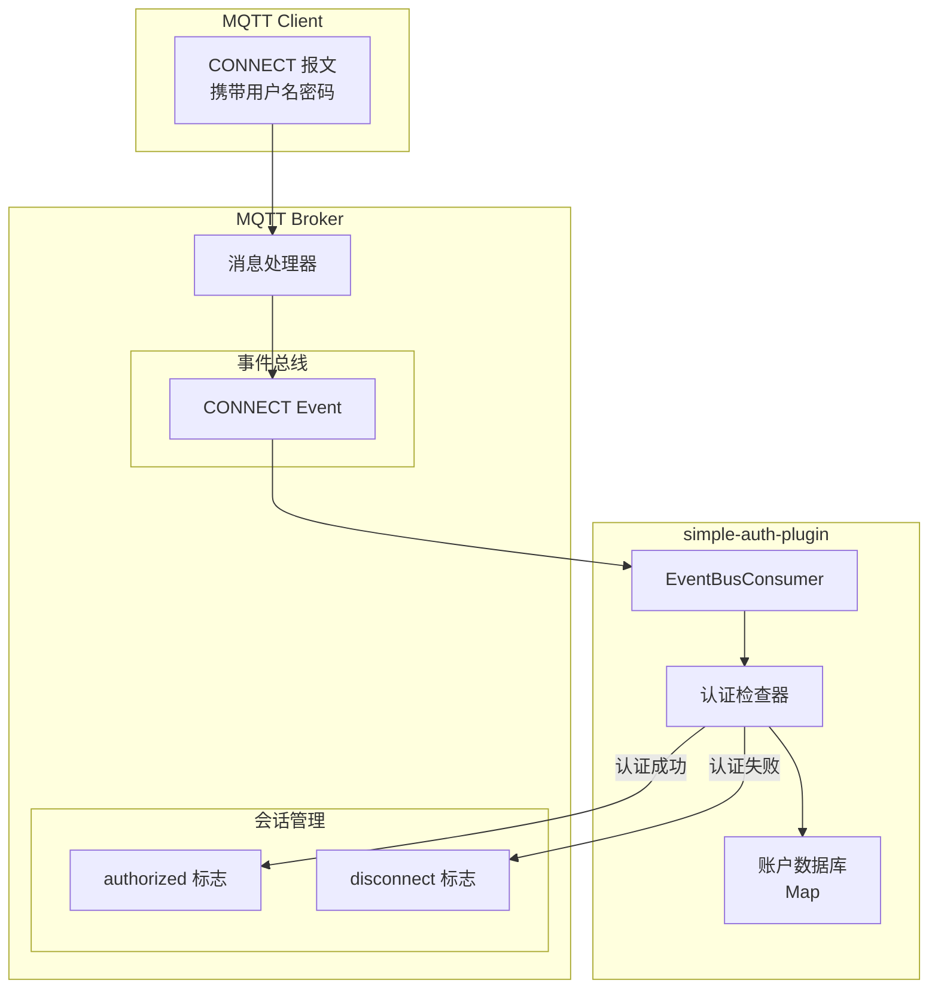
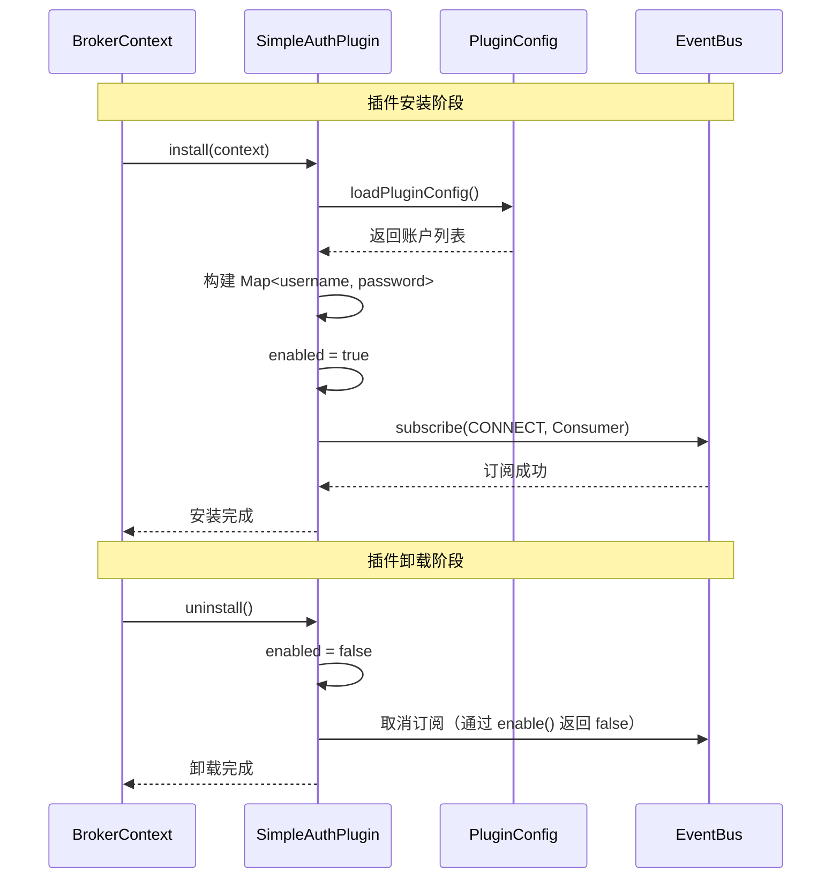

`simple-auth-plugin` 是一个轻量级的 MQTT 认证插件，提供基于用户名和密码的基础认证功能。

## 概述

在开放的 MQTT 环境中，任何人都可以连接到 broker 并发布/订阅消息，这会带来安全隐患。simple-auth-plugin 提供了最基础的认证机制，确保只有合法用户才能接入。

### 适用场景

- **开发测试环境**: 快速搭建带认证的测试环境
- **小规模部署**: 用户数量较少的场景
- **基础安全需求**: 简单的用户名/密码保护
- **演示环境**: 展示认证流程的示例

### 核心特性

- 支持多用户配置
- 简单的用户名/密码认证机制
- 基于事件总线的非侵入式实现
- 配置简单，即配即用

## 架构原理

### 认证流程



### 事件驱动架构



### 插件生命周期



## 核心组件

| 组件 | 类名 | 职责 |
|------|------|------|
| 插件入口 | [`SimpleAuthPlugin`](https://gitee.com/smartboot/smart-mqtt/blob/master/plugins/simple-auth-plugin/src/main/java/tech/smartboot/mqtt/auth/SimpleAuthPlugin.java) | 管理认证逻辑和事件订阅 |
| 配置管理 | [`PluginConfig`](https://gitee.com/smartboot/smart-mqtt/blob/master/plugins/simple-auth-plugin/src/main/java/tech/smartboot/mqtt/auth/PluginConfig.java) | 解析用户名密码配置 |
| 账户实体 | `PluginConfig.Account` | 存储单个账户信息 |

## 配置参数

在 `plugin.yaml` 中配置：

```yaml
accounts:
  - username: admin
    password: admin123
  - username: device1
    password: device_pass
  - username: sensor_001
    password: sensor_secret
```

### 参数详解

| 参数名 | 类型 | 默认值 | 必填 | 说明 |
|--------|------|--------|------|------|
| `accounts` | array | [] | 是 | 用户账户列表 |
| `username` | string | - | 是 | 用户名 |
| `password` | string | - | 是 | 密码（明文存储） |

## 部署示例

### 基础配置

```yaml
# plugin.yaml
accounts:
  - username: admin
    password: admin123
```

### 多用户配置

```yaml
# plugin.yaml
accounts:
  # 管理员账户
  - username: admin
    password: Admin@2024
    
  # 设备账户
  - username: device_001
    password: dev_001_pass
  - username: device_002
    password: dev_002_pass
    
  # 应用账户
  - username: app_backend
    password: backend_secret
```

### Docker Compose 部署

```yaml
version: '3.8'

services:
  mqtt-broker:
    image: smartboot/smart-mqtt:latest
    ports:
      - "1883:1883"
    volumes:
      - ./plugin.yaml:/app/plugins/simple-auth-plugin/plugin.yaml
```

## 客户端连接

### MQTT.js 示例

```javascript
const mqtt = require('mqtt');

// 带认证的连接
const client = mqtt.connect('mqtt://broker.example.com:1883', {
  username: 'admin',
  password: 'admin123',
  clientId: 'nodejs_client_' + Math.random().toString(16).substr(2, 8)
});

client.on('connect', () => {
  console.log('认证成功，已连接');
});

client.on('error', (err) => {
  console.error('连接失败:', err.message);
});
```

### Python paho-mqtt 示例

```python
import paho.mqtt.client as mqtt

client = mqtt.Client(client_id="python_client_001")

# 设置认证信息
client.username_pw_set(username="device_001", password="dev_001_pass")

client.connect("broker.example.com", 1883, 60)
client.loop_forever()
```

### mosquitto_pub 示例

```bash
# 带用户名密码发布消息
mosquitto_pub -h broker.example.com \
  -u admin \
  -P admin123 \
  -t "test/topic" \
  -m "Hello with auth"
```

### MQTT.fx 配置

1. 打开 MQTT.fx，点击设置图标
2. 在 **User Credentials** 选项卡中：
   - 勾选 **Use Username/Password**
   - Username: `admin`
   - Password: `admin123`
3. 保存并连接

## 注意事项

:::caution[安全警告]
- **明文存储**: 密码以明文形式存储在配置文件中，请妥善保管配置文件
- **权限控制**: 配置文件应设置为只读权限（chmod 600）
- **生产建议**: 生产环境建议使用更安全的认证方式，如数据库存储或集成 LDAP/Active Directory
- **传输安全**: 建议配合 `mqtts-plugin` 使用，确保密码在传输过程中加密
:::

## 与其他认证方式对比

| 特性 | simple-auth-plugin | 数据库认证 | LDAP/AD 认证 |
|------|-------------------|------------|--------------|
| 配置复杂度 | 🟢 简单 | 🟡 中等 | 🔴 复杂 |
| 安全性 | 🟡 一般 | 🟢 高 | 🟢 高 |
| 用户管理 | 手动编辑文件 | Web 管理界面 | 统一身份管理 |
| 动态更新 | 需重启 | 实时生效 | 实时生效 |
| 适用场景 | 开发测试 | 中小型生产 | 大型企业 |

## 故障排查

| 现象 | 可能原因 | 解决方案 |
|------|---------|---------|
| 连接被拒绝(5) | 用户名或密码错误 | 检查配置文件中的账户信息 |
| 无认证提示 | 未安装插件或配置错误 | 检查插件是否正确加载 |
| 认证不生效 | 其他认证插件冲突 | 检查是否有其他认证插件启用 |
| 配置热加载失败 | 插件不支持热更新 | 重启 broker 服务 |

## 扩展开发

如需增强安全性，可以基于此插件进行二次开发：

```java
// 示例：添加密码哈希验证
@Override
protected void initPlugin(BrokerContext brokerContext) throws Throwable {
    PluginConfig pluginConfig = loadPluginConfig(PluginConfig.class);
    
    // 存储哈希后的密码
    Map<String, String> accounts = pluginConfig.getAccounts().stream()
        .collect(Collectors.toMap(
            PluginConfig.Account::getUsername,
            account -> hashPassword(account.getPassword())  // 使用 SHA-256 等哈希
        ));
    
    // ... 订阅事件并验证哈希密码
}

private String hashPassword(String password) {
    // 实现密码哈希
    return DigestUtils.sha256Hex(password + salt);
}
```

## 技术支持

- **作者**: 三刀（zhengjunweimail@163.com）
- **供应商**: smart-mqtt
- **版本**: 与 MQTT Broker 版本保持一致
