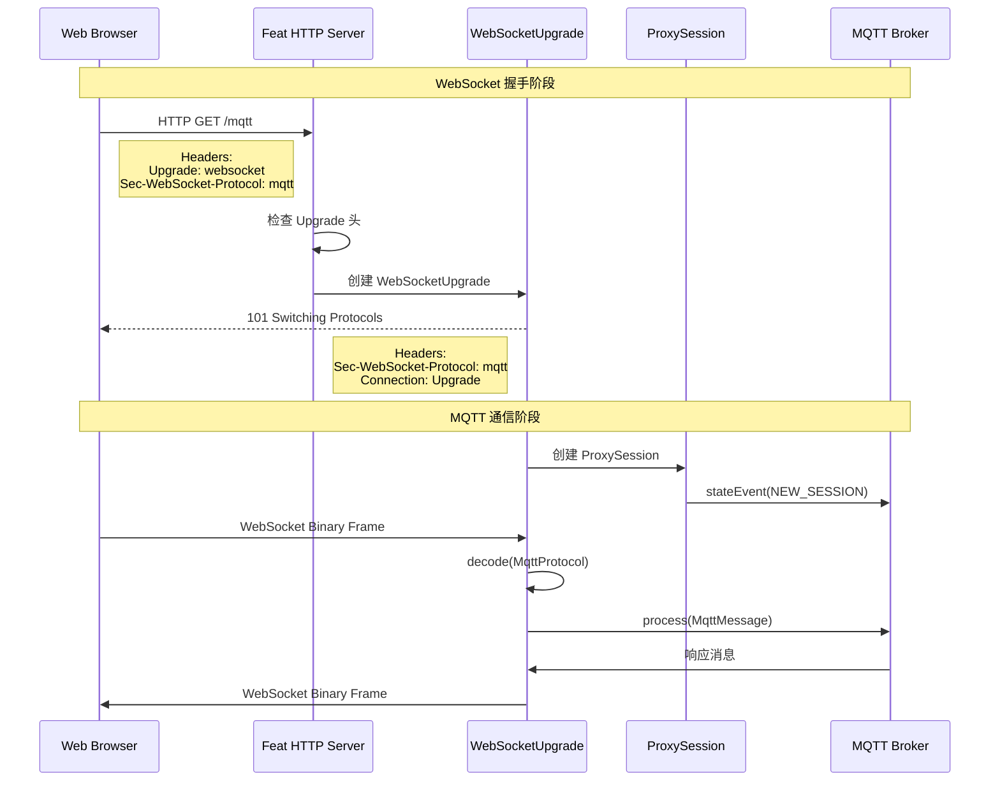
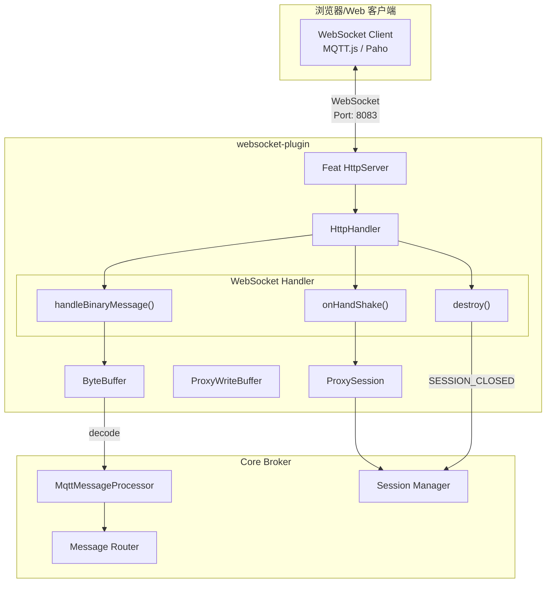
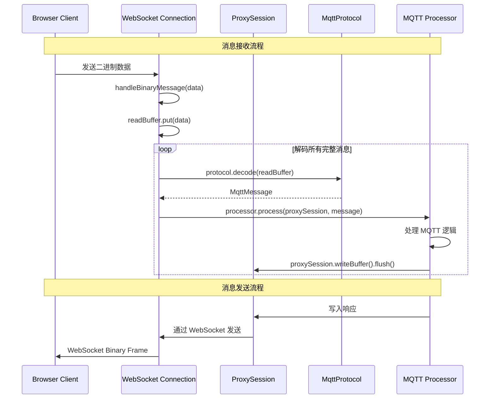

`websocket-plugin` 为 MQTT Broker 提供 WebSocket 协议支持，允许客户端通过 WebSocket 连接进行 MQTT 通信。

## 概述

在现代 Web 应用中，浏览器端的 MQTT 客户端无法直接使用 TCP 连接。WebSocket 协议提供了一种在浏览器中与 MQTT Broker 通信的标准方式。

### 适用场景

- **Web 应用**: 在浏览器中实现实时数据展示
- **小程序**: 微信小程序等平台的 MQTT 连接
- **移动端 H5**: 移动 Web 应用的消息推送
- **实时监控大屏**: 数据可视化实时更新

### 核心特性

- 基于 Feat 框架的 HTTP 服务器实现 WebSocket 升级
- 支持 MQTT over WebSocket 协议（Sec-WebSocket-Protocol: mqtt）
- 使用 ByteBuffer 处理二进制消息流
- 与核心 Broker 共享相同的消息处理器和会话管理

## 架构原理

### WebSocket 升级流程



### 架构设计



### 数据流转



## 核心组件

| 组件 | 类名 | 职责 |
|------|------|------|
| 插件入口 | [`WebSocketPlugin`](https://gitee.com/smartboot/smart-mqtt/blob/master/plugins/websocket-plugin/src/main/java/tech/smartboot/mqtt/ws/WebSocketPlugin.java) | 初始化 WebSocket 服务器 |
| 配置管理 | [`PluginConfig`](https://gitee.com/smartboot/smart-mqtt/blob/master/plugins/websocket-plugin/src/main/java/tech/smartboot/mqtt/ws/PluginConfig.java) | 管理监听端口配置 |
| 会话代理 | [`ProxySession`](https://gitee.com/smartboot/smart-mqtt/blob/master/plugins/websocket-plugin/src/main/java/tech/smartboot/mqtt/ws/ProxySession.java) | 适配 WebSocket 到 MQTT 会话接口 |
| 写入缓冲 | [`ProxyWriteBuffer`](https://gitee.com/smartboot/smart-mqtt/blob/master/plugins/websocket-plugin/src/main/java/tech/smartboot/mqtt/ws/ProxyWriteBuffer.java) | 处理 WebSocket 数据写入 |

## 配置参数

在 `plugin.yaml` 中配置：

```yaml
# WebSocket 监听端口
port: 8083
```

### 参数详解

| 参数名 | 类型 | 默认值 | 必填 | 说明 |
|--------|------|--------|------|------|
| `port` | int | 8083 | 是 | WebSocket 服务监听端口 |

## 部署示例

### 基础配置

```yaml
# plugin.yaml
port: 8083
```

### 多协议共存配置

```yaml
# broker.yaml - MQTT TCP 端口
port: 1883
host: 0.0.0.0
```

```yaml
# plugins/websocket-plugin/plugin.yaml
port: 8083
```

### Docker Compose 部署

```yaml
version: '3.8'

services:
  mqtt-broker:
    image: smartboot/smart-mqtt:latest
    ports:
      - "1883:1883"    # MQTT TCP
      - "8083:8083"    # WebSocket
    volumes:
      - ./broker.yaml:/app/conf/broker.yaml
      - ./plugin.yaml:/app/plugins/websocket-plugin/plugin.yaml
```

## 客户端连接

### MQTT.js (浏览器)

```html
<!DOCTYPE html>
<html>
<head>
    <script src="https://unpkg.com/mqtt/dist/mqtt.esm.js"></script>
</head>
<body>
    <script type="module">
        import mqtt from 'https://unpkg.com/mqtt/dist/mqtt.esm.js';
        
        // 连接 WebSocket MQTT
        const client = mqtt.connect('ws://localhost:8083/mqtt', {
            clientId: 'web_client_' + Math.random().toString(16).substr(2, 8),
            clean: true,
            connectTimeout: 4000,
            reconnectPeriod: 1000
        });
        
        client.on('connect', () => {
            console.log('WebSocket 连接成功');
            
            // 订阅主题
            client.subscribe('sensor/+/temperature', (err) => {
                if (!err) {
                    console.log('订阅成功');
                }
            });
        });
        
        client.on('message', (topic, message) => {
            console.log(`收到消息 [${topic}]: ${message.toString()}`);
            // 更新页面显示
            document.getElementById('data').innerHTML += 
                `<p>${topic}: ${message}</p>`;
        });
        
        // 发布消息
        function publish() {
            client.publish('test/topic', 'Hello from WebSocket');
        }
    </script>
    <div id="data"></div>
    <button onclick="publish()">发送消息</button>
</body>
</html>
```

### 微信小程序

```javascript
// app.js 或页面逻辑
const mqtt = require('mqtt.min.js');

Page({
    data: {
        client: null
    },
    
    onLoad() {
        this.connectMqtt();
    },
    
    connectMqtt() {
        const client = mqtt.connect('wx://broker.example.com:8083/mqtt', {
            clientId: 'weapp_' + new Date().getTime(),
            username: 'admin',
            password: 'admin123'
        });
        
        client.on('connect', () => {
            console.log('MQTT 连接成功');
            wx.showToast({ title: '连接成功' });
            
            // 订阅设备状态
            client.subscribe('device/+/status');
        });
        
        client.on('message', (topic, message) => {
            console.log('收到消息:', topic, message.toString());
            this.setData({
                lastMessage: message.toString()
            });
        });
        
        this.setData({ client });
    },
    
    publishMessage() {
        const { client } = this.data;
        if (client && client.connected) {
            client.publish('control/device1', JSON.stringify({
                action: 'turn_on'
            }));
        }
    }
});
```

### Vue.js 集成

```vue
<template>
  <div class="mqtt-dashboard">
    <h2>实时数据监控</h2>
    <div class="connection-status">
      状态: {{ connected ? '已连接' : '未连接' }}
    </div>
    <div class="messages">
      <div v-for="(msg, index) in messages" :key="index" class="message">
        <span class="topic">{{ msg.topic }}</span>
        <span class="payload">{{ msg.payload }}</span>
        <span class="time">{{ msg.time }}</span>
      </div>
    </div>
  </div>
</template>

<script>
import mqtt from 'mqtt';

export default {
  data() {
    return {
      client: null,
      connected: false,
      messages: []
    };
  },
  
  mounted() {
    this.connect();
  },
  
  beforeDestroy() {
    if (this.client) {
      this.client.end();
    }
  },
  
  methods: {
    connect() {
      this.client = mqtt.connect('ws://localhost:8083/mqtt', {
        clientId: 'vue_client_' + Math.random().toString(16).substr(2, 8)
      });
      
      this.client.on('connect', () => {
        this.connected = true;
        this.client.subscribe('sensors/#');
      });
      
      this.client.on('message', (topic, message) => {
        this.messages.unshift({
          topic,
          payload: message.toString(),
          time: new Date().toLocaleTimeString()
        });
        // 只保留最近 100 条
        if (this.messages.length > 100) {
          this.messages.pop();
        }
      });
    }
  }
};
</script>
```

### React 集成

```jsx
import React, { useEffect, useState } from 'react';
import mqtt from 'mqtt';

function MqttDashboard() {
  const [client, setClient] = useState(null);
  const [connected, setConnected] = useState(false);
  const [messages, setMessages] = useState([]);
  
  useEffect(() => {
    const mqttClient = mqtt.connect('ws://localhost:8083/mqtt', {
      clientId: 'react_client_' + Math.random().toString(16).substr(2, 8)
    });
    
    mqttClient.on('connect', () => {
      setConnected(true);
      mqttClient.subscribe('iot/+/data');
    });
    
    mqttClient.on('message', (topic, message) => {
      setMessages(prev => [...prev, {
        topic,
        payload: message.toString(),
        timestamp: Date.now()
      }].slice(-50));
    });
    
    setClient(mqttClient);
    
    return () => {
      mqttClient.end();
    };
  }, []);
  
  return (
    <div>
      <h2>MQTT 实时监控</h2>
      <p>连接状态: {connected ? '🟢' : '🔴'}</p>
      <ul>
        {messages.map((msg, idx) => (
          <li key={idx}>
            <strong>{msg.topic}</strong>: {msg.payload}
          </li>
        ))}
      </ul>
    </div>
  );
}

export default MqttDashboard;
```

## 注意事项

:::caution[重要提示]
- **路径配置**: WebSocket 路径默认为 `/mqtt`，客户端连接时需正确配置
- **协议头**: 插件响应 `Sec-WebSocket-Protocol: mqtt`，确保客户端正确设置
- **浏览器兼容**: 现代浏览器均支持 WebSocket，IE 需使用 polyfill
- **连接数限制**: 浏览器对同一域名的 WebSocket 连接数有限制（通常 6-30 个）
- **心跳保持**: 建议客户端启用 keepalive 保持连接活跃
:::

## 性能优化

| 优化项 | 建议 |
|--------|------|
| 缓冲区大小 | 根据消息大小调整 `readBufferSize` |
| 连接复用 | 单个页面尽量复用一个 MQTT 连接 |
| 消息压缩 | 大数据量场景可考虑启用 permessage-deflate |
| CDN 部署 | Web 静态资源使用 CDN 加速 |

## 故障排查

| 现象 | 可能原因 | 解决方案 |
|------|---------|---------|
| WebSocket 连接失败 | 端口未开放 | 检查防火墙和端口配置 |
| 协议握手失败 | Sec-WebSocket-Protocol 不匹配 | 确保客户端指定 `mqtt` 协议 |
| 消息无法接收 | 订阅主题不匹配 | 检查主题过滤器是否正确 |
| 连接频繁断开 | 心跳超时 | 调整客户端 keepalive 间隔 |

## 安全建议

```javascript
// 生产环境使用 WSS (WebSocket Secure)
const client = mqtt.connect('wss://broker.example.com:8084/mqtt', {
    rejectUnauthorized: true,  // 验证服务器证书
    ca: CA_CERTIFICATE,         // 指定 CA 证书
    username: 'user',
    password: 'pass'
});
```

建议配合 `mqtts-plugin` 提供的证书，实现全链路加密。

## 技术支持

- **作者**: 三刀（zhengjunweimail@163.com）
- **供应商**: smart-mqtt
- **版本**: 与 MQTT Broker 版本保持一致
