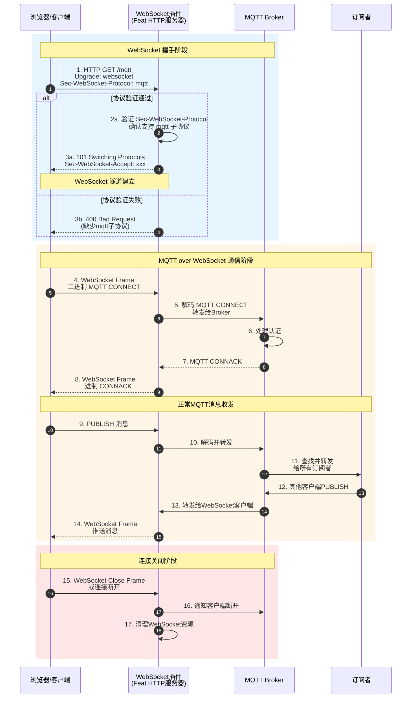

本插件为MQTT Broker提供WebSocket协议支持，允许客户端通过WebSocket连接进行MQTT通信。

## 技术实现
- 基于Feat框架的HTTP服务器实现WebSocket升级
- 支持MQTT over WebSocket协议（Sec-WebSocket-Protocol: mqtt）
- 使用ByteBuffer处理二进制消息流
- 与核心Broker共享相同的消息处理器和会话管理

## 配置参数
```yaml
port: 8084  # WebSocket监听端口
```

## 使用示例
```javascript
// 使用MQTT.js客户端连接示例
const client = mqtt.connect('ws://localhost:8080/mqtt', {
  protocol: 'ws',
  path: '/mqtt'
})
```

## 运行流程图

### WebSocket 协议升级泳道图



### 流程说明
1. **协议升级**: 客户端发送HTTP升级请求，需包含`Sec-WebSocket-Protocol: mqtt`头部
2. **握手验证**: 服务器验证WebSocket协议头，确认支持MQTT子协议
3. **隧道建立**: 握手成功后建立WebSocket双向通信隧道
4. **MQTT封装**: MQTT二进制报文通过WebSocket帧传输
5. **数据流转**: 浏览器/客户端通过WebSocket收发MQTT消息，Broker处理逻辑与普通MQTT一致
