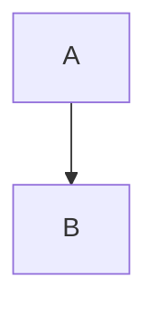
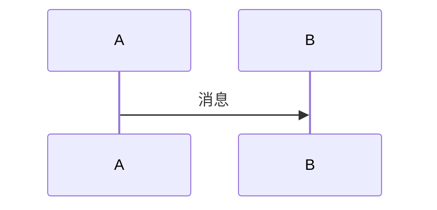

本文档定义了 smart-mqtt 插件文档的写作规范和标准，确保所有插件文档保持一致性、专业性和高质量。

## 一、文档结构标准

### 1.1 Frontmatter 元数据

每个文档必须以 YAML Frontmatter 开头，包含以下字段：

```yaml
---
title: 插件中文名 (插件标识名)
sidebar:
  order: 数字序号
---
```

**规范要求：**
- `title`: 采用"插件中文名"的格式，如 `集群插件`
- `order`: 按插件重要性排序，从 1 开始递增
  - 1: 认证插件 (simple-auth-plugin)
  - 2: WebSocket插件 (websocket-plugin)
  - 3: TLS插件 (mqtts-plugin)
  - 4: 集群插件 (cluster-plugin)
  - 5: Redis桥接 (redis-bridge-plugin)
  - 6: 会话插件 (memory-session-plugin)
  

### 1.2 文档正文结构

文档正文必须按以下顺序组织：

```
1. 概述
   ├── 1.1 适用场景（ bullet 列表）
   └── 1.2 核心特性（ bullet 列表）

2. 架构原理
   ├── 2.1 系统架构图（Mermaid Flowchart）
   ├── 2.2 核心流程图（Mermaid SequenceDiagram）
   └── 2.3 启动/工作流程图（Mermaid SequenceDiagram）

3. 核心组件
   └── 表格形式列出类名和职责

4. 配置参数
   ├── 4.1 完整配置示例（YAML）
   ├── 4.2 参数详解表格
   └── 4.3 特殊参数说明（如有）

5. 使用说明（预留），段落先置空，后续手动插图
   

```

## 二、内容写作规范

### 2.1 概述部分

**首段格式：**
```markdown
`{plugin-name}` 为 smart-mqtt broker 提供 {核心功能描述}，基于 {技术基础} 实现 {能力描述}。
```

**适用场景要求：**
- 使用 bullet 列表（-）
- 每条使用 **加粗标题**: 描述 的格式
- 场景数量 3-5 个，覆盖主要使用场景
- 示例：
  ```markdown
  - **高可用部署**: 多节点冗余，单点故障自动切换
  - **负载均衡**: 客户端连接分散到多个工作节点
  ```

**核心特性要求：**
- 使用 bullet 列表（-）
- 每条以动词开头，描述具体能力
- 特性数量 4-6 个
- 关键类名使用行内代码和链接

### 2.2 架构原理部分

**必须包含三张架构图：**

1. **系统架构图**（flowchart TD）
   - 展示组件间的关系和数据流向
   - 使用 subgraph 分组相关组件
   - 标注关键协议和端口

2. **核心流程图**（sequenceDiagram）
   - 展示主要业务流程
   - 包含参与者（participant）定义
   - 使用 Note over 添加注释
   - 使用 alt/else 展示分支逻辑

3. **启动/工作流程图**（sequenceDiagram）
   - 展示插件生命周期或工作流程
   - 标注关键步骤和判断条件

**图表规范：**
- 使用标准 Mermaid 语法
- 组件名使用驼峰命名
- 中文标签使用引号包裹（如需要）

### 2.3 核心组件部分

**表格格式：**

```markdown
| 组件 | 类名 | 职责 |
|------|------|------|
| 组件中文名 | [`ClassName`](源码链接) | 职责描述 |
```

**要求：**
- 类名必须使用代码格式并链接到源码
- 源码链接格式：`https://gitee.com/smartboot/smart-mqtt/blob/master/plugins/{plugin-name}/src/main/java/...`
- 职责描述简洁明了，不超过 20 字

### 2.4 配置参数部分

**YAML 示例格式：**

```yaml
# 参数说明注释
param_name: value
```

**参数详解表格：**

```markdown
| 参数名 | 类型 | 默认值 | 必填 | 说明 |
|--------|------|--------|------|------|
| `param` | string/int/boolean/array | 默认值 | 是/否 | 参数说明 |
```

**要求：**
- 所有参数必须有默认值说明
- 必填项用"是"标注，非必填用"否"
- 类型使用标准数据类型名称
- 敏感参数（如密码）需特别说明


### 2.6 客户端连接部分（如适用）

**必须提供多语言示例：**
1. MQTT.js（Node.js/浏览器）
2. Python (paho-mqtt)
3. 命令行工具 (mosquitto_pub/sub)
4. 框架集成（Vue.js、React、微信小程序等）

**代码示例要求：**
- 使用正确的语法高亮
- 包含必要的注释说明
- 展示完整的连接、订阅、发布流程


## 三、格式与排版规范

### 3.1 标题层级

- 一级标题 (#): 仅用于文档主标题（由 Frontmatter 生成）
- 二级标题 (##): 主要章节（架构原理、配置参数等）
- 三级标题 (###): 章节内的子主题
- 四级标题 (####): 细分主题（较少使用）

### 3.2 代码格式

**行内代码：**
- 类名、方法名、文件名、配置项使用 `` ` `` 包裹
- 示例：[`ClusterPlugin`](链接)

**代码块：**
- YAML 配置使用 `yaml`
- Java 代码使用 `java`
- JavaScript 使用 `javascript`
- Python 使用 `python`
- Bash 使用 `bash`

### 3.3 链接规范

**源码链接格式：**
```
https://gitee.com/smartboot/smart-mqtt/blob/master/plugins/{plugin-name}/src/main/java/{package-path}/{ClassName}.java
```

**外部链接：**
- 使用描述性文本，避免裸链接
- 技术术语首次出现时链接到官方文档

### 3.4 表格规范

- 表头使用中文
- 列对齐使用默认左对齐
- 复杂表格使用 <br/> 换行

### 3.5 特殊符号

- 使用标准 Markdown 语法
- 表情符号适量使用（如 ✅ ❌ ⚡ 🟢 🟡 🔴）
- 避免使用 HTML 标签（除 Mermaid 和 caution 标签外）

## 四、质量标准

### 4.1 准确性

- [ ] 所有类名、方法名与源码一致
- [ ] 配置参数名称与实际配置一致
- [ ] 版本信息准确
- [ ] 代码示例可运行

### 4.2 完整性

- [ ] 包含所有必需的章节
- [ ] 配置参数完整无遗漏
- [ ] 错误码/异常场景覆盖
- [ ] 多平台/多语言示例（如适用）

### 4.3 可读性

- [ ] 段落长度适中（不超过 5 行）
- [ ] 使用图表辅助说明
- [ ] 专业术语首次出现有解释
- [ ] 避免过长的句子

### 4.4 一致性

- [ ] 术语使用一致（如"broker"不混用"服务器"）
- [ ] 格式风格统一
- [ ] 章节顺序一致
- [ ] 链接格式统一

## 五、模板示例

### 5.1 最小可用模板

```markdown
---
title: 插件中文名 (plugin-name)
sidebar:
  order: N
---

`plugin-name` 为 smart-mqtt broker 提供 {核心功能}。

## 概述

### 适用场景

- **场景1**: 描述
- **场景2**: 描述

### 核心特性

- 特性1
- 特性2

## 架构原理

### 系统架构



### 工作流程



## 核心组件

| 组件 | 类名 | 职责 |
|------|------|------|
| 入口 | [`PluginName`](链接) | 描述 |

## 配置参数

```yaml
# plugin.yaml
key: value
```

| 参数名 | 类型 | 默认值 | 必填 | 说明 |
|--------|------|--------|------|------|
| `key` | string | - | 是 | 说明 |


## 六、审查清单

在提交文档前，请确认：

- [ ] Frontmatter 完整且格式正确
- [ ] 所有 Mermaid 图表可正常渲染
- [ ] 所有代码示例已验证可运行
- [ ] 所有链接可正常访问
- [ ] 拼写和语法检查通过
- [ ] 符合本文档的所有规范要求

---

**文档版本**: v1.0  
**最后更新**: 2024年
