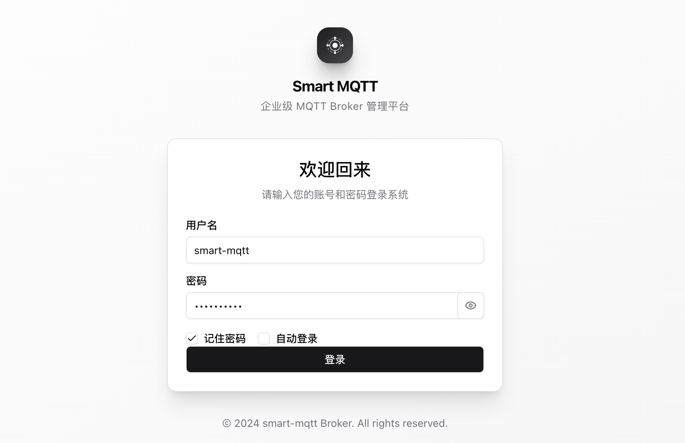
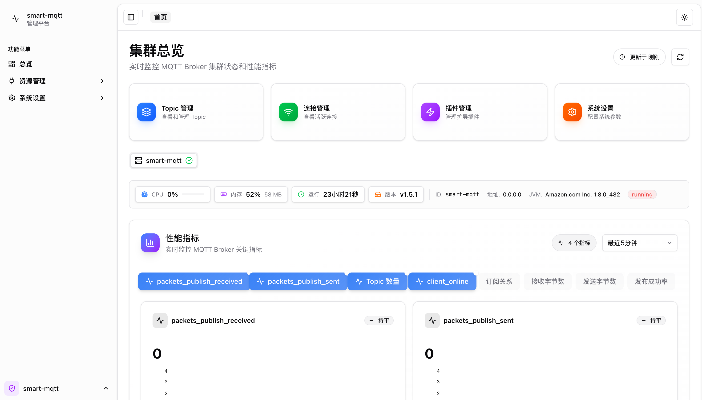
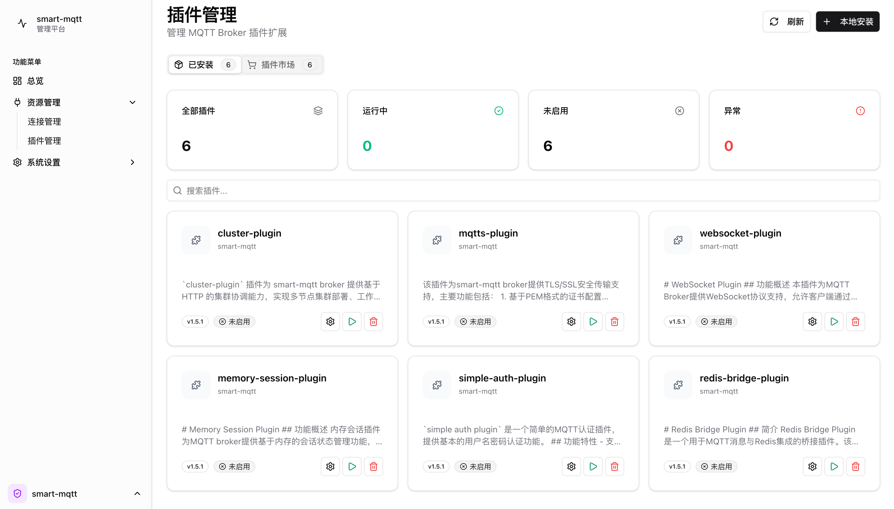
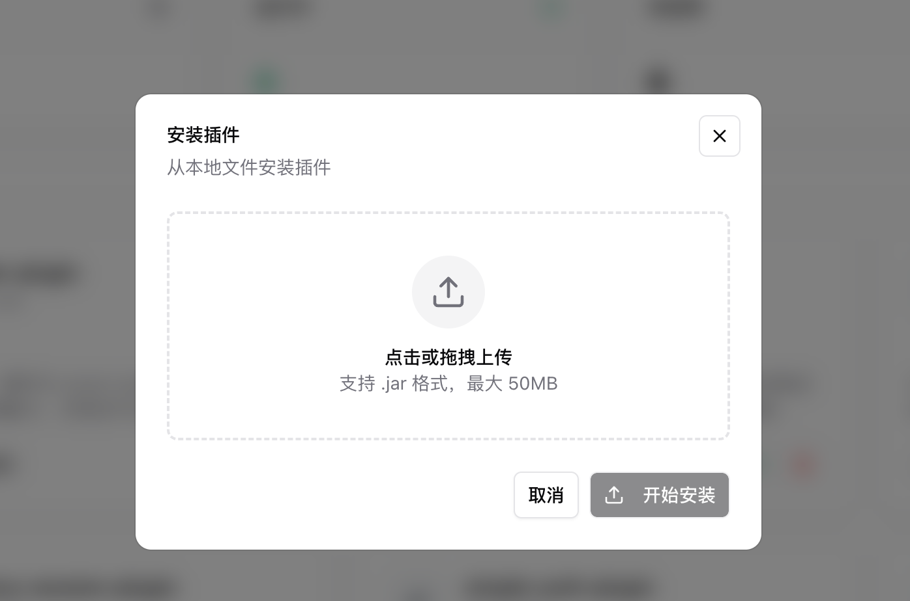
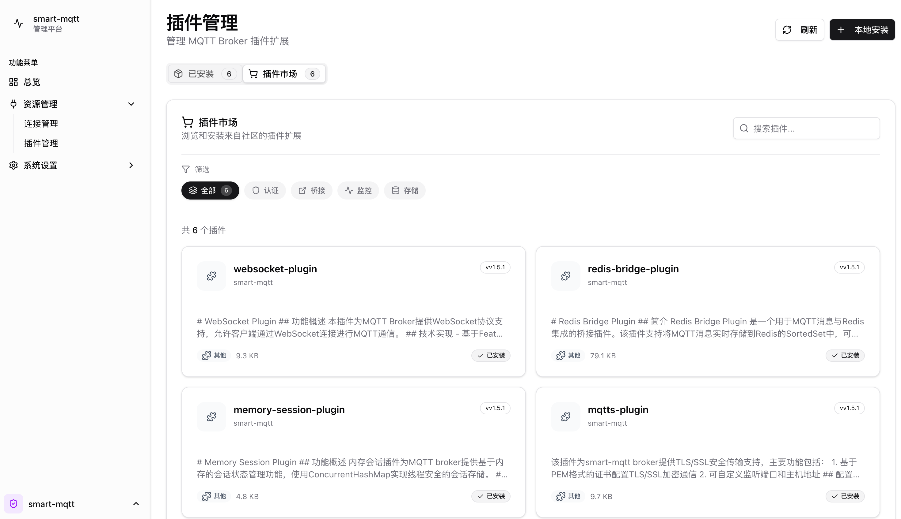

import { Aside } from '@astrojs/starlight/components';

## 关于 smart-mqtt

smart-mqtt 是专为拥有上万级设备连接量的企业级物联网场景设计，同时也是 smartboot 开源组织推出的首款商业化产品，标志着我们在物联网领域的战略布局从社区驱动向可持续发展的重大转型。

### 为什么选择商业化？

在开源领域，我们见证过太多优秀项目因缺乏可持续的投入而逐渐沉寂。一款企业级 MQTT Broker 的研发绝非易事——从协议兼容性到海量连接支撑，从插件生态到运维工具链，每一个环节都需要专业团队长期投入。

商业化的本质，是构建一种健康的价值循环：**用户获得稳定可靠的产品与服务，团队获得持续迭代的资源保障**。这不是对开源精神的背离，而是让开源项目走得更远的必要选择。

**我们的期望**

- **代码开源**：产品功能全部开源，用户自由选择，丰俭由人。
- **品质保障**：逐步更严格的测试流程和 SLA 体系
- **长期主义**：拒绝短期套利，致力于打造经得起时间检验的产品

> **我们相信：好的产品值得被定价，持续的价值值得被投资。**

### 核心优势

| 优势 | 业务价值 |
|------|----------|
| **🚀 超高性能** | 单机百万连接、千万吞吐，用普通服务器支撑海量设备，连接量越大成本优势越明显 |
| **🔧 开放架构** | 插件化设计按需扩展，南向适配多协议设备，北向桥接企业系统，拒绝功能冗余 |
| **☕ Java 生态** | 与现有技术栈零门槛对接，团队快速上手，运维工具链成熟，长期维护无负担 |
| **🔄 标准协议** | 完全遵循 MQTT 3.1.1/5.0，无厂商锁定，业务自主可控，随时平滑迁移 |
| **🇨🇳 自主可控** | 全栈自研核心组件，代码透明安全，符合政企信创合规要求 |

## 主要功能介绍

smart-mqtt 通过内置的 **enterprise-plugin** 插件，作为产品的基础性核心组件，提供功能完善的 Web 管理控制台和强大的插件生命周期管理能力。

服务正常启动后可通过浏览器访问 http://localhost:18083/ （IP根据实际情况调整）进入平台的登录界面。

管理平台基于 HTTP 服务提供 RESTful API，前端采用 Shadcn UI 框架构建，主要功能模块包括：

| 功能模块 | 说明 |
|----------|------|
| **用户认证** | 基于 Session 的用户登录，支持用户名+密码认证 |
| **License 管理** | 授权验证、License 导入、状态展示 |
| **Broker 管理** | 集群节点列表查询 |
| **连接管理** | MQTT 客户端连接查询、强制断开连接 |
| **Topic 管理** | 订阅关系查询、Topic 统计查询 |
| **插件管理** | 插件列表、启停控制、配置管理、插件市场、本地上传安装 |
| **系统设置** | 用户管理、系统参数配置 |

### Dashboard

仪表盘是管理平台的可视化数据展示中心，提供 Broker 运行状态的实时监控能力：

- **连接指标**：实时展示当前活跃连接数、历史连接峰值、连接速率等关键指标
- **消息指标**：监控消息收发速率、吞吐量、消息积压情况等
- **系统资源**：展示服务器 CPU、内存、磁盘等基础资源使用情况
- **趋势图表**：支持按时间维度展示指标变化趋势，便于分析业务规律

---
### 连接管理

提供 MQTT 客户端连接的实时监控和管理能力：

- **连接列表查询**：支持分页查询，可按 ClientID 模糊搜索
- **连接信息展示**：ClientID、用户名、IP 地址、连接时间、最后活动时间、状态
- **强制断开连接**：可主动断开指定客户端连接

<Aside type="tip">
    对于海量设备的场景，建议采用 mysql 存储方式。
</Aside>

---

### 插件管理

物联网业务从 POC 到量产，从单一设备接入到多协议融合，需求始终处于动态变化中。smart-mqtt 的插件管理体系，让企业能够像搭积木一样，按需构建和演进自己的 MQTT 平台。

#### 解决三大核心痛点

| 痛点 | 解决方案 |
|------|----------|
| **功能冗余或缺失** | 按需启用 WebSocket、集群、数据桥接等能力，用多少开多少 |
| **变更即停机** | 插件热插拔，配置实时生效，版本无缝升级 |
| **定制需求难落地** | 标准化接口支持私有插件开发，享受与官方插件同等的管理体验 |

#### 分层能力，按需扩展

- **连接层**：WebSocket、SSL/TLS、多协议网关
- **安全层**：简单认证、企业级鉴权、ACL 权限控制
- **数据层**：MySQL 持久化、Redis 桥接、消息队列对接
- **架构层**：集群扩展、会话保持、监控告警

> **一句话总结**：插件管理让 smart-mqtt 从标准化 Broker 进化为可随业务灵活演进的物联网通信平台，让技术真正服务于业务。

#### 插件发现与获取

由 smart-mqtt 官方提供的插件，都以内置在产品中。同时 smart-mqtt 还提供两种插件集成方式，以满足不同场景需求：

1. **本地上传**
支持上传自定义开发的 JAR 包进行安装，满足私有化部署和二次开发需求

2. **插件市场**
连接远程官方插件仓库，浏览、搜索并下载已发布的插件

---

### 系统设置

#### 用户管理

提供系统用户账号的管理功能：

| 功能 | 说明 |
|------|------|
| **用户列表** | 分页展示用户信息（用户名、角色、描述、创建时间） |
| **添加用户** | 创建新用户，设置用户名、密码、角色 |
| **更新用户** | 修改用户信息，支持密码重置 |
| **删除用户** | 批量删除用户账号 |
| **角色管理** | 支持管理员和普通用户两种角色 |

#### 系统参数配置

支持灵活的系统参数配置：

| 配置项 | 说明 |
|--------|------|
| **连接记录模式** | 设置连接记录存储方式（不记录/内存/数据库） |
| **订阅记录模式** | 设置订阅记录存储方式 |
| **指标记录模式** | 设置性能指标记录方式 |
| **展示指标** | 配置仪表盘展示的指标项 |

---

## 成本对比
云产品的采购成本几乎同连接量成线性增长关系，而 smart-mqtt 本就存在性能溢出的优势，所以**连接量越大，性价比越高**。

| 规格 | SaaS 云产品 | smart-mqtt |
|------|-------------|------------|
| 1000连接/1000TPS/1000订阅 | 1.7万/年 | 3000~5000 + 授权费 |
| 50000连接/20000TPS/1000订阅 | 37万/年 | 5000~10000 + 授权费 |
| 100万连接/20万TPS/100万订阅 | 376.8万/年 | ~10万 + 授权费 |

> 数据来源：[阿里云 IoT](https://www.aliyun.com/product/mq4iot)、[华为云 IoT](https://www.huaweicloud.com/pricing.html#/iothub)
