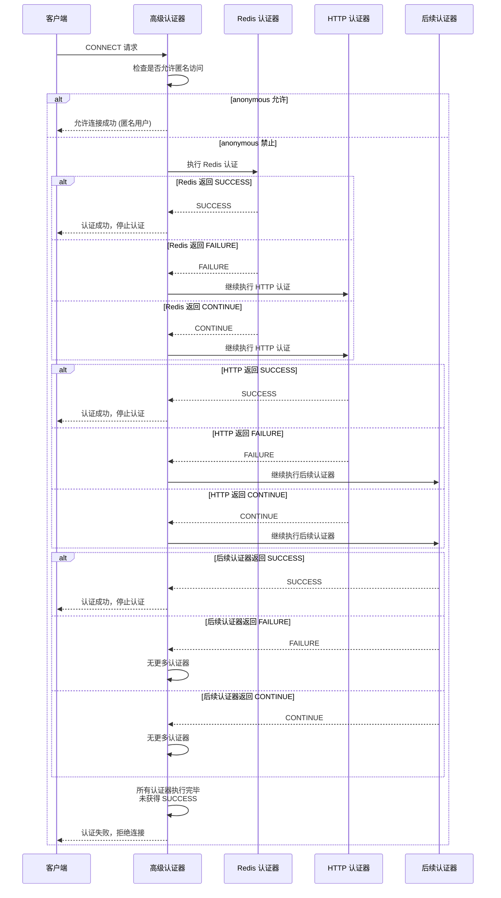

# Advanced Auth Plugin for smart-mqtt

## 简介

高级认证插件提供企业级认证能力，支持认证链、多种认证方式和密码编码。

## 配置说明

### 基础配置

```yaml
stopOnError: true          # 认证器异常时立即拒绝连接（默认 true）
allowAnonymous: false      # 是否允许匿名连接（username 和 password 都为空）

# 认证链顺序（按此顺序执行认证器）
chain:
  - redis                  # Redis 认证器
  - http                   # HTTP 认证器
```

### 认证链执行流程



**认证结果说明**：
- `SUCCESS`: 认证成功，立即停止后续认证，允许连接
- `FAILURE`: 认证失败（如密码错误），继续执行下一个认证器
- `CONTINUE`: 当前认证器无法处理（如用户不存在），继续执行下一个认证器

**流程规则**：
1. 认证器按 `chain` 配置顺序依次执行
2. 任一认证器返回 `SUCCESS` → 认证通过，立即停止
3. 认证器返回 `FAILURE` 或 `CONTINUE` → 继续下一个认证器
4. 所有认证器执行完仍未获得 `SUCCESS` → 最终拒绝连接

> **注意**：`stopOnError` 配置仅在认证器**抛出异常**时生效。当 `stopOnError=true` 时，认证器异常会立即返回失败；当 `stopOnError=false` 时，认证器异常会被捕获并当作 `CONTINUE` 处理，继续执行下一个认证器。

### Redis 认证

从 Redis 查询用户凭证进行认证，适用于分布式、高并发场景。

**Redis Key 格式**: `smart-mqtt:auth:{username}`

```yaml
redis:
  address: redis://localhost:6379    # Redis 地址 (必填)
  username:                          # Redis 用户名 (可选)
  password:                          # Redis 密码 (可选)
  database: 0                        # 数据库索引 (默认 0)
```

**Redis Hash 存储格式**：

| 字段 | 说明 | 必填 |
|------|------|------|
| `pwd_hash` | 密码哈希值 | 是 |
| `salt` | 盐值（有盐值时密码 = salt + 原始密码） | 否 |
| `encoder` | 密码编码器名称 | 否 |

**示例**：
```bash
# 创建用户
HSET smart-mqtt:auth:user1 pwd_hash "e3b0c44298fc1c149afbf4c8996fb92427ae41e4649b934ca495991b7852b855"

# 创建带盐值的用户
HSET smart-mqtt:auth:user2 pwd_hash "..." salt "salt123" encoder "sha256"
```

**密码编码说明**：
- `encoder` 字段指定密码编码器名称，可选值：
  - `plain`: 明文存储
  - `md5`: MD5 哈希（Base64 编码）
  - `sha256`: SHA-256 哈希（Base64 编码）
- 不指定 `encoder` 时，默认使用 `plain`
- 注意：MD5 和 SHA-256 哈希后会进行 Base64 编码存储

### HTTP 认证

调用外部 HTTP 接口进行认证，适用于微服务架构和第三方认证系统集成。

```yaml
http:
  url: http://localhost:8080/api/auth    # 认证接口 URL (必填)
  timeout: 5000                          # 请求超时时间，单位毫秒 (默认 5000)
  headers:                               # 自定义请求头 (可选)
    Authorization: Bearer token
```

**HTTP 请求说明**：
- 方法：POST
- Content-Type: application/json
- 请求体：
```json
{
  "username": "test",
  "password": "123456",
  "clientId": "client-001"
}
```

**响应处理**：
- 响应码 200: 认证成功
- 其他响应码：认证失败
