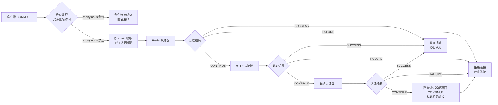

# Advanced Auth Plugin for smart-mqtt

## 简介

高级认证插件为 smart-mqtt 提供了企业级的认证能力，支持认证链、多种认证方式和密码编码。

## 特性

- **认证链**：多个认证器按配置顺序执行，认证失败时可选是否立即停止
- **多种认证方式**：HTTP、Redis、MySQL
- **密码编码**：支持明文、MD5、SHA256 编码方式
- **匿名访问**：可配置是否允许匿名连接

## 配置说明

### 基础配置

```yaml
# stopOnError: true - 认证器异常时立即拒绝连接（默认 true）
# allowAnonymous: false - 是否允许匿名连接
stopOnError: true
allowAnonymous: false

# 认证链顺序（按此顺序执行认证器）
chain:
  - redis
  - http
```

### 认证链执行流程

认证链是本插件的核心特性，当客户端连接时，系统按以下流程处理：



**认证结果说明**：

| 结果 | 说明 | 后续动作 |
|------|------|----------|
| `SUCCESS` | 认证成功 | 停止后续认证器，允许连接 |
| `FAILURE` | 认证失败 | 停止后续认证器，拒绝连接 |
| `CONTINUE` | 当前认证器无法处理 | 继续执行下一个认证器 |

**认证链处理逻辑**：

1. 按 `chain` 字段配置的顺序依次执行认证器
2. 如果 `allowAnonymous: false`，则在认证链之前先检查用户名和密码是否为空，若为空则直接拒绝
3. 如果所有认证器都返回 `CONTINUE`，默认拒绝连接
4. `stopOnError` 配置仅在认证器执行异常时生效：若为 `true`（默认值），异常时返回 FAILURE 拒绝连接；若为 `false`，异常时返回 CONTINUE 继续下一个认证器

### 匿名访问配置

```yaml
# 是否允许匿名访问
# true: 允许未提供凭据的客户端连接（username 和 password 都为空）
# false: 拒绝未提供凭据的客户端连接
allowAnonymous: false
```

**匿名访问说明**：
- 当客户端连接的 CONNECT 报文中不包含用户名和密码时，视为匿名连接
- 匿名连接的客户端会被分配一个默认用户名（通常为空字符串）
- 建议生产环境设置为 `false`，只允许经过认证的客户端连接

### Redis 认证

从 Redis 查询用户凭证进行认证，适用于分布式、高并发场景：

```yaml
redis:
  # Redis 地址 (redis://host:port 格式)
  address: redis://localhost:6379
  # Redis 用户名 (可选)
  username: 
  # Redis 密码 (可选)
  password: 
  # 数据库索引 (默认 0)
  database: 0
  # 连接超时时间，单位毫秒 (默认 20000)
  connectionTimeout: 20000
```

**Redis Hash 存储格式**：

| 字段 | 说明 | 必填 |
|------|------|------|
| `password_hash` | 密码哈希值 | 是 |
| `salt` | 盐值（有盐值时密码 = salt + 原始密码） | 否 |
| `password_encoder` | 密码编码器名称（默认 sha256） | 否 |

**示例**：
```bash
# 创建用户
HSET smart-mqtt:auth:user1 password_hash "e3b0c44298fc1c149afbf4c8996fb92427ae41e4649b934ca495991b7852b855" salt "" password_encoder "sha256"

# 创建带盐值的用户
HSET smart-mqtt:auth:user2 password_hash "..." salt "salt123" password_encoder "sha256"

```

**认证流程**：
```mermaid
flowchart LR
    A[客户端 CONNECT<br/>提取 username 和 password] --> B[查询 Redis<br/>smart-mqtt:auth:{username}]
    B --> C[获取 password_hash,<br/>salt, password_encoder]
    C --> D{salt 存在？}
    D -->|是 | E[password = salt + rawPassword]
    D -->|否 | F[password = rawPassword]
    E --> G[使用 password_encoder<br/>计算哈希]
    F --> G
    G --> H{比较哈希值}
    H -->|匹配 | I[认证成功]
    H -->|不匹配 | J[认证失败]
```

### HTTP 认证

调用外部 HTTP 接口进行认证，适用于微服务架构和第三方认证系统集成：

```yaml
http:
  # 认证接口 URL (必填)
  url: http://localhost:8080/api/auth
  # 请求超时时间，单位毫秒 (默认 5000)
  timeout: 5000
  # 自定义请求头 (可选)
  headers: 
    Authorization: Bearer token
```

**HTTP 请求说明**：

| 项目 | 说明 |
|------|------|
| 方法 | POST |
| Content-Type | application/json |

**请求体 JSON**：
```json
{
  "username": "test",
  "password": "123456",
  "clientId": "client-001"
}
```

**响应处理**：

| 响应码 | 说明 |
|--------|------|
| 200 | 认证成功 |
| 其他 | 认证失败 |

## 密码编码

本插件支持多种密码编码方式，通过 Redis 中的 `password_encoder` 字段指定：

| 编码器名称 | 说明 | 示例 |
|------------|------|------|
| `plain` | 明文存储 | `password` |
| `md5` | MD5 哈希（Base64 编码） | `5f4dcc3b5aa765d61d8327deb882cf99` |
| `sha256` | SHA-256 哈希（Base64 编码） | `e3b0c44...` |

> 注意：MD5 和 SHA-256 哈希后会进行 Base64 编码存储

**密码编码示例**：
```java
// 使用 PluginUtil 工具类
String encoded = PluginUtil.encodePassword("mypassword", "sha256");
```


## 错误处理

### 认证失败原因

| 错误类型 | 说明 | 处理方式 | 适用认证器 |
|----------|------|----------|------------|
| 用户不存在 | Redis 中 key 不存在 | 返回 CONTINUE，续下一个认证器 | Redis |
| 用户不存在 | HTTP 服务返回非 200 | 返回 FAILURE，拒绝连接 | HTTP |
| 密码不匹配 | 哈希值比较失败 | 返回 FAILURE，拒绝连接 | Redis/Http |
| 超时/网络错误 | 请求超时或连接异常 | 返回 CONTINUE，续下一个认证器 | Redis/Http |


## 最佳实践

### 1. 认证链配置建议

```yaml
# 推荐配置：Redis 作为主要认证，HTTP 作为备用
chain:
  - redis      # 优先使用 Redis（高性能）
  - http       # 备用 HTTP 认证（兼容第三方系统）
stopOnError: false  # 允许认证器链式尝试
allowAnonymous: false  # 禁止匿名访问
```
